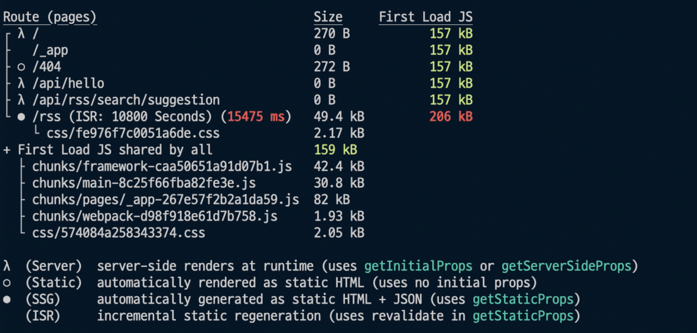

# CSR, SSR

## Next.js가 프레임워크인 이유

### 라이브러리와 프레임워크 

* `라이브러리`는 개발자가 라이브러리 코드를 갖고와서 사용 (✏️연필, 볼펜)  
* `프레임워크`는 개발자의 코드를 프레임워크가 갖고가서 사용 (🖨프린터)
  * 편리하지만 자유가 없음

 

### CLS(Cumulative Layout Shift)

[누적 레이아웃 이동](https://web.dev/cls/)

사용자가 예상치 못한 레이아웃 이동을 경험하는 빈도를 수량화 => 시각적 안정성을 측정할 때 중요한 사용자 중심 메트릭   
CLS가 낮으면 우수한 사용자 경험을 보장하는 데 도움이 됨  

**Next.js image는 CLS를 방지**  
클릭하려고 햇는데 광고떠서 잘못누르는 등의 일 예방 

-> width, height 강제 등, **이미지 크기를 넣으라고 하는 이유**  
Image 컴포넌트는 src 속성으로 받은 이미지 주소를 조작하여 Next.js 내부 서버 API 쪽으로 경로를 돌려놓음

내부 서버 = Next.js로 만든 웹 애플리케이션 내부의 프론트엔드 서버  
클라이언트앱이 돌아가는 시스템환경의 성능이 안 좋으면 리사이징 속도도 느려짐

-> [샤프](https://nextjs.org/docs/messages/install-sharp)  
-> [Next.js 이미지 로딩이 느릴 경우 조치 방법](https://november11techblog.gatsbyjs.io/next-js-%EC%9D%B4%EB%AF%B8%EC%A7%80-%EB%A1%9C%EB%94%A9%EC%9D%B4-%EB%8A%90%EB%A6%B4-%EA%B2%BD%EC%9A%B0-%EC%A1%B0%EC%B9%98-%EB%B0%A9%EB%B2%95)

  

## SSR, SSG 인프라 구성

> 컴퓨팅 자원이 필요한가? → SSR (O) / SSG (X)

### SSR 

컴퓨팅 자원을 제공해주는 AWS EC2, GCP ComputeEngine, Azure VitualCompute 등의 인스턴스를 제품 사용  
AWS Lambda와 같은 서버리스 서비스 사용

 

### SSG

서버가 있어도, 없어도 됨

* 서버가 있을 경우 : 서버를 통해 들어온 요청을 인스턴스 내에 담긴, 혹은 별도의 저장소에 담긴 HTML 파일을 불러와 응답
* 서버가 없을 경우 : S3와 같은 저장소에서 요청에 대한 응답을 가져가도록 구성
  * 일반적으로 **CDN** 역할을 하는 `AWS CloudFront`와 저장소 역할을 하는 `S3 bucket`을 많이 조합해 사용

  

## lambda

즉시실행함수 기호

> 람다 (들 입 入)     
> 대문자 Λ, 소문자 λ

[AWS Lambda](https://aws.amazon.com/ko/lambda/features/)  

서버리스 + CDN = 람다 리스?

 

### Server 

Next.js로 만든 앱을 서빙하기 위해서는 빌드(Build) 과정이 필요  

SSR 혹은 API Route가 이에 해당    
람다 기호(λ)가 그려져 있는 만큼, 
클라이언트 측에서 요청이 들어오면 그 때마다 서버 로직이 개별 함수처럼 즉시 실행(Lambda) 되고 각 경로에 맞는 응답을 내려줌   
`getServerSideProps`를 사용하면 SSR 페이지를 만들 수 있음

  

## 참고 사이트

> 원티드 프리온보딩 7월 챌린지 강의 자료   
> https://patterns-dev-kr.github.io/  
> [React 공식문서 비공식 한글화 사이트](https://react-ko.dev/)  
> https://nextjs.org/blog/next-13  
> https://next-site-4vixvljn1.vercel.sh/
