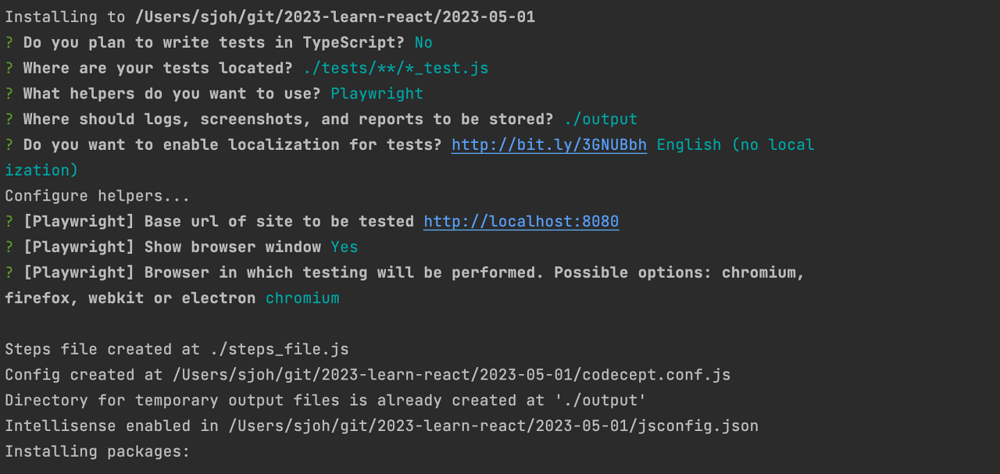

# CodeceptJS 

## 올인원 패키지 설치하기

```
npx create-codeceptjs .
```

### 데모 테스트 실행하기

package.json에 추가된 demo 실행 명령어를 통해 데모 테스트하기 

```bash
# 웹 브라우저를 화면에 띄워 테스트를 실행
npm run codeceptjs

# 웹 브라우저를 화면에 띄우지 않고(헤드리스) 테스트를 실행
npm run codeceptjs:headless

# 웹 브라우저에 CodeceptUI를 띄워 편하게 테스트를 실행
npm run codeceptjs:ui
```

### 데모 제거하기 

데모 테스트를 실행해 봤다면, 혹은 필요 없다면 데모를 제거  
package.json의 "scripts"에서도 `codeceptjs:demo`가 붙은 명령어를 삭제

```
npm uninstall @codeceptjs/examples
```

<br><br>

## 새 프로젝트 시작하기

새 프로젝트를 시작하려면 CodeceptJS를 초기화하여 기본 구성 파일 `codecept.conf.js`를 생성  
⚠️ 이 과정이 없으면 테스트를 작성하거나 실행할 수 없음

```
npx codeceptjs init
```

### 질문 답변하기 

🚨 테스트 위치나 테스트가 진행될 base url 주소 등을 주의해서 답변할 것



### 타입스크립트 이용하기

타입스크립트를 사용하면 관련 패키지가 추가로 다운됨  
config 파일과 새 테스트가 TypeScript 형식으로 생성   
config 파일이 TypeScript 형식(codecept.conf.ts)으로 설정되어 있으면, **ts-node** 패키지가 테스트 실행에 사용됨  

<br><br>

## 참고 사이트

[CodeceptJS 공식문서](https://codecept.io/)

