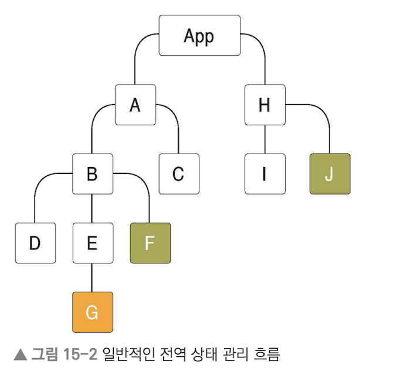
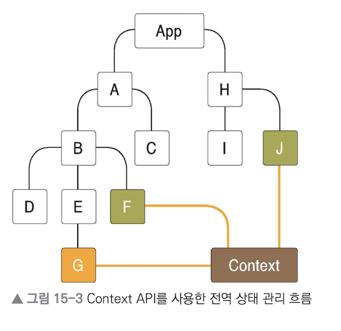

# Context API

## Context API

Context API란, React에서 제공하는 내장 API  
컴포넌트들에게 동일한 context(맥락)를 전달하고, 한 번에 값을 받아와서 사용  
Context API를 기반으로 한 라이브러리 : 리덕스, 리액트 라우터, styled-components 등

  


⚠️ **프롭스 드릴링을 피하기 위해 사용하는 것, 전역 상태관리가 아님**  
* 여러 컴포넌트에 동일한 값을 접근할 수 있도록 만들어주는 api(통로의 개념)
* 자주 변경되는 데이터를 관리하려면 용도에 맞게 구분해서 사용하면 됨

<br>

### React에서 데이터를 전달하는 기본 원칙, 단방향성

애플리케이션의 안전성을 높이고 흐름을 단순화하는데 유용  
React 애플리케이션에서 데이터는 위에서 아래로(👨‍👩‍부모 -> 👧자식) props를 통해 전달   
Context API를 컴포넌트에게 의존성을 주입하는 용도로 사용할 수 있음

<br>

### Props Drilling(프롭스 드릴링) 

props를 애플리케이션 안의 여러 컴포넌트에 전해줘야하는 경우

1. 너무 많은 컴포넌트 단계를 거쳐야 함
2. 중간 컴포넌트가 props를 이용하지 않아도 넘겨줘야 함
3. 형제 관계의 컴포넌트 간의 props 전달이 복잡

데이터가 많아지고, 컴포넌트를 더 많이 거쳐야 하는 경우 **⚠️유지 보수성이 낮아질 수 있음**

<br><br>

## createContext

새로운 Context 객체 생성

```js
import { createContext } from "react";

const MyContext = createContext(defaultValue);
```

* defaultValue 매개변수는 트리 안에서 적절한 Provider를 찾지 못했을 때만 쓰이는 값
* Provider를 통해 undefined를 값으로 보내도, 구독 컴포넌트가 defaultValue를 읽지는 않음

<br><br>

## Context.Consumer 

함수 컴포넌트안에서 context 변화를 구독하는 React 컴포넌트

```jsx
<MyContext.Consumer>
    {value => /* context 값을 이용한 렌더링 */}
</MyContext.Consumer>
```

* Consumer 사이에 **{ 함수 }** 전달
  * 이 패턴을 function as a child 또는 **Render Props** 라고 부름 
  * 이 함수는 context의 현재값을 받고 React 노드를 반환 
  * 이 함수가 받는 value 값은 해당 context의 Provider 중 상위 트리에서 가장 가까운 Provider의 value prop과 동일
  * 상위에 Provider가 없다면 value 매개변수 값은 createContext()에 보냈던 defaultValue와 동일
  
<br><br>

## 참고 사이트

> https://ko.reactjs.org/docs/context.html  
> https://ko.reactjs.org/docs/render-props.html  
