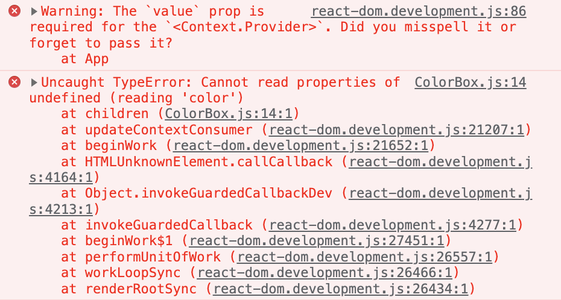

# Context API

## Context API

Context API란, React에서 제공하는 내장 API  
컴포넌트들에게 동일한 context(맥락)를 전달하고, 한 번에 값을 받아와서 사용  
Context API를 기반으로 한 라이브러리 : 리덕스, 리액트 라우터, styled-components 등

  


⚠️ **프롭스 드릴링을 피하기 위해 사용하는 것, 전역 상태관리가 아님**  
* 여러 컴포넌트에 동일한 값을 접근할 수 있도록 만들어주는 api(통로의 개념)
* 자주 변경되는 데이터를 관리하려면 용도에 맞게 구분해서 사용하면 됨

<br>

### React에서 데이터를 전달하는 기본 원칙, 단방향성

애플리케이션의 안전성을 높이고 흐름을 단순화하는데 유용  
React 애플리케이션에서 데이터는 위에서 아래로(👨‍👩‍부모 -> 👧자식) props를 통해 전달   
Context API를 컴포넌트에게 의존성을 주입하는 용도로 사용할 수 있음

<br>

### Props Drilling(프롭스 드릴링) 

props를 애플리케이션 안의 여러 컴포넌트에 전해줘야하는 경우

1. 너무 많은 컴포넌트 단계를 거쳐야 함
2. 중간 컴포넌트가 props를 이용하지 않아도 넘겨줘야 함
3. 형제 관계의 컴포넌트 간의 props 전달이 복잡

데이터가 많아지고, 컴포넌트를 더 많이 거쳐야 하는 경우 **⚠️유지 보수성이 낮아질 수 있음**

<br><br>

## createContext

새로운 Context 객체 생성

```js
import { createContext } from "react";

const MyContext = createContext(defaultValue);
```

* defaultValue 매개변수는 Provider가 없을 때만 사용됨
* Provider를 통해 undefined를 값으로 보내도, 구독 컴포넌트가 defaultValue를 읽지는 않음

<br><br>

## Context.Provider

Context의 value를 변경 가능한 React 컴포넌트, 값을 제공하는 역할

```jsx
<MyContext.Provider value={/* 어떤 값 */}>
...
</MyContext.Provider>
```

Provider 컴포넌트는 value prop을 받아서 값을 하위 컴포넌트에게 전달  
* Provider 하위에 또 다른 Provider를 배치하는 것도 가능 
  * 이 경우 하위 Provider의 값이 우선시
* Provider 하위에서 context를 구독하는 모든 컴포넌트는 Provider의 value가 바뀔 때마다 리렌더링 발생

<br>

📌 **Provider 사용 시 value 값을 명시해야 함**
* createContext 함수에서 파라미터로 넣은 기본값은 Provider를 사용하지 않았을 때만 사용됨 
* Provider는 기본값을 사용하지 않기 때문에 value가 없으면 오류 발생

<br>



<br><br>

## Context.Consumer

함수 컴포넌트안에서 context 변화를 구독하는 React 컴포넌트, 값을 소비하는 역할

```jsx
<MyContext.Consumer>
    {value => /* context 값을 이용한 렌더링, Provider에서 받은 값 */}
</MyContext.Consumer>
```

* Consumer 사이에 **{ 함수 }** 전달
  * 이 패턴을 function as a child 또는 **Render Props** 라고 부름
  * 이 함수는 context의 현재값을 받고 React 노드를 반환
  * 이 함수가 받는 value 값은 가장 가까운 상위 Provider의 value prop과 동일
  * 상위 Provider가 없다면 value 매개변수 값은 createContext의 defaultValue와 동일

<br><br>

## useContext

context 객체를 받아 그 context의 현재 값을 반환, context 값을 편리하게 조회  
💡 context의 값에 접근할 때, Consumer를 사용하지 않아도 됨

```jsx
const value = useContext(MyContext);

// 틀린 사용: useContext(MyContext.Consumer)
// 틀린 사용: useContext(MyContext.Provider)
```

> **클래스에서의 static contextType = MyContext 또는 <MyContext.Consumer>와 동일**   
> 클래스 메소드에서도 context에 넣어 둔 함수 호출 가능  
> 한 클래스에서 하나의 context만 사용 가능

useContext를 호출한 컴포넌트는 context 값이 변경되면 항상 리렌더링 발생
* 메모이제이션을 사용하여 최적화 가능

<br>
 
context의 현재 값은 Hook을 호출하는 컴포넌트에 가장 가까운 <MyContext.Provider>의 value prop에 의해 결정 
* <MyContext.Provider>가 갱신되면 Hook은 provider에게 전달된 가장 최신의 context value를 사용하여 렌더 
* 상위 컴포넌트에서 React.memo 또는 shouldComponentUpdate를 사용하더라도 useContext를 사용하고 있는 컴포넌트 자체에서부터 다시 렌더링

<br><br>

## 참고 사이트

> https://ko.reactjs.org/docs/context.html  
> https://ko.reactjs.org/docs/render-props.html  
> https://ko.reactjs.org/docs/hooks-reference.html#usecontext
