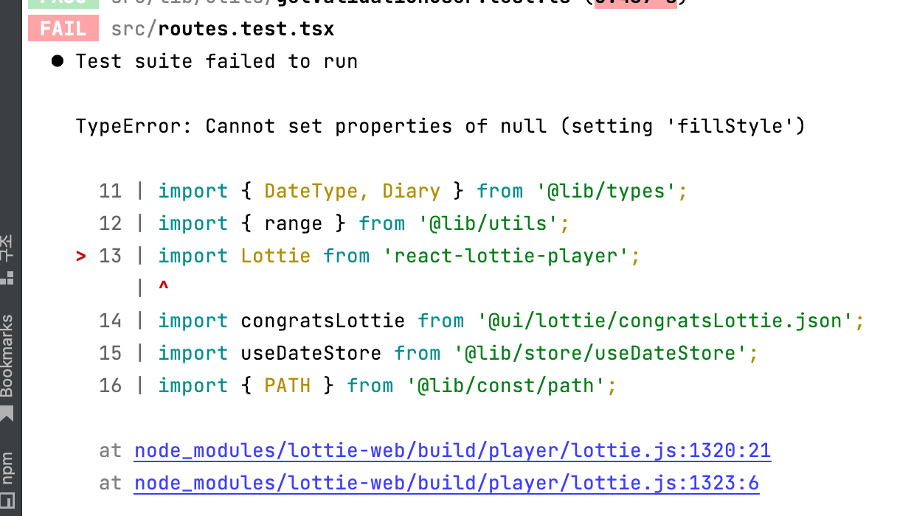

# 테스트

## Lottie 추가하기 

### 라이브러리 설치  

> https://www.npmjs.com/package/react-lottie-player

<br>

### JSON 형식으로 된 Lottie 파일 이용하기 

```tsx
import Lottie from 'react-lottie-player';
import congratsLottie from '@ui/lottie/congratsLottie.json';

export function CalendarPage() {
  return (
    <>
      {isFirstSign && (
        <Lottie 
          loop
          animationData={congratsLottie}
          play
          style={{ position: 'absolute', top: '10%', left: '5%' }} 
        />
      )}
    <>
  );
}
```

<br><br>

## 테스트 에러 발생 



<br><br>

## 에러 해결하기 

### 라이브러리 설치 

> https://www.npmjs.com/package/jest-canvas-mock

* Jest 유닛 테스트에 사용 
* 테스트 용도이기 때문에 devDependencies로 추가

<br>

### `setupTest.ts` 파일 생성

* src/setupTest.ts

```ts
import 'jest-canvas-mock';

// or 

require('jest-canvas-mock');
```

<br>

### `jest.config.ts` 파일에 내용 추가

```ts
export default {
  testEnvironment: 'jsdom',
  transform: {
    '^.+\\.tsx?$': 'ts-jest',
  },
  moduleNameMapper: {
    '^.+\\.svg$': 'jest-svg-transformer',
    '\\.(css|less|sass|scss)$': 'identity-obj-proxy',
    '^@ui/(.*)$': '<rootDir>/src/ui/$1',
    '^@lib/(.*)$': '<rootDir>/src/lib/$1',
  },
  setupFilesAfterEnv: [
    '<rootDir>/jest.setup.ts', 
    '<rootDir>/src/setupTests.ts'], // ✅ 추가 
};
```
