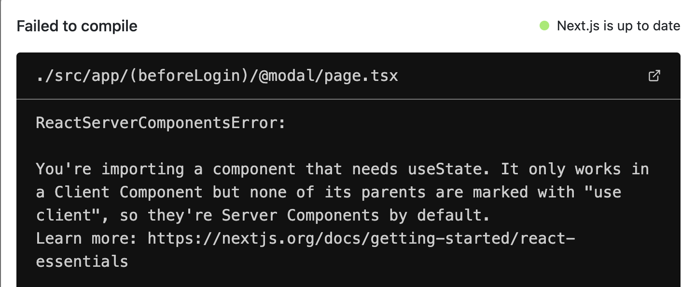

# Next.js App Router

## 서버 컴포넌트

[server components](https://nextjs.org/docs/app/building-your-application/rendering/server-components)

서버 컴포넌트는 React v18에서 추가된 기능  
리액트 서버 컴포넌트를 사용하면 서버에서 렌더링하고 선택적으로 캐시할 수 있는 UI를 작성할 수 있음 

<br>

### 서버 컴포넌트 에러 



> 🚨 You're importing a component that needs useState. It only works in a Client Component but none of its parents are marked with "use client", so they're Server Components by default.
Learn more: https://nextjs.org/docs/getting-started/react-essentials

useState는 클라이언트 컴포넌트에서만 동작하는데 지금은 서버 컴포넌트를 사용하고 있다는 오류

* 기본적으로 프로젝트의 모든 컴포넌트는 서버 컴포넌트 (page.tsx, layout.tsx 등)
* Next.js 서버에서 돌고 있음
* async로 비동기 컴포넌트를 만들 수도 있음

<br>

### 주의점 

⚠️ 서버 컴포넌트에서는 useEffect, useState, useRouter 등의 hook을 사용할 수 없음  
-> 클라이언트 컴포넌트로 바꿔줘야함(hook은 클라이언트 컴포넌트에서만 작동)   
`“use client”` 를 붙이면 클라이언트 컴포넌트로 간단히 변환 

* 이벤트 리스너(onClick 등)가 있으면 `use client` 사용해야 함 
* 서버 컴포넌트는 클라이언트 컴포넌트를 import 해도 되는데, 그 반대는 불가

<br><br>

## 클라이언트 컴포넌트와 서버 컴포넌트 동시에 사용하기

부모는 클라이언트 컴포넌트, 칠드런은 서버 컴포넌트 

1. 전부 서버 컴포넌트로 만들기 애매할 때 
2. 일부분만 분리해 클라이언트 컴포넌트로 뺄 수 있음 
3. 나머지 서버 컴포넌트 부분을 칠드런으로 넣으면 됨

<br>

### 예시

#### 서버 컴포넌트 

```tsx
// Post.tsx

export default function Post({noImage}: Props) {
    return (
        <PostArticle post={target}> // ✅ 분리
            <div className={style.postWrapper}>
                <div className={style.postUserSection}>
                    <Link href={`/${target.User.id}`} className={style.postUserImage}>
                        
                        <div className={style.postShade}/>
                    </Link>
                </div>
                {/* 생략 */}
            </div>
        </PostArticle>
    );
}
```

#### 클라이언트 컴포넌트

```tsx
// PostArticle.tsx

"use client";

import {useRouter} from "next/navigation";

export default function PostArticle({children, post}: Props) {
    const router = useRouter();

    const onClick = () => {
        router.push(`/${post.User.id}/status/${post.postId}`);
    }

    return (
        <article onClickCapture={onClick} className={style.post}>
            {children}
        </article>
    );
}
```

* 리액트에 `onClickCapture`를 사용하면 **이벤트 캡처링** 가능

<br>

### 주의점

⚠️ `children`이나 `props`로 넘겨서 사용해야 함   
클라이언트 컴포넌트에서 서버 컴포넌트를 import해서 쓰면, 서버 컴포넌트가 클라이언트 컴포넌트로 성격이 바뀌게 됨
