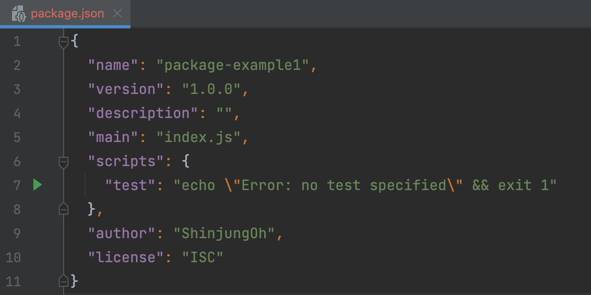

# npm

npm (Node Package Manager)  
Node.js의 패키지 관리 도구

  

## 패키지 생성

1️⃣ 초기 package.json 설정    
`npm init`  

  
* 패키지의 정보를 기록하는 환경설정 파일 
* main : 패키지를 실행할 때 어떤 파일을 실행해야 하는지 명시 
* scripts : 자주 실행하는 명령어를 사전 정의

 

2️⃣ package.json에 있는 디펜던시 다운로드 -> node_modules 생성    
`npm i`  
`npm install`  
`npm install 패키지@ver` <em>@ver 생략 시 최신 버전 다운로드</em>

  

## 📦 패키지 생성 방법 2가지
1️⃣ npm init -> 필요한 디펜던시 npm install로 하나씩 직접 추가     
2️⃣ 필요한 디펜던시 목록 복사-붙여넣기로 package.json 생성 -> npm install

  

## 외부 패키지 사용
> https://www.npmjs.com/

외부 패키지를 설치하면 디펜던시가 생성되고, 패키지의 이름과 버전이 기록된다.  
정확한 버전 정보는 `package-lock.json`
