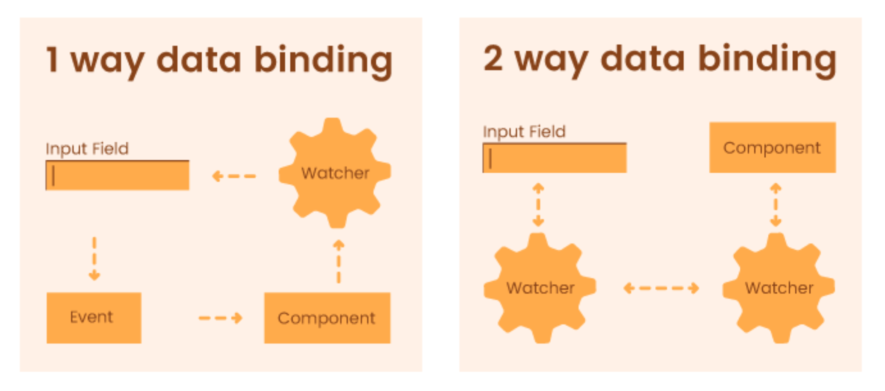
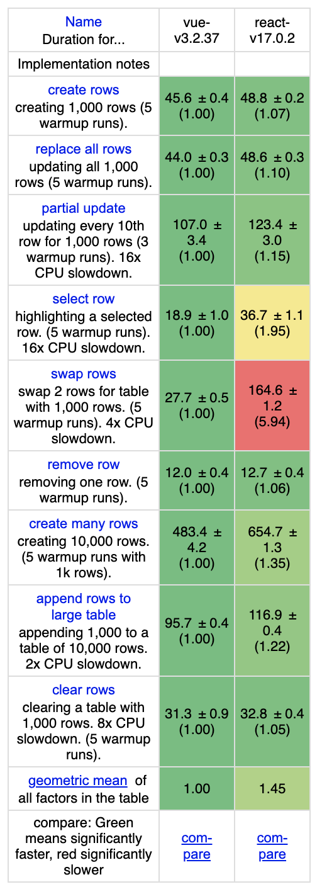
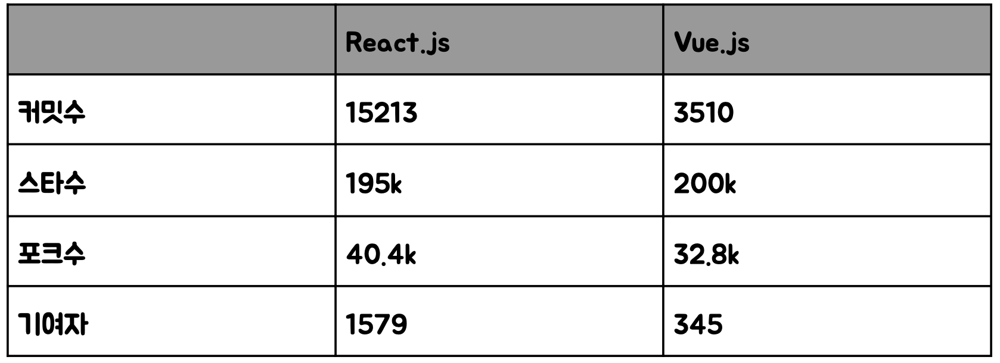

# React, Vue 비교

## 특징

|         |                                                         React.js                                                          |                                    Vue.js                                    |
|:-------:|:-------------------------------------------------------------------------------------------------------------------------:|:----------------------------------------------------------------------------:|
|         | 함수형 immutable, setState (함수를 통해서 값을 바꿀 수 있음) mapStatetoProps, pureComponent https://codepen.io/e_me/pen/NdPabd | 반응형  watch, computed가 있으며 값 대입만으로 값을 수정 가능 Try it in the Playground  |
| 데이터바인딩  |                                                            단방향 바인딩                                                            |                                   양방향 바인딩                                    |
|         |                                                            JSX                                                           |                                     html                                     |

 

### 데이터바인딩

화면에 보이는 데이터와 브라우저 메모리상의 데이터가 일치하게 만드는 것

* 단방향 바인딩(one-way binding)
* 양방향 바인딩(two-way binding)

 

 

React.js는 단방향 바인딩 모델을 사용, Vue.js는 양방향 바인딩 모델을 사용     
데이터가 변했을 때 뷰(view)에 반영되는 것은 둘 다 동일   
뷰에서 이벤트가 일어났을 때 양방향 바인딩은 바로 반영되는 반면, 단방향 바인딩은 따로 처리해줘야 한다는 점에서 차이 (속도의 차이는 x)

  

## 자유도, 타 플러그인 의존도, 공식 문서, 러닝커브

 

|      | React.js  | Vue.js  |
|:----:|:---------:|:-------:|
| 자유도  |    높음    |   낮음   |
| 의존도  |    높음    |   낮음   |
| DOC  |    보통    |   쉬움   |
| 러닝커브 |    보통    |   낮음   |

  

## 성능

 

 

> https://krausest.github.io/js-framework-benchmark/2022/table_chrome_105.0.5195.102.html

  

## 커뮤니티

기술을 사용하는데 있어서 이 기술을 만드는 사람이 얼마나 꾸준히 만드는지, 얼마나 많은 사람이 만드는지, 지속적으로 업데이트가 되는지 등은 중요  

 

 

기여자수, 커밋수, 포크수는 React.js가 많음  
Vue.js는 스타수가 앞섬   
전반적으로 React.js가 우위

  

## 모바일로의 확장성

* React : React-native  
* Vue.js : Native script, Capacitor

> https://github.com/facebook/react-native   
> https://github.com/ionic-team/capacitor   
> https://github.com/NativeScript/NativeScript  

React-native가 커뮤니티 적인 측면에서 압승

