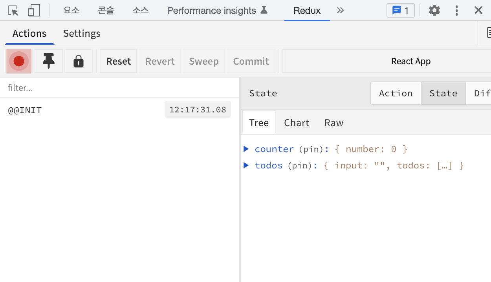

# React-Redux

## 프로젝트 생성

### 라이브러리 설치

```
yarn add redux react-redux
```

<br><br>

## 프로젝트 패턴

프레젠테이셔널 컴포넌트와 컨테이너 컴포넌트를 분리
* 프레젠테이셔널 컴포넌트 `src/components`
    * 주로 상태 관리가 이루어지지 않고, 그저 props를 받아 와서 화면에 UI를 보여 주기만 하는 컴포넌트
* 컨테이너 컴포넌트 `src/containers`
    * 리덕스와 연동되어 있는 컴포넌트
    * 리덕스로부터 상태를 받아 오거나, 리덕스 스토어에 액션을 디스패치
    


### 장점
* 코드의 재사용성 증가
* 관심사의 분리 -> UI를 작성할 때 편리

<br>

## 리덕스 구조

### 1. 각각 다른 파일에 작성

가장 기본적이지만 불편할 수 있음

```md
├── actions
│   ├── counter.js
│   └── todos.js
├── constants
│   └── ActionTypes.js
└── reducers
    ├── counter.js
    └── todos.js
```

### 2. 기능별로 묶어 파일 하나에 작성 ✅

Ducks 패턴   
액션 타입, 액션 생성 함수, 리듀서 함수를 기능별로 파일 하나(**모듈**)에 몰아서 작성하는 방식

```md
└── modules
    ├── counter.js
    └── todos.js
```

<br>

### 루트 리듀서

`createStore` 함수를 사용해 스토어를 만들 때는 리듀서를 하나만 사용해야 함  
이를 위해 기존의 리듀서들을 하나로 합치는 작업을 할 때, 리덕스의 `combineReducers` 함수를 사용

```js
import { combineReducers } from 'redux';
import counter from './counter';
import todos from './todos';

const rootReducer = combineReducers({
  counter,
  todos,
});

export default rootReducer;
```

<br>

### 스토어

컴포넌트에서 스토어를 사용할 수 있도록 react-redux에서 제공하는 **Provider** 컴포넌트로 App 컴포넌트를 감싸야 함      
props로는 store를 전달  


```js
import { createStore } from 'redux';
import rootReducer from './modules';
import { Provider } from 'react-redux';
import { composeWithDevTools } from 'redux-devtools-extension';

const store = createStore(rootReducer, composeWithDevTools()); // 스토어 생성, 루트 리듀서 전달

const root = ReactDOM.createRoot(document.getElementById('root'));
root.render(
    <Provider store={store}>
      <App />
    </Provider>,
);
```

<br><br>

## 리덕스 개발자 도구

> `Redux DevTools`
> https://chrome.google.com/webstore/search/redux  

### 1. 패키지 없이 적용하기

```js
conststore = createStore(
    rootReducer, /* preloadedState,*/
    window.__REDUX_DEVTOOLS_EXTENSION__ && window.__REDUX_DEVTOOLS_EXTENSION__()
);
```

### 2. 패키지 설치해서 적용하기 ✅  

```
yarn add redux-devtools-extension
```

```js
import { composeWithDevTools } from 'redux-devtools-extension';

const store = createStore(rootReducer, composeWithDevTools());
```



<br><br>

## redux-actions

```
yarn add redux-actions
```

* `createAction` 액션 생성 함수를 간단하게 선언
* `handleActions(각 액션에 대한 업데이트 함수, 초기 상태)`
  * 리듀서를 작성할 때 switch/case 문이 아닌 `handleActions` 함수를 사용해, 각 액션마다 업데이트 함수를 설정하는 형식으로 작성 가능    

<br>

### createAction

createAction으로 액션을 만들면 **액션에 필요한 추가 데이터**는 `payload` 라는 이름을 사용  

```js
const MY_ACTION = 'sample/MY_ACTION';
const myAction = createAction(MY_ACTION);
const action = myAction('hello world');

/*  결과:
    { type: MY_ACTION, payload: 'hello world' }
*/
```

액션 생성 함수에서 받아 온 **파라미터에 변형**을 줄 때, createAction의 두 번째 함수에 payload를 정의하는 함수를 따로 선언해서 넣으면 됨

```js
const MY_ACTION = 'sample/MY_ACTION';
const myAction = createAction(MY_ACTION,text=>`${text}!`);
const action = myAction('hello world');

/*  결과:
    { type: MY_ACTION, payload: 'hello world!' }
*/
```

<br>

### handleActions

액션 생성 함수는 액션에 필요한 추가 데이터를 모두 payload라는 이름으로 사용하기 때문에  
모두 공통적으로 `action.payload` 값을 조회하도록 리듀서를 구현해야 함   

```js
[CHANGE_INPUT]: (state, action) => ({ ...state, input: action.payload })
```

💡 객체 비구조화 할당으로 actions 값의 payload 이름을 새로 설정하면 정확한 action.payload 값을 알 수 있음

```js
[CHANGE_INPUT]: (state, { payload: input }) => ({ ...state, input })
```
