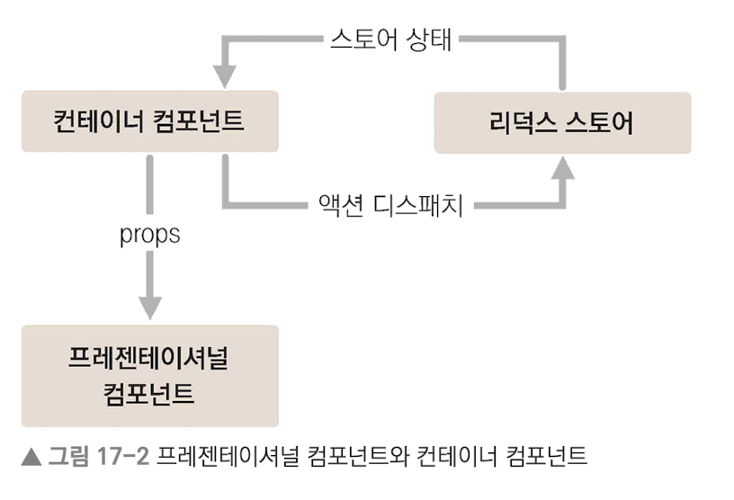

# React-Redux

## 프로젝트 패턴

프레젠테이셔널 컴포넌트와 컨테이너 컴포넌트를 분리
* 프레젠테이셔널 컴포넌트 `src/components`
    * 주로 상태 관리가 이루어지지 않고, 그저 props를 받아 와서 화면에 UI를 보여 주기만 하는 컴포넌트
* 컨테이너 컴포넌트 `src/containers`
    * 리덕스와 연동되어 있는 컴포넌트
    * 리덕스로부터 상태를 받아 오거나, 리덕스 스토어에 액션을 디스패치
    




### 장점
* 코드의 재사용성 증가
* 관심사의 분리 -> UI를 작성할 때 편리

<br>

## 리덕스 구조

### 1. 각각 다른 파일에 작성

가장 기본적이지만 불편할 수 있음

```md
├── actions
│   ├── counter.js
│   └── todos.js
├── constants
│   └── ActionTypes.js
└── reducers
    ├── counter.js
    └── todos.js
```

### 2. 기능별로 묶어 파일 하나에 작성 ✅

Ducks 패턴   
액션 타입, 액션 생성 함수, 리듀서 함수를 기능별로 파일 하나(**모듈**)에 몰아서 작성하는 방식

```md
└── modules
    ├── counter.js
    └── todos.js
```

<br>

### 루트 리듀서

`createStore` 함수를 사용해 스토어를 만들 때는 리듀서를 하나만 사용해야 함  
이를 위해 기존의 리듀서들을 하나로 합치는 작업을 할 때, 리덕스의 `combineReducers` 함수를 사용  


