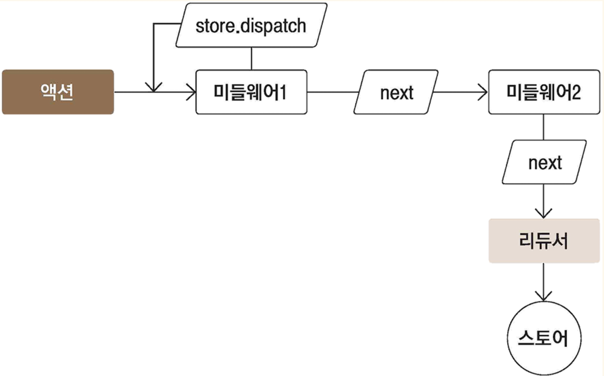
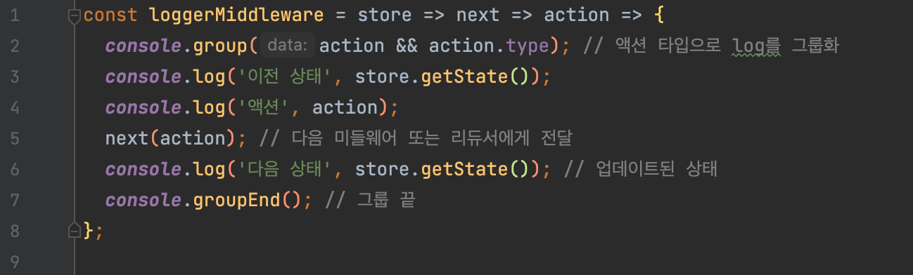
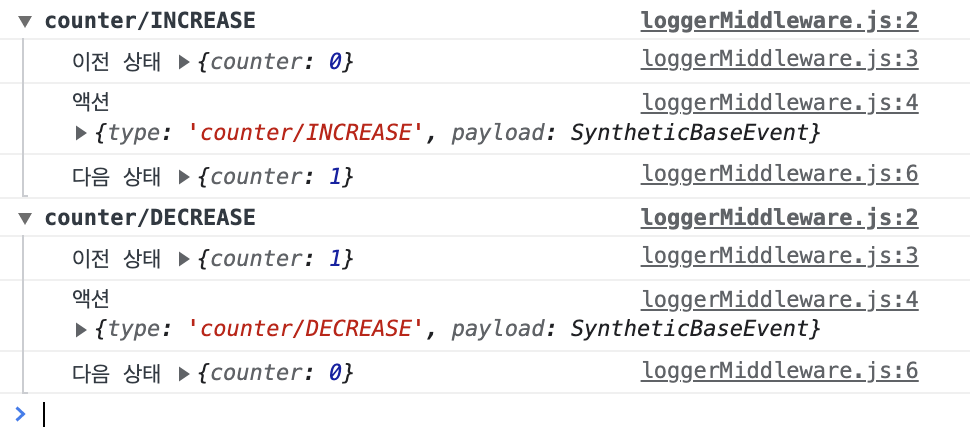
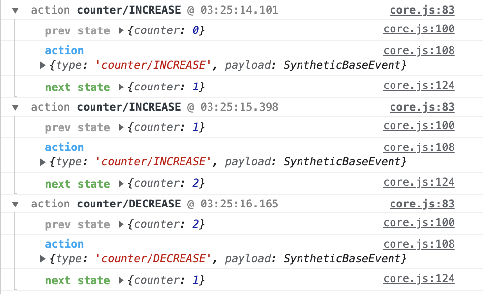

# Redux-Middleware

## 프로젝트 생성

### 라이브러리 설치

```
yarn add redux react-redux redux-actions
```

<br><br>

## 미들웨어 

액션을 디스패치했을 때, 리듀서에서 처리하기 전에 사전 지정된 작업을 실행   

> `액션` ➡️ `💡미들웨어` ➡️ `리듀서` ➡️ `스토어`

### 미들웨어가 하는 일 

1. 전달받은 액션을 콘솔에 기록하기
2. 전달받은 액션 정보를 기반으로 액션을 취소하기
3. 다른 종류의 액션을 추가로 디스패치하기 

📌 **네트워크 요청 등의 비동기 작업 관리에 매우 유용**

<br><br>

## 미들웨어 생성 

직접 만들어 사용할 일은 드물지만, 직접 만들어보면 미들웨어의 작동 방식을 이해하기 좋음  
원하는 미들웨어를 찾을 수 없을 때는 1. 직접 만들기 2. 기존의 미들웨어를 커스터마이징 

미들웨어는 `함수를 반환하는 함수`를 반환하는 함수  
💡 next를 호출하면 그 다음 처리해야할 미들웨어에게 액션을 넘겨주고, 그 다음 미들웨어가 없다면 리듀서에게 액션을 넘겨줌 



* 미들웨어 내부에서 store.dispatch를 사용하면 첫 번째 미들웨어부터 다시 처리 
* 미들웨어에서 next를 사용하지 않으면 액션이 리듀서에 전달되지 않음 (= 액션이 무시)

```js
const loggerMiddleware = store => next => action => {
  // 미들웨어 기본 구조
};

// 동일 코드
const loggerMiddleware = function loggerMiddleware(store) { // 리덕스 스토어 인스턴스 
  return function(next) { // 함수 형태, store.dispatch와 비슷한 역할 
    return function(action) { // 디스패치된 액션 
      // 미들웨어 기본 구조
    }
  }
}

export default loggerMiddleware;
```

```js
// 스토어 생성 과정에서 적용 
import loggerMiddleware from './lib/loggerMiddleware';

const store = createStore(rootReducer, applyMiddleware(loggerMiddleware));
```

<br>

### 예시





<br><br>

## 📌 redux-logger

리덕스 미들웨어를 사용할 때는 미리 완성된 미들웨어를 라이브러리로 설치해 사용하는 경우가 많음  

### 라이브러리 설치

```
yarn add redux-logger
```

```js
// 적용 
import { createLogger } from 'redux-logger';

const logger = createLogger();
const store = createStore(rootReducer, applyMiddleware(logger));
```



* 콘솔에 색상
* 액션 디스패치 시간

<br><br>

## 📌 redux-thunk

리덕스 프로젝트에서 비동기 작업을 처리할 때 가장 많이 사용하는 미들웨어  
리덕스 창시자인 댄 아브라모프(Dan Abramov)가 만듦  
리덕스 공식 매뉴얼에서도 이 미들웨어를 사용하여 비동기 작업을 다루는 예시를 보여줌

* 객체가 아닌 `함수 형태의 액션`을 디스패치할 수 있도록 해줌
* 함수 형태의 액션을 디스패치해서, 미들웨어에서 해당 함수에 스토어의 dispatch와 getState를 파라미터로 넣어서 사용하는 원리
* 일반 함수로 이루어져 있어서 간단함
* `Thunk` : 특정 작업을 나중에 할 수 있도록 미루기 위해 함수 형태로 감싼 것

### 라이브러리 설치

```
yarn add redux-thunk
```

```js
// 적용 
import ReduxThunk from 'redux-thunk';

const logger = createLogger();
const store = createStore(rootReducer, applyMiddleware(logger, ReduxThunk));
```

<br>

### 예시

```js
const sampleThunk = () => (dispatch, getState) => {
    // 현재 상태를 참조할 수 있고, 
    // 새 액션을 디스패치 할 수도 있다.
}
```

* 처음 사용할 때는 작성해야 하는 코드가 많아서 불편할 수 있음
* 유용한 함수와 리듀서를 만들어서 상태를 관리하면 깔끔한 코드로 구현할 수 있음

<br><br>

## 📌 redux-saga

redux-thunk 다음으로 가장 많이 사용되는 비동기 작업 관련 미들웨어 라이브러리  
특정 액션이 디스패치되었을 때, 정해진 로직에 따라 다른 액션을 디스패치시키는 규칙을 작성해 비동기 작업을 처리

* ES6의 **제너레이터(generator)** 함수 문법을 사용해서 진입장벽이 있음
* 디스패치하는 액션을 모니터링해서 그에 따라 필요한 작업을 따로 수행할 수 있는 미들웨어
* 대부분의 경우에는 redux-thunk로도 기능을 구현할 수 있음  

### redux-saga를 이용하면 좋은 까다로운 상황

* 기존 요청을 취소 처리해야 할 때(불필요한 중복 요청 방지)
* 특정 액션이 발생했을 때 다른 액션을 발생시키거나, API 요청 등 리덕스와 관계없는 코드를 실행할 때
* 웹소켓을 사용할 때
* API 요청 실패 시 재요청해야 할 때

### 제너레이터 함수 문법

💡 함수를 작성할 때 함수를 특정 구간에 멈춰 놓을 수 있고, 원할 때 다시 돌아가게 할 수도 있음

* 제너레이터 문법 : `function*`
* 제너레이터 함수 : 사가 saga

```js
// 1️⃣
function* generatorFunction() {
    console.log('안녕하세요');
    yield 1;
    console.log('제너레이터 함수');
    yield 2;
    console.log('function*');
    yield 3;
    return 4;
}

// 제너레이터 생성
const generator = generatorFunction();

// 한 줄씩 실행
generator.next();
// 안녕하세요
// {value: 1, done: false}
generator.next();
// 제너레이터 함수
// {value: 2, done: false}
generator.next();
// function*
// {value: 3, done: false}
generator.next();
// {value: 4, done: true}
generator.next();
// {value: undefined, done: true}
```

```js
// 2️⃣ next에 파라미터 전달 
function* sumGenerator() {
    console.log('sumGenerator가 만들어졌습니다.');
    let a = yield;
    let b = yield;
    yield a + b;
}

// 제너레이터 생성
const sum = sumGenerator();

// 한 줄씩 실행
sum.next();
// sumGenerator가 만들어졌습니다.
// {value: undefined, done: false}
sum.next(1);
// {value: undefined, done: false}
sum.next(2);
// {value: 3, done: false}
sum.next();
// {value: undefined, done: true}
```

```js
// 3️⃣ redux-saga 작동 원리 
function* watchGenerator() {
    console.log('모니터링 중...');
    let prevAction = null;
    while(true) {
        const action = yield;
        console.log('이전 액션: ', prevAction);
        prevAction = action;
        if(action.type === 'HELLO') {
            console.log('안녕하세요!');
        }
    }
}

// 제너레이터 생성
const watch = watchGenerator();

// 한 줄씩 실행
watch.next();
// 모니터링 중...
// {value: undefined, done: false}
watch.next({ type: 'TEST' });
// 이전 액션:  null
// {value: undefined, done: false}
watch.next({ type: 'HELLO' });
// 이전 액션:  {type: 'TEST'}
// 안녕하세요!
// {value: undefined, done: false}
```

### 라이브러리 설치

```
yarn add redux-saga
```

```js
// 적용 
import { applyMiddleware, createStore } from 'redux';
import rootReducer, { rootSaga } from './modules';
import { createLogger } from 'redux-logger/src';
import ReduxThunk from 'redux-thunk';
import createSagaMiddleware from 'redux-saga';

const logger = createLogger();
const sagaMiddleware = createSagaMiddleware();
const store = createStore(
  rootReducer,
  applyMiddleware(logger, ReduxThunk, sagaMiddleware)
);
sagaMiddleware.run(rootSaga);
```

### 리덕스 개발자 도구 라이브러리  

```
yarn add redux-devtools-extension
```

```js
import { composeWithDevTools } from 'redux-devtools-extension';

const store = createStore(
  rootReducer,
  composeWithDevTools(applyMiddleware(logger, ReduxThunk, sagaMiddleware)),
);
```

composeWithDevTools를 리덕스 미들웨어와 함께 사용할 경우

> https://redux-saga.js.org/


