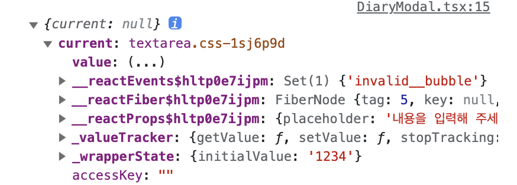
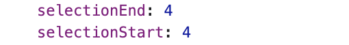
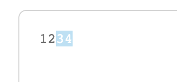

# input 커서 위치 조정하기 

## 개요

렌더링 후 커서의 위치를 동적으로 조정하는 방법 - `useRef`를 이용

```tsx
import {ChangeEvent, useEffect, useRef, useState} from 'react';

export default function DiaryModal({diaryText, onClose, onSubmit}: ModalProps) {
    const [modalInput, setModalInput] = useState<string>(diaryText || '');
    const textareaRef = useRef<HTMLTextAreaElement | null>(null);

    useEffect(() => {
        if (textareaRef.current) {
            const inputLength = modalInput.length;
            textareaRef.current?.setSelectionRange(inputLength, inputLength);
            textareaRef.current?.focus();
        }
    }, [textareaRef]);

    return (
        <Container>
            <TextContainer
                placeholder="내용을 입력해 주세요"
                value={modalInput}
                onChange={handleChangeModalInput}
                ref={textareaRef}
            />
            {/*...*/}
        </Container>
    );
}
```

<br><br>

## input/textarea 프로퍼티

`<input>`과 `<textarea>` 등의 form 요소들은 선택을 위한 API를 제공

input/textarea의 프로퍼티 selectionStart와 selectionEnd

* `input.selectionStart` : 선택 시작 위치 (쓰기 가능)
* `input.selectionEnd` : 선택 끝 위치 (쓰기 가능)
* `input.selectionDirection` : 선택 방향
    * 다음 중 하나 : 'forward' (앞쪽), 'backward' (뒤쪽) 또는 'none' (더블 마우스 클릭으로 선택한 경우)

<br>

### 콘솔에서 확인허기

```js
console.log(textareaRef);
```





<br><br>

## setSelectionRange 메소드

HTMLInputElement.setSelectionRange() 메소드는 `<input>`, `<textarea>` 요소 내에서 현재 텍스트 선택의 시작 및 끝 위치를 설정

```js
setSelectionRange(selectionStart, selectionEnd)
setSelectionRange(selectionStart, selectionEnd, selectionDirection)
```

<br>

### 직접 수정하기

```js
useEffect(() => {
  if (textareaRef.current) {
    textareaRef.current?.focus();
    
    inputFocus.current.selectionStart = inputFocus.current.selectionEnd = modalInput.length;
  }
}, [textareaRef]);
```

<br>

### 메소드 사용하기

```tsx
useEffect(() => {
    if (textareaRef.current) {
        const inputLength = modalInput.length;
        textareaRef.current?.setSelectionRange(inputLength, inputLength);
        textareaRef.current?.focus();
    }
}, [textareaRef]);
```

<br><br>

## 블록 처리하기

텍스트에 블록 처리하는 방법  
시작과 끝의 length를 1 이상 차이가 나도록 설정

```js
const inputLength = modalInput.length;
textareaRef.current?.setSelectionRange(inputLength - 2, inputLength);
textareaRef.current?.focus();
```



<br><br>

## 참고 사이트

> https://fe-developers.kakaoent.com/2021/211104-setselectionrange/  
> https://developer.mozilla.org/en-US/docs/Web/API/HTMLInputElement/setSelectionRange  
> https://ko.javascript.info/selection-range#ref-847
