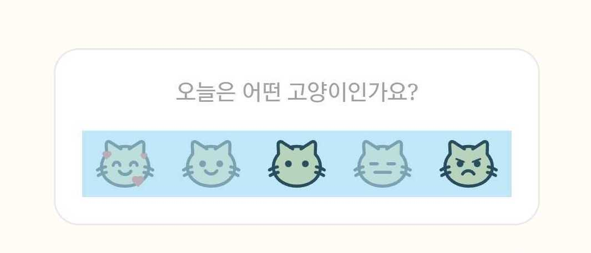
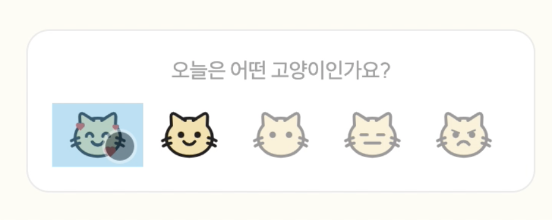

# React

## item 대신 list가 선택되는 이슈 해결하기

### 문제 파악하기 

> 📌 아이템을 클릭했을 때, 개별 요소 대신 리스트가 선택되는 문제



<br><br>

## 해결 과정 1 : 버블링 중단하기

하위 요소에서 상위 요소로의 이벤트 전파 중단하기 

```ts
event.stopPropagation();
```

```ts
const handleClickFeeling = (e) => {
    event.stopPropagation();
    onClick(feeling);
}

```

> 🚨 해결 X

<br><br>

## 해결 과정 2 : 컴포넌트 분리하기 

기존의 `FeelingContainer`에서 ``를 렌더링하는 부분을 `FeelingItem` 컴포넌트로 분리

```tsx
// 기존 FeelingContainer.tsx

export function FeelingContainer({ diary, onClick }: FeelingContainerProps) {
  return (
    <Container>
      <Typography variant="subtitle4" color={styleToken.color.gray3}>
        오늘은 어떤 고양이인가요?
      </Typography>
      <FeelingCatList>
        <>
          {FEELING_CAT_TYPE.map((el, index) => {
            const isSelected = el.feeling === diary.feel;

            return (
              <FeelingItem
                key={el.feeling}
                feeling={el.feeling}
                imgSrc={el.url}
                isSelected={isSelected}
                onClick={onClick}
              />
            );
          })}
        </>
      </FeelingCatList>
    </Container>
  );
}
```

```tsx
// 분리한 FeelingItem.tsx

export function FeelingItem({ feeling, imgSrc, isSelected, onClick }: FeelingItemProps) {
  return (
    <Container isSelected={isSelected} onClick={() => onClick(feeling)}>
      
    </Container>
  );
}

const Container = styled.div<{ isSelected: boolean }>`
  width: 100%;
  height: 100%;
  display: flex;
  flex-direction: row;
  justify-content: center;
  align-items: center;

  img {
    width: 70%;
    height: auto;
    opacity: ${(props) => (props.isSelected ? '100%' : '45%')};

    :hover {
      opacity: 100%;
    }
  }
`;
```

> 🚨 해결 X

<br><br>

## 해결 과정 3 : 스타일링 보완 

스타일 보완 중 `cursor: pointer`의 선언 위치 변경 -> 해결  

```tsx
// FeelingContainer.tsx

export function FeelingContainer({ diary, onClick }: FeelingContainerProps) {
  return (
    <Container>
      <Typography variant="subtitle4" color={styleToken.color.gray3}>
        오늘은 어떤 고양이인가요?
      </Typography>
      <FeelingCatList>
        <>
          {FEELING_CAT_TYPE.map((el) => {
            const isSelected = el.feeling === diary.feel;

            return (
              <FeelingItem
                key={el.feeling}
                feeling={el.feeling}
                imgSrc={el.url}
                isSelected={isSelected}
                onClick={onClick}
              />
            );
          })}
        </>
      </FeelingCatList>
    </Container>
  );
}

const FeelingCatList = styled.div`
  margin-top: 12px;
  width: 100%;
  height: 100%;
  display: flex;
  flex-direction: row;
  justify-content: center;
  align-items: center;
  cursor: pointer; <--- 🚨 문제가 되는 부분
`;
```

```tsx
// FeelingItem.tsx

export function FeelingItem({ feeling, imgSrc, isSelected, onClick }: FeelingItemProps) {
  return (
    <Container isSelected={isSelected} onClick={() => onClick(feeling)}>
      
    </Container>
  );
}

const Container = styled.div<{ isSelected: boolean }>`
  width: 100%;
  height: 100%;
  display: flex;
  flex-direction: row;
  justify-content: center;
  align-items: center;
  cursor: pointer; <--- ✅ 해결 
`;
```

<br><br>

## 해결


