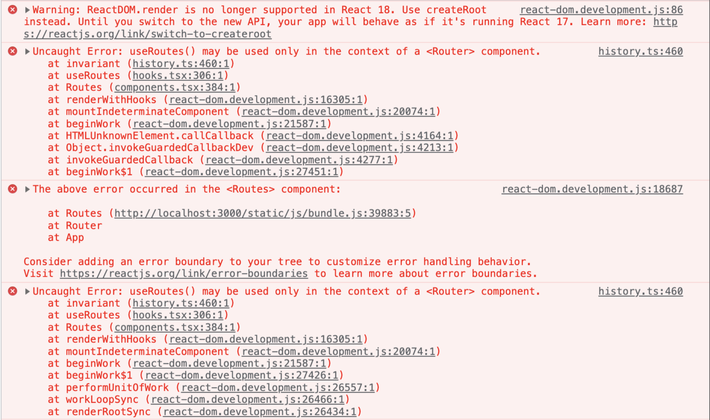

# React Router

## 에러  

> Uncaught Error: useRoutes() may be used only in the context of a `<Router>` component.   
> useRoutes는 `<Router>`로 감싸야 한다.



<br><br>

## 해결 방법

```js
// Router.tsx

import { Route, Routes } from 'react-router-dom';
import React from 'react';

import { PATH } from './lib/const/path';
import {
  SignInPage, SignUpPage, Component, Home,
} from './ui/pages';

const Router = () => (
  <Routes>
    <Route path={PATH.HOME} element={<Home />} />
    <Route path={PATH.SIGN_IN} element={<SignInPage />} />
    <Route path={PATH.SIGN_UP} element={<SignUpPage />} />
    <Route path={PATH.COMPONENT} element={<Component />} />
  </Routes>
);

export default Router;
```

`import { BrowserRouter as Router } from 'react-router-dom'`을 Router에서 직접 사용하지 않고, index.tsx 파일에 추가한다. 
* 컴포넌트 이름 Router가 Router라는 속성과 겹치면 오류 발생

<br>

```js
// index.tsx

import React from 'react';
import ReactDOM from 'react-dom';
import { BrowserRouter } from 'react-router-dom';

import App from './App';

ReactDOM.render(
  <BrowserRouter>
    <App />
  </BrowserRouter>,
  document.getElementById('root'),
);
```

index.tsx 파일에서 App 컴포넌트를 감싸줄 때 BrowserRouter를 추가한다.

