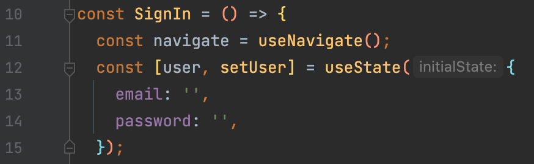
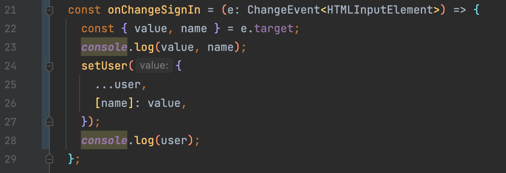
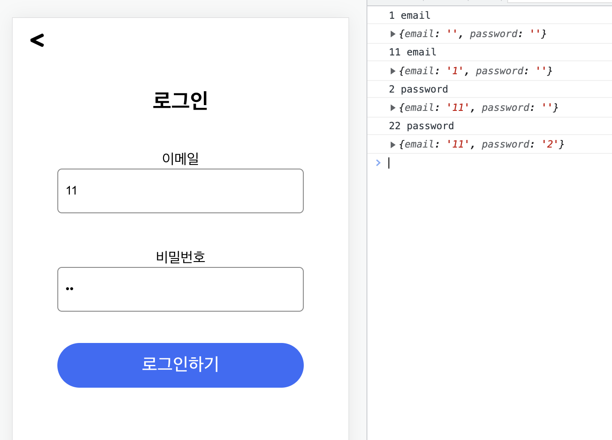
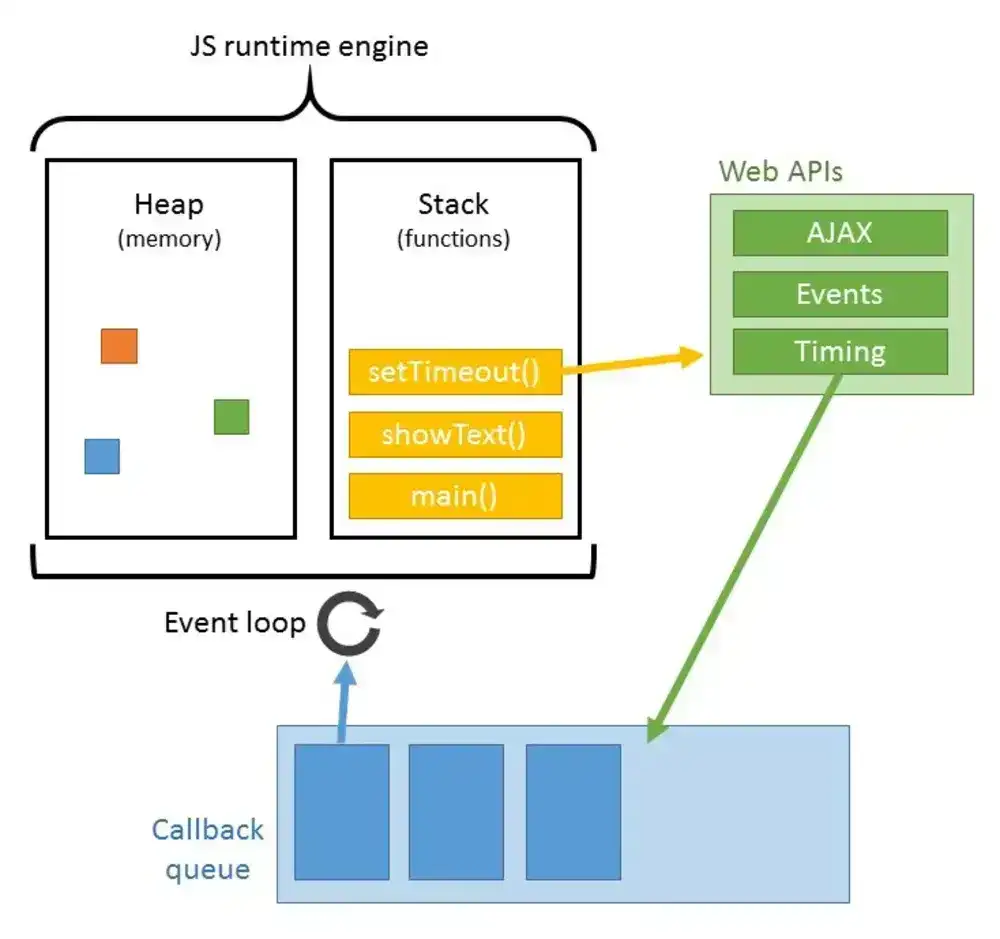

# React Hooks

## useState

React 버전 16.8부터 React 요소로 새로 추가   
Hook을 이용하여 기존 Class 바탕의 코드를 작성할 필요 없이 `상태 값`과 여러 React의 기능을 사용 가능

```js
  // "state"라는 새로운 상태 값을 정의
  const [state, setState] = useState(0);
```

<br><br>

## 활용 방법

> 🎯 로그인 창에서 input에 입력하는 값을 useState로 관리하기

<br>

### 1️⃣ setState 추가 



* 입력값을 받을 user와, user값을 업데이트 해줄 setUser 생성
* 각 input의 초기값으로 email, password가 담긴 오브젝트
* email, password 초기값은 공백으로 처리

<br>

### 2️⃣ onChange 함수 생성



* e.target으로 이벤트 값 가져오기
* 💡 `불변성 유지`를 위해 스프레드 연산자를 사용해 기존의 state값을 유지
* 각 e.target의 name에 value 값 넣기 
  * 오브젝트의 키 값으로 사용

<br>

### 3️⃣ 콘솔 확인 



1. `console.log(value, name)`  
2. `console.log(user)`

<br>

### ⚠️️ setState의 비동기 처리

#### setUser는 비동기로 처리됨



1. setState가 콜스택에 들어감
   * 콜스택에는 한 번에 하나의 함수만 등록
2. 비동기 객체이기 때문에 바로 Web APIs로 넘어감(콜스택에서 비워짐) 
   * Web APIs에서 time 처리가 끝남
3. 값이 콜백 큐로 들어감 
4. 이벤트 루프를 돌면서 다시 콜스택에 들어가야 하는데, 콜스택에 이미 console.log(user) 존재
5. 콜 스택이 비워질 때까지 기다리다가 들어감

#### 💡 콘솔에 값이 한 박자 늦게 찍히는 이유

<br><br>

## 참고 사이트

> https://ko.reactjs.org/docs/hooks-intro.html  
