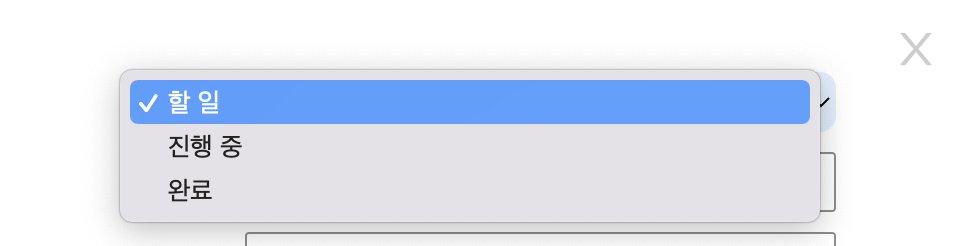

# HTML

## select 태그

`select` 태그는 옵션 메뉴를 제공하는 드롭다운 리스트를 정의할 때 사용  
`select` 요소 내부의 `option` 요소는 드롭다운 리스트에서 사용되는 각각의 옵션을 정의

<br><br>

## react에서 사용하는 방법

* React에서는 selected 대신 value를 사용 
* selected의 선택된 value 값을 가져오기 위해 onChange 사용

<br><br>

## 예시



```js
const issueStateData = ['할 일', '진행 중', '완료'];
const [selectedState, setSelectedState] = useState('할 일');
const [userInput, setUserInput] = useState({
    state: selectedState
});

// onChange 함수
const handleChangeInput = (e: any) => {
    const { value, name } = e.target;
    if (value === '') {
        setIsOpenSearchList(false);
    }
    setUserInput({
        ...userInput,
        [name]: value,
    });
}

// return 
<SelectState onChange={handleChangeInput} name="state" value={userInput.state}>
    {issueStateData.map((item: string) => (
        <option value={item} key={item}>
            {item}
        </option>
    ))}
</SelectState>

// styled-components
const SelectState = styled.select`
  width: 100%;
  height: 30px;
  padding: 2px 12px;
  background-color: #e1efff;
  border: none;
  border-radius: 8px;
  outline: none;
`;
```

<br><br>

## 참고 사이트

> https://developer.mozilla.org/ko/docs/Web/HTML/Element/select  
> https://wazacs.tistory.com/31
