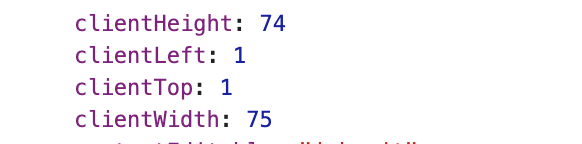

# useRef로 반응형 구현하기

## ref.current

`current`는 ref 객체의 값이 저장되는 프로퍼티  
ref.current로 접근할 수 있는 DOM 요소 중 Width, Height 등이 있음



<br><br>

## useRef 이용하기

* useEffect를 이용해 브라우저가 렌더링될 때, containerRef가 변경될 때의 clientWidth 값으로 width 값을 업데이트
* width의 값을 받아 height값을 변경시킴 

```tsx
export function EmotionItem({ emotion, imgSrc, isSelected, onClick }: EmotionItemProps) {
  const containerRef = useRef<HTMLDivElement | null>(null);
  const [width, setWidth] = useState(0);

  useEffect(() => {
    if (containerRef.current) {
      console.log(containerRef.current?.clientWidth);
      setWidth(containerRef.current?.clientWidth || 0);
    }
  }, [containerRef]);

  return (
    <Container onClick={() => onClick(emotion)} ref={containerRef}> 
      <EmotionHeader isSelected={isSelected} height={width}>
        
      </EmotionHeader>
      <EmotionBody>{emotion}</EmotionBody>
    </Container>
  );
}


const EmotionHeader = styled.div<{ isSelected: boolean; height: number }>`
  width: 100%;
  height: ${(props) => props.height}px;
  // ...
`;
```

<br><br>

## 참고 사이트

> https://www.thecodeforge.io/post/react-get-the-height-or-width-of-an-element
