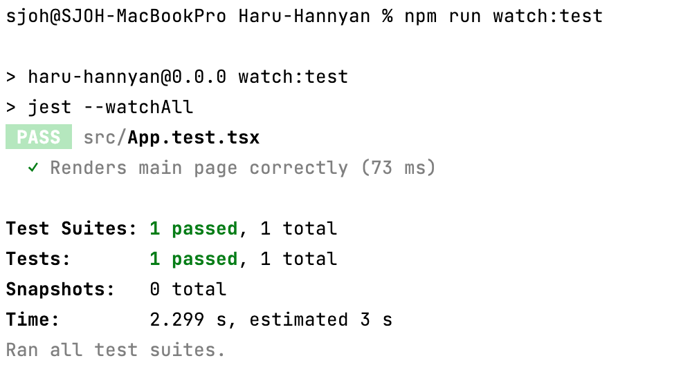

# Test

## 설정 방법

### 1. vite 프로젝트 세팅

```
npm create vite@latest . --template react-ts
```

<br>

### 2. Jest 패키지 설치

```
// npm
npm install -D jest @types/jest ts-node ts-node ts-jest @testing-library/react identity-obj-proxy jest-environment-jsdom @testing-library/jest-dom jest-svg-transformer

// yarn
yarn add -D jest @types/jest ts-node ts-node ts-jest @testing-library/react identity-obj-proxy jest-environment-jsdom @testing-library/jest-dom jest-svg-transformer
```

<br>

### 3. `package.json`에 script 추가 

```
  "scripts": {
    "test": "jest --silent",
    "watch:test": "jest --watchAll",
  }
```

* "watch:test" 명령어의 경우, 변경이 있을 때 자동으로 테스트 실행 
* 💡 husky를 사용하는 경우, lint-staged에 'npm run test' 명령 추가
* 💡 github actions ci를 사용하는 경우, 명령 추가 

<br>

### 4. `jest.config.ts` 파일 생성

```ts
export default {
  testEnvironment: "jsdom",
  transform: {
    "^.+\\.tsx?$": "ts-jest",
  },
  moduleNameMapper: {
    "^.+\\.svg$": "jest-svg-transformer",
    "\\.(css|less|sass|scss)$": "identity-obj-proxy",
  },
  setupFilesAfterEnv: ["<rootDir>/jest.setup.ts"],
};
```

<br>

### 5. `jest.setup.ts` 파일 생성

```ts
import "@testing-library/jest-dom/extend-expect";
```

### eslint 에러 발생 시, `.eslintrc` 파일에 내용 추가

```
  "env": {
    "jest": true
  },
  "extends": [
    "plugin:react/jsx-runtime",
  ],
```

<br>

### 6. `tsconfig.json` 파일에 내용 추가

```
{
    "compilerOptions":{
        "esModuleInterop": true      
    }
}
```

<br>

### 7. 테스트 코드 추가 

#### `App.test.tsx` 파일 생성

```tsx
// Imports
import { render, screen, fireEvent } from "@testing-library/react";

// To Test
import App from "./App";

// Tests
test("Renders main page correctly", async () => {
  // Setup
  render(<App />);
  const buttonCount = await screen.findByRole("button");
  const codeCount = await screen.queryByText(/The count is now:/);

  // Pre Expecations
  expect(buttonCount.innerHTML).toBe("count is 0");
  // Instead of:
  expect(codeCount).toBeNull();
  expect(codeCount).not.toBeInTheDocument();

  // Init
  fireEvent.click(buttonCount);
  fireEvent.click(buttonCount);

  // Post Expectations
  expect(buttonCount.innerHTML).toBe("count is 2");
  expect(await screen.queryByText(/The count is now:/)).toBeInTheDocument();
});
```

#### `App.tsx` 파일 수정

```tsx
import { useState } from "react";
import reactLogo from "./assets/react.svg";
import viteLogo from "/vite.svg";
import "./App.css";

function App() {
  const [count, setCount] = useState(0);

  return (
    <>
      <div>
        <a href="https://vitejs.dev" target="_blank">
          
        </a>
        <a href="https://react.dev" target="_blank">
          
        </a>
      </div>
      <h1>Vite + React1</h1>
      <div className="card">
        <button onClick={() => setCount((count) => count + 1)}>
          count is {count}
        </button>
        {count > 0 ? (
          <p>
            <code>The count is now: {count}</code>
          </p>
        ) : null}
        <p>
          Edit <code>src/App.tsx</code> and save to test HMR
        </p>
      </div>
      <p className="read-the-docs">
        Click on the Vite and React logos to learn more
      </p>
    </>
  );
}

export default App;
```

<br>

### 8. 테스트 실행 

```
// npm 
npm run test

// yarn
yarn test
```

#### 테스트 통과 확인 



<br><br>

## 참고 사이트 

> https://github.com/vitejs/vite/tree/main/packages/create-vite  
> https://codingwithmanny.medium.com/quick-jest-setup-with-vitejs-react-typescript-82f325e4323f
