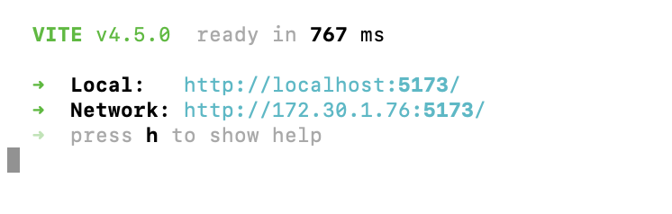

# React

## 개발 중인 웹페이지 모바일로 미리보기

프로젝트 디렉토리에 진입 후, 터미널에 명령어 입력

> vite --host 0.0.0.0 --port 5173

* vite, npm, react, typescript 사용하는 프로젝트의 예시

  

## 오류 발생 시 해결 방법

### 오류 메시지

> 🚨 zsh: command not found: vite

 

### 터미널에 명령어 입력하기

1번으로 해결되지 않는 경우 2번 명령어 입력

1. `npm i -g vite`
2. `sudo npm install -g vite`

  

## 모바일로 접속하기

**Network 주소로 접속하기**  
PC로 사이트에 접속될 경우, 모바일에서도 동일한 주소로 접속

 

### 주의점 

* 스마트폰과 PC가 **동일한 Wi-Fi**를 사용할 것  
* `http://`까지 포함해서 입력하기 
