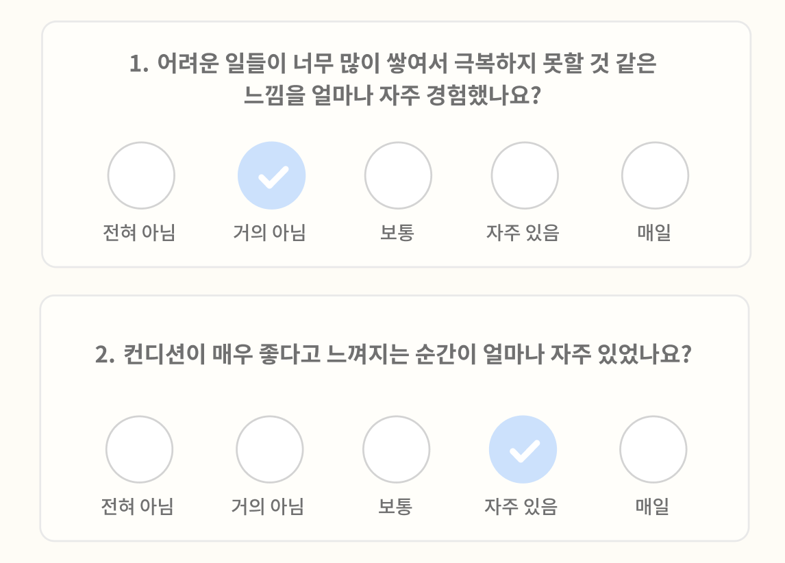

# 라디오 버튼 구현하기

## 라디오 버튼

1. `<ladel>` 태그로 감싸기 
2. `<ladel>` 태그 하위에 `<input>` 태그 삽입
   * `type="radio"`
   * ⚠️ name 지정 시 주의 - 라디오 그룹 묶음을 정의
3. `<input>` 태그 스타일링 `visibility: hidden`
4. `<i>` 태그 이용해 `<input>` 태그 대신 스타일링
5. `input[type='radio']:checked + i` 를 선택해, 라디오 버튼이 클릭되었을 때의 스타일을 지정
6. `input[type='radio']:checked + i:before` 를 선택해, 클릭한 라디오 버튼에 추가할 스타일을 지정
   * 체크 ✅ 표시를 생성하고 싶은 경우 직사각형을 이용
   * transform과 border를 사용해 직사각형을 기울여 체크 표시처럼 보이도록 border 지정
   * 가상 선택자를 사용할 때는 `content` 필수 작성

<br><br>

## 예시



```tsx
{
    AnswerTitle.map((answer) => (
        <Radio key={answer.text}>
            <input
                type="radio"
                name={`question-${questionIndex}`}
                value={answer.score}
                onChange={(e) => handleChangeAnswer(e, questionIndex)}
            />
            <i/>
            <Typography variant="body4" style={{marginTop: 8}}>
                {answer.text}
            </Typography>
        </Radio>
    ))
}
```

```tsx

const Radio = styled.label`
  width: 50px;
  position: relative;
  display: flex;
  flex-direction: column;
  justify-content: center;
  align-items: center;
  text-align: center;
  cursor: pointer;

  i {
    position: relative;
    display: inline-block;
    height: 36px;
    width: 36px;
    outline: 0;
    background: ${styleToken.color.white};
    border: 1px solid ${styleToken.color.gray4};
    border-radius: 50%;
  }

  input {
    visibility: hidden;
    vertical-align: middle;
    position: absolute;
    height: 100%;
  }

  input[type='radio']:checked + i {
    background-color: ${styleToken.color.secondary};
    border: unset;
  }

  input[type='radio']:checked + i:before {
    content: '';
    display: block;
    position: absolute;
    top: 20%;
    left: 55%;
    transform: rotate(-45deg) translate(-50%, -50%);
    width: 49%;
    height: 30%;
    border-bottom: 2px solid ${styleToken.color.white};
    border-left: 2px solid ${styleToken.color.white};
  }
`;
```
