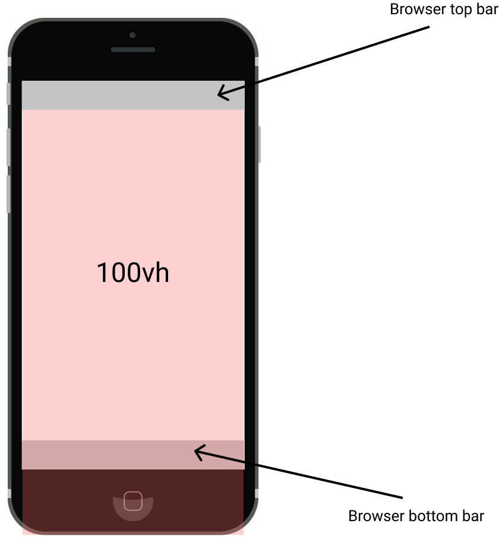

# 모바일 전체화면

## 반응형 단위 vh
뷰포트 단위(반응하는 단위) : vw, vh, vmin, vmax
* 앞에 붙는 숫자가 백분율

<br><br>

## 100vh
상단 url을 입력하는 영역과, 하단 네비게이션 영역의 사이즈를 포함



<br><br>

## 해결 방법
### 1️⃣ innerHeight 값을 구해 --vh라는 속성으로 새로 정의하는 함수 생성

```javascript
funciton setScreenSize() {
  let vh = window.innerHeight * 0.01;

  document.documentElement.style.setProperty('--vh', `${vh}px`);
}

setScreenSize();
```

<br>

### 2️⃣ 기존에 사용했던 vh단위를 --vh로 교체

```javascript
height: calc(var(--vh, 1vh) * 100);
```
* 함수의 첫번째 인수는 대체할 사용자 지정 속성의 이름이고, 두번째 인수는 대체 값으로 사용
* 첫번째 인수에서 참조하는 사용자 지정 속성이 유효하지 않은 경우, 함수는 두번째 값을 사용
* 두번째 인수는 생략 가능

<br>

### 3️⃣ 스크린 사이즈가 변경될 때마다 --vh의 크기 변경

```javascript
window.addEventListener('resize', () => setScreenSize());
```
* useEffect 안에 추가

<br>

### 4️⃣ body 스크롤 막기
모바일에서 스크롤 방지하기

> **1. overflow와 touch-action 설정** 

body 부분에 overflow를 hidden으로 설정하면 콘텐츠의 크기가 화면에 알맞게 설정 <br> 

```javascript
body {
  overflow: hidden;
  touch-action: none;
}
```

<br>

> **2. position: fixed 설정**

```javascript
body {
  position: fixed;
  overflow: hidden;
  touch-action: none;
}
```

<br>

> **3. 스크롤 이벤트 자체 제거**

모바일 스크롤을 막기 위해서는 touchmove, onclick, mousewheel 세가지 이벤트를 모두 막아야 한다.

```javascript
disableScroll = () => {
    document.querySelector('body').addEventListener('touchmove', this.removeEvent, { passive: false });
    document.querySelector('body').addEventListener('onclick', this.removeEvent, { passive: false });
    document.querySelector('body').addEventListener('mousewheel', this.removeEvent, { passive: false });
  }

  removeEvent = e => {
    e.preventDefault();
    e.stopPropagation();
  }

  enableScroll = () => {
    document.querySelector('body').removeEventListener('touchmove', this.removeEvent);
    document.querySelector('body').removeEventListener('onclick', this.removeEvent);
    document.querySelector('body').removeEventListener('mousewheel', this.removeEvent);
  }
```