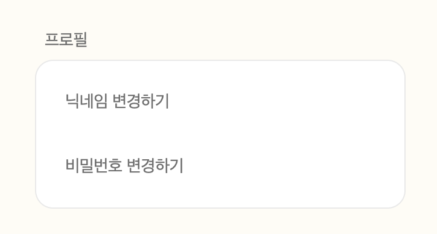
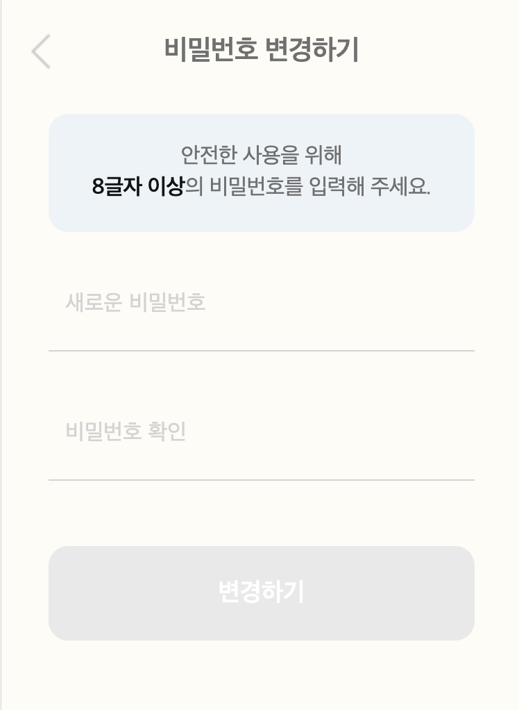
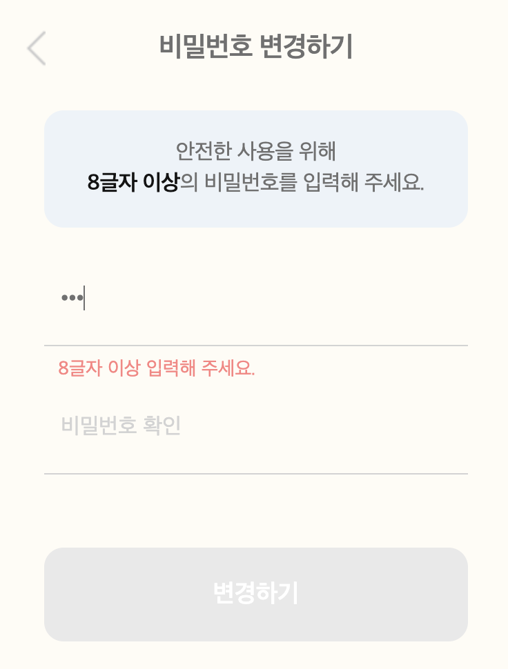

# React 

## 비밀번호 변경하기 구현

> 변경하기 PUT/PATCH API 필요

 

### 1. 변경하기 버튼 구현

버튼 클릭 시 `변경하기 페이지`로 이동 처리 

 

### 2. 변경 페이지 UI 구현

* 기존 비밀번호 입력란 추가하기
* 새로운 비밀번호 입력한
* 비밀번호 확인란
* 변경하기 버튼

 

### 3. 변경 페이지 기능 구현

* 유효성 검사 기능 추가 - 변경 버튼 클릭 시 
* API 연동

