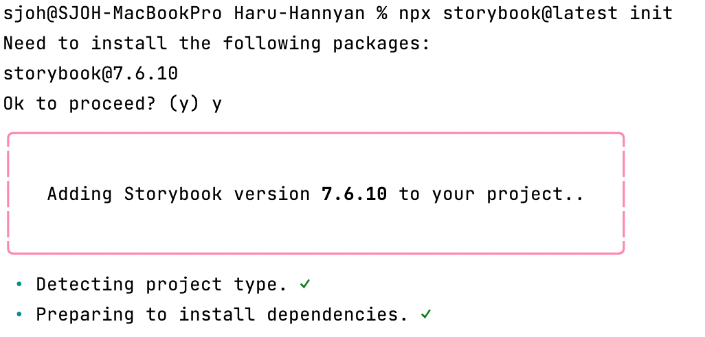
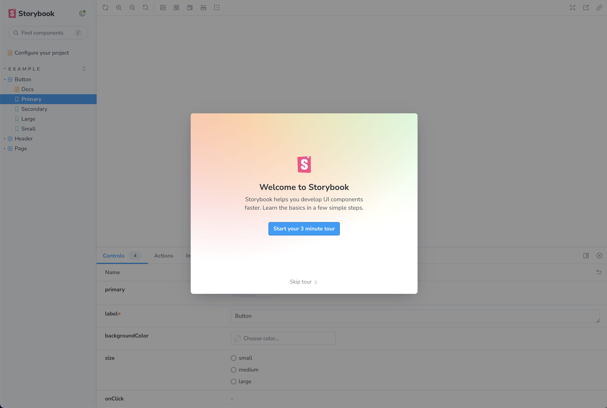
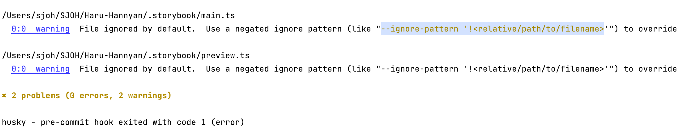

# StoryBook

## 설치 방법 

### 패키지 다운로드

* 작업할 브랜치 생성 `feat/storybook`

```
npx storybook@latest init
```

* story 파일이 자동으로 생성됨 





<br>

### 오류 해결

> 🚨 story 파일을 그대로 `git add, commit` 하면 husky 이슈와 eslint 이슈가 발생



#### `package.json`에 명령어 추가 후 `git add, commit`

```
“scripts”: {
    // 생략  
    “lint”: “eslint src --ext ts,tsx --report-unused-disable-directives --max-warnings 0 --ignore-pattern ‘!<.storybook/**/*>’“
},
```

<br>

#### 동일한 에러가 발생할 경우 `.storybook` 파일을 commit할 때만 `package.json`에서 명령어 제외하기

```
“lint-staged”: {
    “*.{ts,tsx}“: [
        “npm run lint”, // ✅ 이 명령어를 삭제해두고, add는 하지 않음 
        “npm run prettier:check”,
        “npm run test”
    ]
},
```

<br>

#### 오류가 재발생하면 다음의 명령어 실행시키기 

```
“prettier:write”: “prettier --write \“src/**/*.{ts,tsx}\“”,
```

* husky, lint, prettier, github actions를 사용하지 않았으면 오류가 발생하지 않았겟지만, 대신 런타임 오류가 발생했을 것

<br><br>

## 스토리 생성하기

> 만들고자 하는 컴포넌트의 이름과 동일하게, 중간에 `.stories.` 붙여서 새 파일 생성 

1. args 사용하기
2. render 사용하기 
3. 혼용해서 사용하기 

```tsx
// BaseButton.stories.tsx

import { Meta, StoryObj } from '@storybook/react';
import { BaseButton } from '@ui/components/common/BaseButton';

const meta: Meta<typeof BaseButton> = {
  title: 'Component/BaseButton',
  component: BaseButton,
};

export default meta;

type Story = StoryObj<typeof BaseButton>;

// 1️⃣
export const Primary: Story = {
  args: {
    colorTheme: 'primary',
    children: 'Button',
  },
};

// 2️⃣
export const Success: Story = {
    render: () => <BaseButton colorTheme="success">Button</BaseButton>,
};

// 3️⃣ 동적으로도 이용 가능
export const Danger: Story = {
  args: {
    colorTheme: 'danger',
  },
  render: (args) => <BaseButton {...args}>Button</BaseButton>,
};
```

<br><br>

## 참고 사이트 

> https://storybook.js.org/tutorials/intro-to-storybook/react/ko/get-started/

