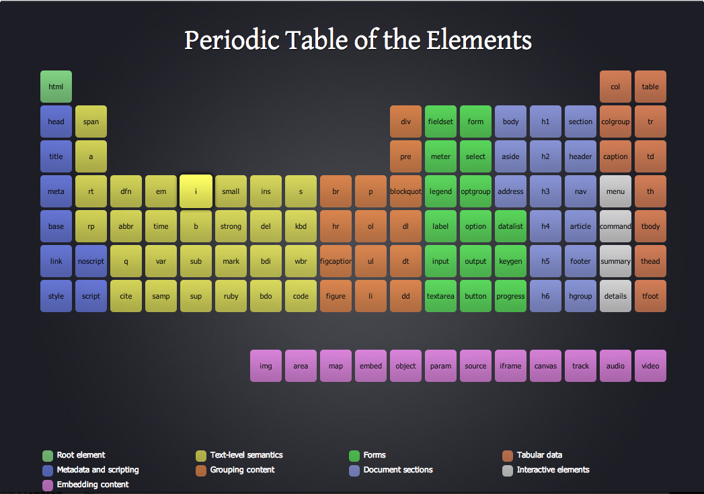

# 스토리북

## Atomic Design Pattern

[Atomic Design by Brad Frost](https://atomicdesign.bradfrost.com/)  
[atomic design](https://bradfrost.com/blog/post/atomic-web-design/)  
[<자동차 인터페이스 디자인>](https://www.aladin.co.kr/shop/wproduct.aspx?ItemId=294960244)

인터페이스 디자인 시스템을 만드는 방법론 + 디자인 패턴

> 💡 아토믹 디자인 패턴은 정답은 아니지만, 개발을 배우며 학습하는 관점에서 좋은 예시이자 방법론
> 
> 아토믹 디자인 패턴을 구성하는 기준 + 리액트스러운 컴포넌트 조합
> * +@ 회사에서 추구하는 비즈니스 가치, 도메인 컨텍스트 고려
> * TPO (Time(시간), Place(장소), Occasion(상황))

<br>

### 인터페이스

어떤 제품을 개발하려고 할 때 표준 문서를 보고 제작하게 됨 -> 인터페이스  
많은 사람들 사이의 약속 

Ex. 가위바위보(복잡해지면 묵찌빠), 신호등  
타입스크립트의 인터페이스도 정의한대로 지켜야함 

five distinct levels in atomic design

* Atoms : 조합x, 인터페이스를 구성하는 가장 작은 단위 
* Molecules : 조합o, Atoms을 조합해서 만든 더 복잡한 컴포넌트 
* Organisms : 조합o, Molecules을 조합해서 만든 더 복잡한 컴포넌트 
* Templates : Atoms, Molecules, Organisms 조합해서 만든 레이아웃  
* Pages : 여러 Templates과 Organisms을 합쳐 만든 것

<br>

### Atomic Design




<br><br>

## CDD

Component Driven Development   
컴포넌트 주도 개발

### 상향식 컴포넌트 개발

* 가장 작은 단위의 하위 컴포넌트를 먼저 개발
* 작은 하위 컴포넌트를 조합해서 전체적인 컴포넌트 완성
* 일반 사용자뿐 아니라, 개발자도 사용할 수 있는 것을 고려해야 함
* 숙련도가 부족하면 YAGNI에 빠질 수 있음
* Ex. 작은 컴포넌트 => Next.js Page 
* Ex. 원자(Atoms) → 분자(Molecules) → 유기체(Organisms) → 템플릿(Templates) → 페이지(Pages) 

<br>

### 하향식 컴포넌트 개발

* 전체 시스템의 큰 구성요소를 먼저 개발
* 이후 중복되는 작은 컴포넌트를 분리하거나, 공통/교차되는 컴포넌트를 분리
* 전체 시스템의 디자인과 구조를 먼저 구성하고, 이를 바탕으로 세부 요소를 개발
* 르블랑의 법칙 
  * 한 번 작성한 쓰레기 코드를 나중에 수정하는 일은 결코 없다
* Ex. Next.js Page => 작은 컴포넌트

<br><br>

## 제어 컴포넌트, 비제어 컴포넌트

[controlled vs uncontrolled inputs react](https://goshacmd.com/controlled-vs-uncontrolled-inputs-react/)

값 유효성 체크를 해야하는 경우(비밀번호)라면 제어  
그럴 필요없이 값을 전달하는 경우라면 비제어

벨리데이션 체크를 실시간으로 하느냐 안하느냐로 효율을 나누면 됨

* 제어 컴포넌트 : 타이핑마다 유효성 체크
* 비제어 컴포넌트 : form 제출 시 한 번 유효성 체크

### 제어 컴포넌트

> Push & Single Source of Truth (진실의 원천)

- 개입이 많음
- `React`에 값이 완전히 제어되는 `Input Element`
- `State`를 값으로 넘기고 그 `State`을 다룰 수 있는 `핸들러`를 콜백으로 넘김
- 값을 ___ 으로 받음

```
// input의 값은 항상 React state의 값
<input value={value} onChange={handleChange} />
```

<br>

### 비제어 컴포넌트

> Pull & get State

- 전통적인 `HTML` 처럼 `DOM`에 제어되는 `Input Element`
- ref는 렌더링이 일어나지 않음
- 오직 사용자만 값과 상호작용
- 값을 ___ 로 사용

```
<input value={value} onChange={handleChange} ref={inputRef} />
```

<br>

### 차이점

|  | Controlled (제어)                                                      | Uncontrolled (비제어)                                               |
| --- |----------------------------------------------------------------------|------------------------------------------------------------------|
| 지향점 | Push                                                                 | Pull                                                             |
| 사용성 | 항상 진실의 원천을 유지                                                        | 값을 담아내는 방법 필요<br> 값을 가져오는 트리거 포인트가 필요 <br> 이 모든 것을 관리하는 코드 직접 작성 |
| 성능 | 잦은 리렌더링                                                              | 구현하는 방법에 따라 다르지만 성능에 이점이 있을 수 있음                                 |
| 동적 핸들링 | 상태를 중심으로 개발하기 때문에 상태 변경에 따른 핸들링이 용이                                  | DOM을 직접 조작하기 때문에 핸들링이 어렵고 값 비싼 비용 지불                             |
| 유효성 검사 | 상태 변경 ⇒ UI 자동으로 업데이트<br>이러한 자동 업데이트로 인해 개발자가 별도의 업데이트 코드를 작성할 필요가 없음 | DOM을 직접 조작하기 때문에 핸들링이 어렵고 값 비싼 비용 지불 |

<br><br>

## 스토리북 상호작용 테스트 

> 올바른 테스트 전략을 선택하기  
> 적당한 도구를 선택하기 

[테스트 트로피](https://kentcdodds.com/blog/the-testing-trophy-and-testing-classifications)

### 테스트 도구

* Jest
* React Testing Library 

<br><br>

## 스토리북

[Storybook](https://storybook.js.org/)

UI 컴포넌트와 페이지를 별도로 구축하기 위한 프론트엔드 워크샵  
UI 개발, 테스트 및 문서화를 위해 사용

실제로 배포하지 않아도 컴포넌트 단위로 만들어서 직접 테스트 가능 

* 확장자에 `stories`가 붙음
* 스토리북7의 핵심

```js
  docs: {
    autodocs: "tag",
  }
  ```

### 장점

기능이 다양해서 단지 컴포넌트만을 위한 도구를 넘어섬

* url 쿼리 파라미터 테스트 가능  
* 링크를 통한 공유
* 개발자-비개발자 소통이 원활 
* 명세서 작성 편리  
* 많은 테스트 도구와의 통합(피그마 플러그인 등)

<br><br>

## 스토리북 환경 세팅

⚠️ 최근 버전 7로 업데이트 되면서 Breaking Changes가 발생했기 때문에 예전 자료로 공부하는 것에 주의

거의 [Zero config](https://ko.wikipedia.org/wiki/Zeroconf) 이기 때문에 개발자가 따로 번거롭게 설정할 것이 없음  

### 1. vite 설치 

[vitejs](https://ko.vitejs.dev/guide/)

```
npm create vite@latest 디렉토리명 --template react
```

### 2. 스토리북 설치

[Install Storybook](https://storybook.js.org/docs/react/get-started/install/)

7.0 버전인지 확인 

```
cd 디렉토리명
npx storybook@latest init
```

### 3. vanilla extract 설치

```
npm install @vanilla-extract/css 
```

### 4. React 환경 실행
```
npm run dev
```

### 5. 스토리북 환경 실행

```
npm run storybook
```

<br><br>

