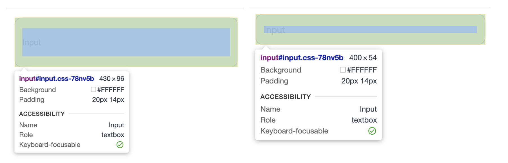

# Storybook

## 스토리북에 글로벌 스타일 적용하기

> 프로젝트에서는 CSS에 이상이 없지만 스토리북으로 확인할 때는 컴포넌트의 크기가 제대로 적용되지 않는 경우

box-sizing이 content-box로 설정되어 있었기 때문에 발생한 문제  

GlobalStyle에서 `box-sizing: border-box` 스타일을 적용했지만,   
스토리북에서는 GlobalStyle이 적용되지 않은 상태 (`box-sizing: content-box`로 되어 있음) 



* 스토리북에 GlobalStyle 적용하기 전과 후

### import GlobalStyle 

스토리북을 설치할 때 생성된 `preview.tsx` 파일에 GlobalStyle 파일을 import  


### decorators

decorators를 이용해 GlobalStyle 추가  
-> 모든 스토리북의 `.stories.` 파일에 글로벌 스타일이 적용됨


### 사용 방법 

```tsx
import type { Preview } from '@storybook/react';
import { Global } from '@emotion/react';
import { globalStyle } from '../src/ui/styles';

const withGlobalStyle = (Story: any) => ( // ✅
  <>
    <Global styles={globalStyle} />
    <Story />
  </>
);

const preview: Preview = {
  decorators: [withGlobalStyle], // ✅
  parameters: {
    actions: { argTypesRegex: '^on[A-Z].*' },
    controls: {
      matchers: {
        color: /(background|color)$/i,
        date: /Date$/i,
      },
    },
  },
};

export default preview;
```

<br><br>

## 참고 사이트

> https://storybook.js.org/docs/configure/styling-and-css  
> https://storybook.js.org/docs/writing-stories/decorators
