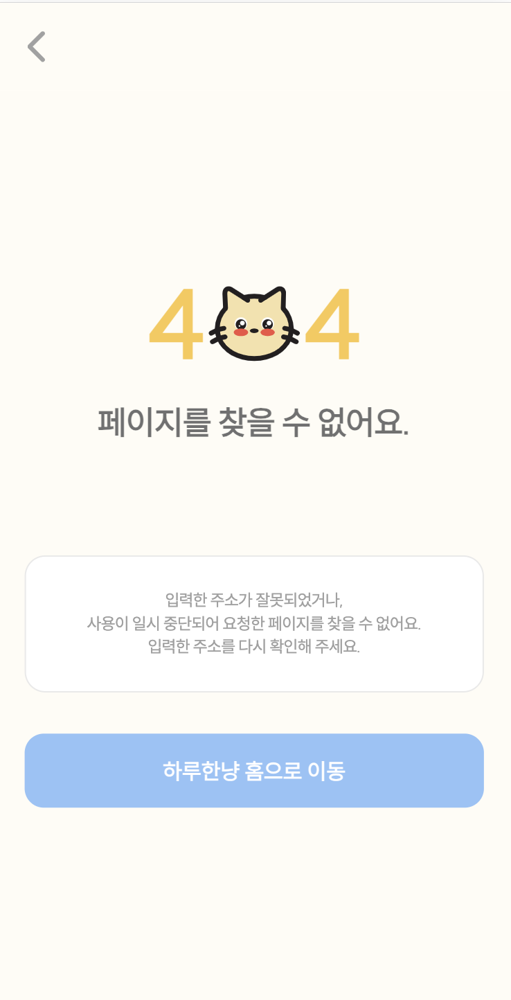

# React

## 에러 페이지

404 오류가 발생했을 때 개발자가 만들어놓은 에러 페이지를 렌더링하는 방법



<br>

### 체크 사항

* 에러 페이지 컴포넌트
* 라우팅 구현

<br><br>

## 404 Not Found 

> 🚨 404 Not Found, 요청한 페이지를 찾을 수 없습니다.

클라이언트가 서버와 통신할 수는 있지만, 서버가 요청한 바를 찾을 수 없다는 것을 가리키는 HTTP 표준 응답 코드

<br><br>

## 에러 페이지 구현하기

* 오류 안내 : 404 페이지 오류 
* 부가 설명 : 후속 처리에 관한 문구, 관리자 연락처 등
* 기능 
  * 뒤로가기
  * 홈으로 이동

<br>

### 예시 

```tsx
import styled from '@emotion/styled';
import { styleToken } from '@ui/styles';
import { useNavigate } from 'react-router';
import { Body } from '@ui/components/layout';
import { BaseButton, EmptyItem, NavigationHeader, Typography } from '@ui/components/common';
import { PATH } from '@lib/const/path';

export function ErrorPage() {
  const navigate = useNavigate();

  const handleClickPageHome = () => {
    navigate(PATH.HOME);
  };

  return (
    <>
      <NavigationHeader isBack />
      <Container>
        <TitleContainer>
          <h2 style={{ fontWeight: 800, fontSize: 70, color: styleToken.color.primary, textAlign: 'center' }}>4</h2>
          
          <h2 style={{ fontWeight: 800, fontSize: 70, color: styleToken.color.primary, textAlign: 'center' }}>4</h2>
        </TitleContainer>
        <Typography variant="h3" fontWeight={900} style={{ textAlign: 'center' }}>
          페이지를 찾을 수 없어요.
        </Typography>
        <EmptyItem
          description={
            '입력한 주소가 잘못되었거나,\n사용이 일시 중단되어 요청한 페이지를 찾을 수 없어요.\n입력한 주소를 다시 확인해 주세요.'
          }
          fontSize="12px"
          style={{ marginTop: 80 }}
        />
        <BaseButton colorTheme="primary" onClick={handleClickPageHome} style={{ marginTop: 30 }}>
          하루한냥 홈으로 이동
        </BaseButton>
      </Container>
    </>
  );
}

const Container = styled(Body)`
  overflow-y: auto;
  padding: 4px 20px 14px 20px;
  width: 100%;
  display: flex;
  flex-direction: column;
  justify-content: center;
  align-items: center;
`;

const TitleContainer = styled.div`
  width: auto;
  height: auto;
  display: flex;
  flex-direction: row;
  justify-content: space-between;
  align-items: center;
  margin-bottom: 20px;

  img {
    width: 70px;
    height: 70px;
  }
`;
```

<br><br>

## 라우팅 처리하기 

오류가 발생하면 **어떤 경로에도 일치하지 않는 경우**에 ErrorPage 컴포넌트가 렌더링됨

💡 path는 `'*'`로 설정

```
path: '*',
element: <ErrorPage />,
```

<br>

### * 와일드카드 라우트 

React Router에서 사용하는 와일드카드 라우트  
입력한 경로가 정의된 라우터에 없는 모든 경우에 에러 페이지로 이동시킴  

> 🔎 **사용자가 존재하지 않는 경로로 이동했을 때**
> 
> 1. React Router는 정의된 모든 경로를 확인하고,
> 2. 일치하는 경로를 찾지 못할 경우, 
> 3. 와일드카드 라우트가 작동하여 404 오류 페이지를 렌더링

<br>

### 예시 

```tsx
function App() {
  return (
    <Router>
      <Routes>
        {/* 다른 라우트 설정들 */}
        {/* ... */}
        
        {/* 404 오류 페이지로 이동하는 라우트 */}
        <Route path="*" element={<ErrorPage />} />
      </Routes>
    </Router>
  );
}
```

<br>

### useNavigate

navigate 함수를 사용해 원할 때 404 페이지로 이동시킬 수도 있음 

```tsx
const navigate = useNavigate();

const handleNavigateToErrorPage = () => {
    navigate('/404'); // 404 페이지의 경로에 맞게 수정
};
```
