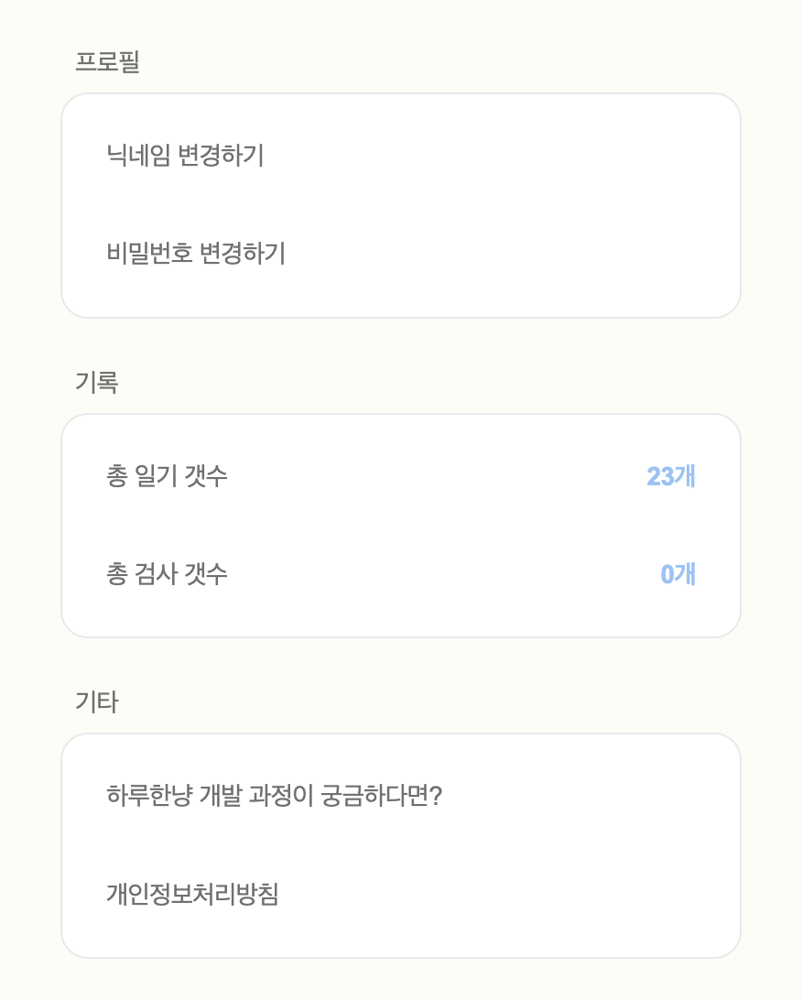
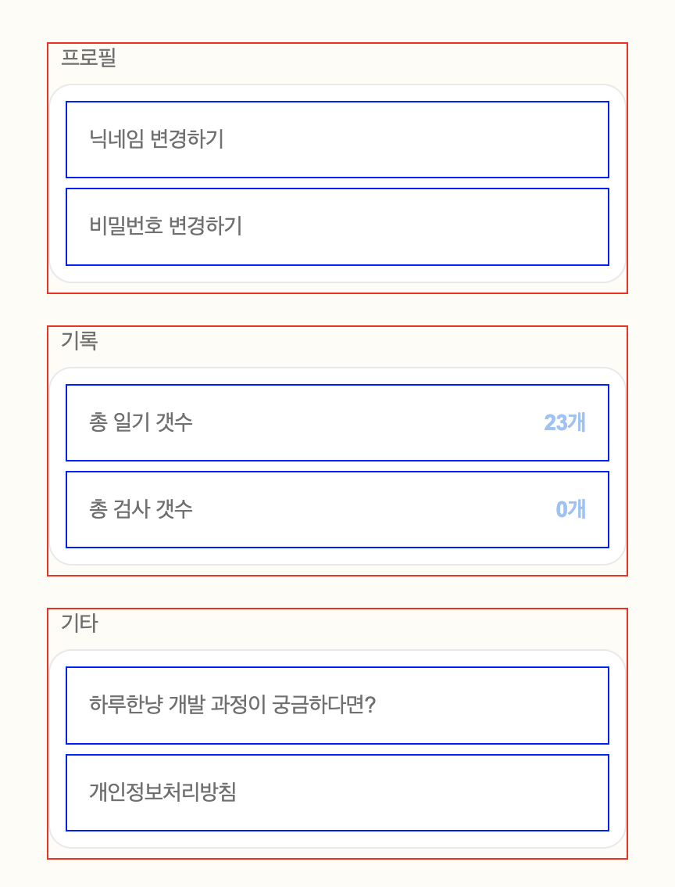

# React

## 정보값이 여러개인 메뉴 구현하기

### 완성 스크린샷



<br><br>

## 1. 컴포넌트 설계

### 컴포넌트 분리하기

* MenuList : 🔴 빨간색
* MenuItem : 🔵 파란색



<br>

### 컴포넌트 구조

```tsx
// SettingPage.tsx

<Container>
    <MenuList/>
    <MenuList/>
    <MenuList/>
</Container>
```

```tsx
// MenuList.tsx

<Container>
    <MenuItem/>
</Container>
```

```tsx
// MenuItem.tsx

<Container>
    <Typography>{value}</Typography>
</Container>
```

<br><br>

## 2. props로 값 넘겨주기

### 넘겨줄 값

MenuList를 사용하는 페이지에서 넘겨줘야 하는 값

* label (list 이름)
* title (item 별 이름)
* description (record)
* function (onClick 함수)
* navigate로 페이지 전환이 아닌, 하이퍼 링크 연결 유무

<br>

### 객체로 값 묶기

```tsx
const settingMenus = {
    profile: [
        {
            title: '닉네임 변경하기',
            link: PATH.SETTING_MODIFY_NAME,
        },
        {
            title: '비밀번호 변경하기',
            link: PATH.SETTING_MODIFY_PASSWORD,
        }
    ],
    recore: [
        {
            title: '총 갯수',
            description: '0개',
        },
        {
            title: '총 갯수',
            description: '0개',
        }
    ],
    etc: [
        {
            title: '하루한냥 개발 과정이 궁금하다면?',
            link: 'www.링크.com',
            isOpen: true,
        },
        {
            title: '개인정보처리방침',
            link: PATH.SETTING_PRIVACY,
        }
    ]
}
```

<br>

### props 전달하기

```tsx
// SettingPage.tsx

<Container>
    <MenuList label='프로필' menuItems={settingMenus.profile} />
    <MenuList label='기록' menuItems={settingMenus.record} />
    <MenuList label='기타' menuItems={settingMenus.etc} />
</Container>
```

<br><br>

## 3. List 구현하기

### JSX

```tsx
// MenuList.tsx

<Container>
    <p>{label}</p>
    <InfoContainer>
        {
            menuItems.map((menuItem) => (
                <MenuItem key={menuItem.title} {...menuItem} />
            ))
        }
    </InfoContainer>
</Container>
```

<br>

### 스프레드 연산자

`{...menuItem}`

**Object 데이터를 JSX 태그에 key-value로 반영**

Object에서 불변성을 지켜줄 떄 쓰는 것과 동일  
객체의 속성을 JSX 요소로 펼치는 역할

```tsx
<MenuItem title={menuItem.title} description={menuItem.description} />
```

<br><br>

## 4. Item 구현하기

### JSX

```tsx
// MenuItem.tsx

<SettingButton type='button' onClick={handleClickMenu} isLink={isLink}>
    <p>{title}</p>
        {
            description && (
                <span>{description}</span>
            )
        }
</SettingButton>
```

<br>

### 함수 구현하기 

* route 처리 로직 

#### 기존 함수 

```ts
  const handleChangeUserName = () => {
    navigate(PATH.SETTING_MODIFY_NAME);
  };

  const handleChangePassword = () => {
    navigate(PATH.SETTING_MODIFY_PASSWORD);
  };

  const handlePagePrivacyPolicy = () => {
    navigate(PATH.SETTING_PRIVACY);
  };
```

#### 새로운 함수

```ts
const handleClickMenu = () => {
    if (isOpen && link) {
        window.open(link);
        return;
    } 
    
    if (link) {
        navigate(link);
    }
}
```

<br>

### 상태에 따른 스타일 입히기

```ts
// link 유뮤 확인
const isLink = Boolean(link);

// 스타일
const SettingButton = styled.button<{isLink: boolean}>`
// ...
${(props) => props.isLink && `cursor: pointer;` }
`;
```

