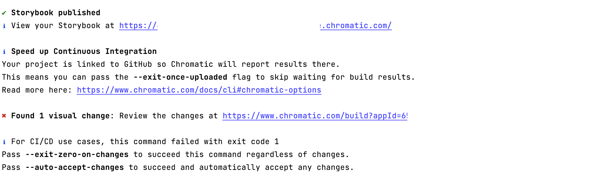
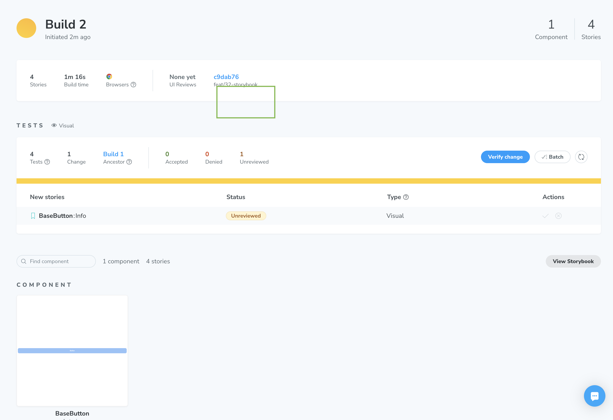

# Chromatic

## 크로마틱

브라우저 전체에서 가능한 모든 UI 상태를 스캔하여, 시각적 및 기능적 버그를 잡아내는 시각적 테스트, 검토 도구  
검토자를 할당하고 논의를 통해 팀 승인을 간소화

<br><br>

## 설치 및 실행 방법

### 크로마틱 설치

```
npm install --save-dev chromatic
```

<br>

### 사용하기

#### 1. stories 파일 내용 추가 또는 변경

#### 2. 명령어를 입력하면 크로마틱 설정 완료

```
npx chromatic --project-token=본인의_토큰_추가
```



* 버전별 빌드와 빌드에서의 변경사항을 볼 수 있음 
* 다른 사람들에게 보여줄 수 있는 퍼블리시된 스토리북 사이트 생성
* ⚠️ 토큰 유출에 주의



#### 3. package.json script 명령어 추가

```
"chromatic": "npx chromatic --project-token=본인의_토큰_추가 --exit-zero-on-changes"
```

* 보안상 토큰이 유출될 수 있으므로 분리해두어야 함 

> 💡 **--exit-zero-on-changes** 
>    
> 주로 CI/CD 파이프라인에서 사용되는 옵션   
> 변경 사항이 감지되어도 파이프라인이 실패하지 않고 계속 진행될 수 있도록 하는데 도움이 됨  
> 
> Chromatic 테스트에서 변경 사항이 감지되었을 때에도 프로세스를 성공적으로 종료하도록 하는 옵션  
> 일반적으로는 변경 사항이 있을 때 프로세스가 실패로 표시되어 CI/CD 도구에서 이를 감지할 수 있음    
> --exit-zero-on-changes 옵션을 사용하면 변경 사항이 있어도 종료 코드가 0으로 설정되어 성공적으로 보고됨   

<br>

### Github Actions CI 설정 

```yaml
name: Chromatic Deployment

on:
  push:
    paths:
      - 'src/ui/components/**'

jobs:
  build-and-deploy:
    runs-on: ubuntu-latest
    steps:
      - name: Checkout
        uses: actions/checkout@v3
        with:
          fetch-depth: 0

      - name: Setup Node
        uses: actions/setup-node@v3
        with:
          node-version: v18.14.2

      - name: Install dependencies
        run: npm install

      - name: Build and Deploy to Chromatic for Haru-Hannyan
        run: npm run chromatic 
```

<br>

### 깃허브 시크릿으로 토큰 관리하기

github secret

1. 해당 깃허브 레포지토리의 `Settings` > `Security` > `Secrets and Variables` > `Actions`에 접속
2. New repository secret 버튼 클릭
3. Key-Value로 토큰 입력
4. 프로젝트의 `chromatic.yml` 명령어 수정

```
     - name: Build and Deploy to Chromatic for 프로젝트 이름
       run: npx chromatic --project-token=${{secrets.CHROMATIC_TOKEN}} --exit-zero-on-changes
```

<br><br>

## 참고 사이트

> https://www.chromatic.com/  
> https://www.chromatic.com/docs/setup/  
> https://www.chromatic.com/docs/ci/   
> https://www.chromatic.com/docs/github-actions/#project-token-secret  
> https://docs.github.com/ko/actions/security-guides/using-secrets-in-github-actions
