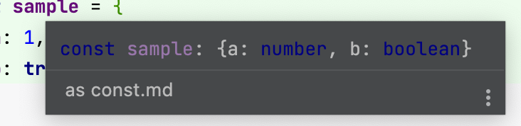
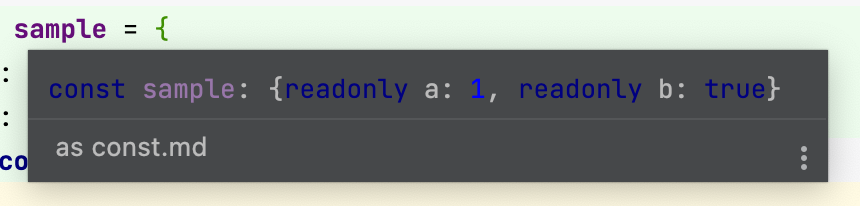

# TypeScript

## as const

값 뒤에 `as const`를 붙이면 타입 지정 가능하며, 읽기전용이 됨  
타입스크립트는 최대한 좁은 타입으로 추론  

⚠️ const 단언문은 let, const 등 변수 선언에 쓰이는 키워드와 별개의 기법

<br><br>

## 비교

### as const ❌

```tsx
const sample = {
    a: 1,
    b: true,
} 
```




```tsx
const arr1 = [1, 2, 3];
// number[]
```

<br>

### as const ✅

```tsx
const sample = {
    a: 1,
    b: true,
} as const;
```



```tsx
const arr2 = [1, 2, 3] as const;
// readonly [1, 2, 3]
```

* readonly 
* 그 자체로 타입이 지정됨
* 배열을 튜플 타입으로 추론할 때에도 사용 가능 

<br><br>

## 참고 사이트 

> <이펙티브 타입스크립트> 아이템 21 - 타입 넓히기
