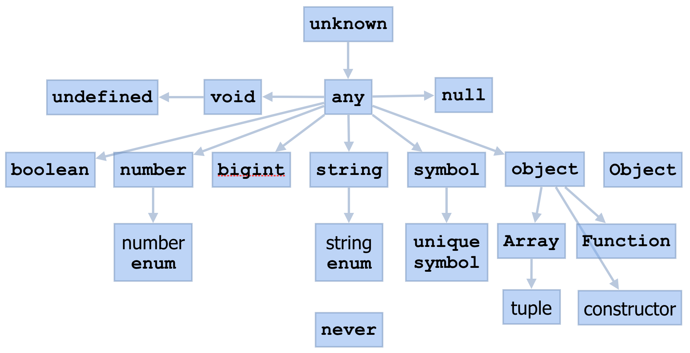
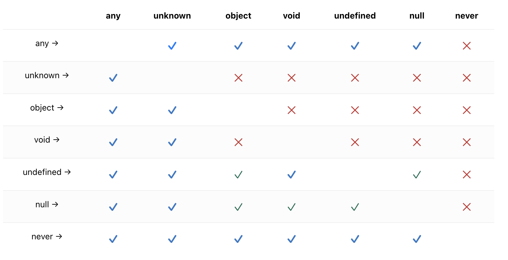

# Typescript Hierarchy

## 타입 계층



* `unknown` : 최상위 타입  
* `any` : 유지보수를 쉽게 하기 위한 개발자용 백터널같은 것(타입 체크를 하지 않음)  
* `never` : 가장 자식 타입

⚠️ 타입의 상하관계를 몰라서 오류 발생하기도 하므로, 잘 알아두어야 함 

<br>

### Any, unknown, object, void, undefined, null, never 할당 호환성



<br><br>

## unknown

unknown 타입은 모든 값을 나타냄  
any 타입과 유사하지만, unknown 타입에 어떤 것을 대입할 수 없기 때문에 더 안전

```ts
// any
function f1(a: any) {
    a.b(); // OK
}

// unknown
function f2(a: unknown) {
    a.b(); // ⛔️ 'a' is of type 'unknown'.
}
```
any 형태의 값을 함수 본문에 사용하지 않고도 **아무 값이나 받는 함수**를 표현할 수 있기 때문에, 함수 타입을 설명하는 데에 유용

반대로, **unknown 타입의 값을 반환하는 함수**를 표현할 수 있음 -> `타입 캐스팅` 

```ts
function safeParse(s: string): unknown {
    return JSON.parse(s);
}

// 'obj'를 사용할 때 주의
const obj = safeParse(someRandomString);
```

<br><br>

## any

특정 값으로 인해 타입 검사 오류가 발생하는 것을 원하지 않을 때 사용   

어떤 값의 타입이 any이면, 해당 값에 대하여 임의의 속성에 접근할 수 있고(이때 반환되는 값의 타입도 any),
함수인 것처럼 호출할 수 있고, 다른 임의 타입의 값에 할당하거나(받거나), 그 밖에도 구문적으로 유효한 것이라면 무엇이든 할 수 있음

> 💡 **`any`를 사용하면 추가적인 타입 검사가 비활성화**   
> 오류가 발생해야 할 코드도 오류 없이 정상적으로 실행됨  
> 개발자가 TypeScript보다 상황을 더 잘 이해하고 있다고 가정함    

* **JavaScript** : `동적 형 지정 언어`, 선언된 변수에 어떤 값이든 재할당이 가능  
* **TypeScript** : 명시적으로 데이터 유형을 설정해 사용하는 `정적 형 지정 언어`, 타입을 지정해 사용하는 것이 권장됨 

<br>

### noImplicitAny

컴파일러 플래그 `noImplicitAny`를 사용하면 암묵적으로 `any`로 간주하는 모든 경우에 오류를 발생시킴 

타입이 지정되지 않은 값에 대해 TypeScript가 문맥으로부터 그 타입을 추론해낼 수 없을 경우     
컴파일러는 `any` 타입을 부여하는 것이 기본 동작이지만, 이런 상황은 보통 선호되지 않음  
-> `any`는 타입 체크가 이루어지지 않기 때문  
-> 타입 체크를 하지 않으면 타입스크립트의 장점을 제대로 이용하지 못하는 것 

<br><br>

## never

never 타입은 결코 관측될 수 없는 값을 의미  
어떤 함수는 결코(never) 값을 반환하지 않음  

```ts
function fail(msg: string): never {
    throw new Error(msg);
}
```

```ts
// 이 함수는 절대 함수의 끝까지 실행되지 않는다는 의미
function neverEnd(): never {
  while (true) {

  }
}
```

반환 타입에서는, 해당 함수가 예외를 발생시키거나, 프로그램 실행을 종료함을 의미  
never은 TypeScript가 유니온에 아무것도 남아있지 않다고 판단했을 때도 나타남

<br><br>

## 참고 사이트

> https://www.typescriptlang.org/ko/docs/handbook/2/everyday-types.html#any  
> https://www.typescriptlang.org/ko/docs/handbook/2/functions.html#unknown  
> https://www.typescriptlang.org/ko/docs/handbook/2/functions.html#never  
> https://www.typescriptlang.org/ko/docs/handbook/type-compatibility.html  
> https://joshua1988.github.io/ts/guide/basic-types.html#any
> https://yamoo9.gitbook.io/typescript/types/any  
> https://medium.com/@vinhle95/the-unknown-type-in-typescript-939ec261294b
