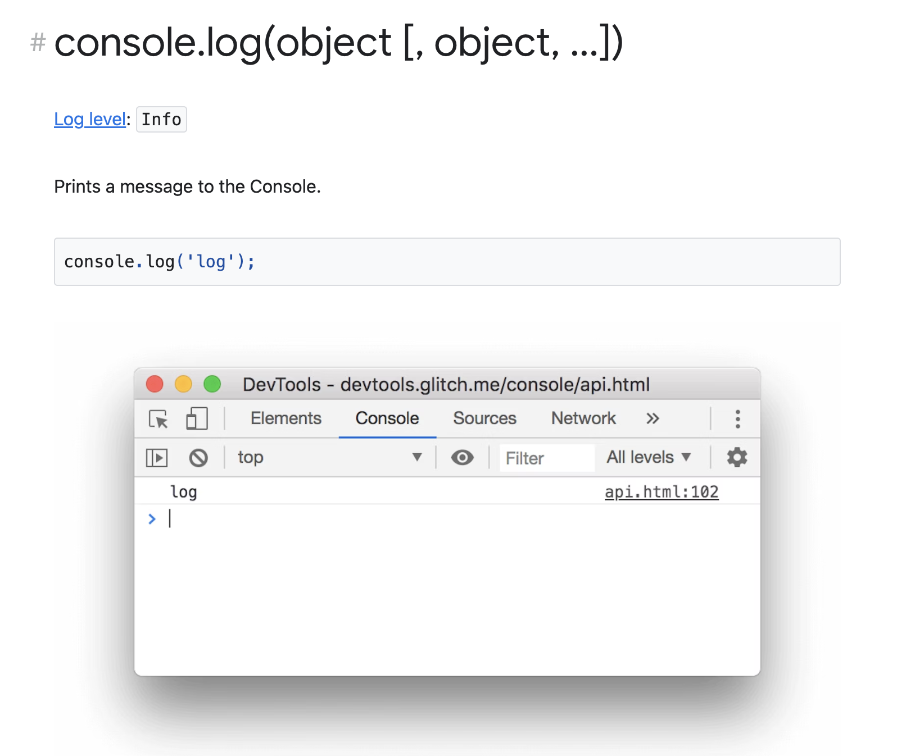
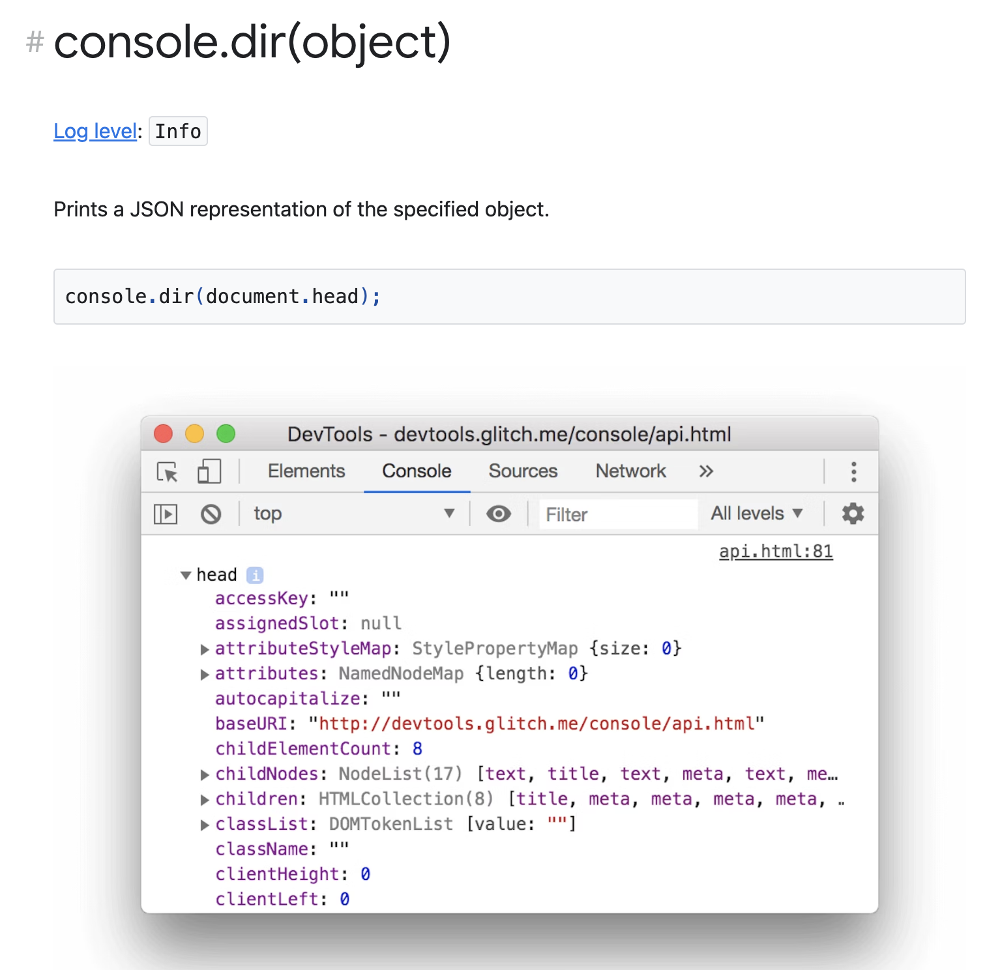

# Console API

## Console API

Console API는 코드의 특정 지점에서 **값이나 변수를 기록**하고, 작업의 소요 시간을 알아내는 등 개발자가 사용할 수 있는 **디버깅 기능**을 제공

<br><br>

## console.log

```
console.log(object);
```

웹 콘솔에 **메시지**를 출력   
메시지는 (선택적 대체 값을 포함한) 단일 문자열이거나 더 많은 JavaScript 객체중 하나일 수 있음  
Web Worker에서 사용 가능 

<br><br>

## console.dir

📂 dir = directory

```
console.dir(object);
```

주어진 JavaScript **객체의 프로퍼티를 인터랙티브한 목록**으로 표시  
출력된 결과는 자식 객체의 내용을 볼 수 있는 ▶️ 여닫는 삼각형과 함께 **계층적인 목록**으로 나타남   
주어진 JavaScript 객체의 **모든 프로퍼티**를 콘솔에서 볼 수 있는 방법   


<br><br>

## log와 dir의 차이

DOM 요소들을 콘솔로 보낼 때 [Chrome](https://developer.chrome.com/docs/devtools/console/api/) 에서 다른 유용한 차이점이 존재 

`console.log`는 요소를 **HTML**과 같은 트리 구조로 출력  
`console.dir`은 요소를 **JSON**과 같은 트리 구조로 출력

console.log는 DOM 요소에 대해 특별한 처리를 제공하지만 console.dir은 그렇지 않음   
console.dir은 DOM JS 객체의 전체 표현을 보려고 할 때 유용





<br><br>

## 참고 사이트 

> https://developer.mozilla.org/ko/docs/Web/API/Console_API  
> https://developer.mozilla.org/ko/docs/Web/API/console/log  
> https://developer.mozilla.org/ko/docs/Web/API/console/dir
