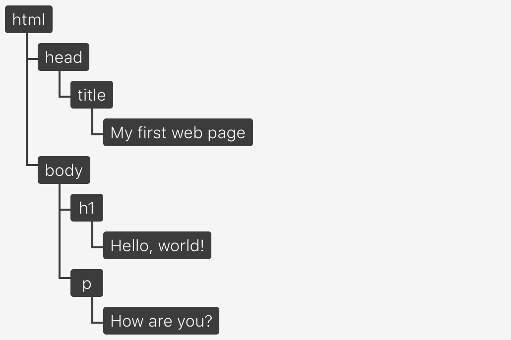
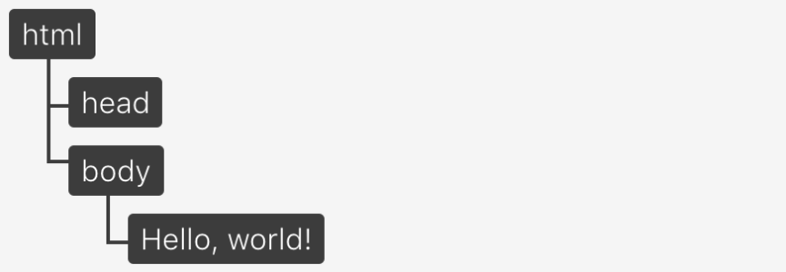
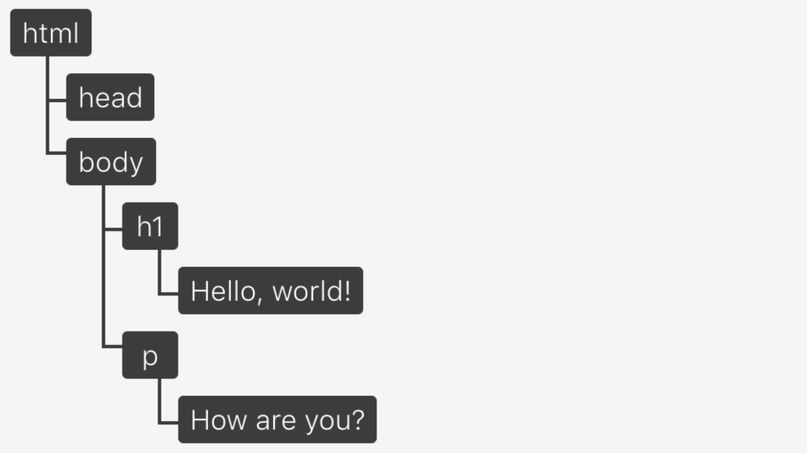
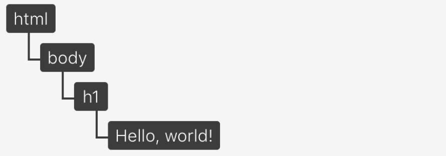
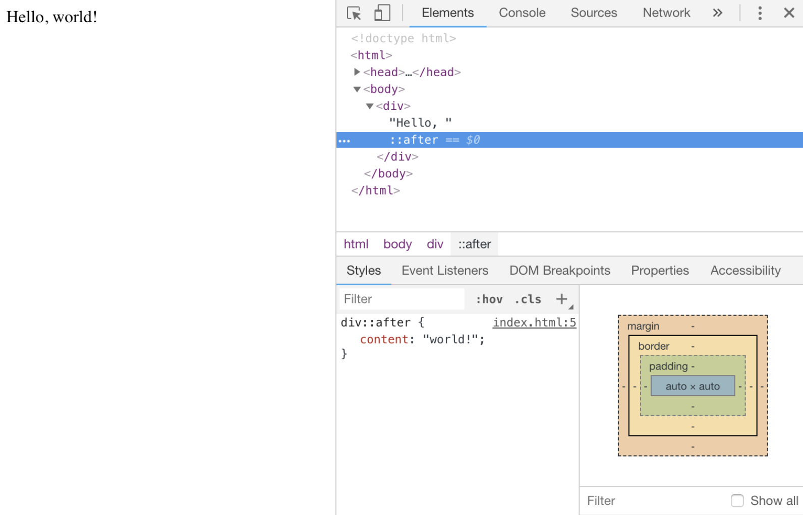

# DOM

## DOM(Document Object Model)

웹 페이지에 대한 인터페이스    
뷰 포트에 무엇을 렌더링 할지 결정하기 위해 사용  
여러 프로그램들이 페이지의 콘텐츠 및 구조, 스타일을 읽고 조작할 수 있도록 API를 제공

<br><br>

## Critical Rendering Path

웹 페이지가 빌드 되는 과정  
웹 브라우저가 원본 HTML 문서(파일)를 읽어들인 후, 스타일을 입히고 대화형 페이지로 만들어 뷰 포트에 표시하기까지의 과정

<br>

1️⃣ 브라우저는 읽어들인 문서를 파싱하여 최종적으로 어떤 내용을 페이지에 렌더링할지 결정 ➡️ `렌더 트리` 생성   
2️⃣ 브라우저는 해당 렌더링을 수행

<br>

### Render Tree

`렌더 트리`는 웹 페이지에 표시될 **HTML 요소**와, 이에 관한 **스타일 요소**로 구성  
브라우저는 렌더 트리를 생성하기 위해 다음의 두 모델이 필요

`Render Tree` = `DOM` + `CSSOM`

* DOM(Document Object Model) – HTML 요소들의 구조화된 표현
* CSSOM(Cascading Style Sheets Object Model) – 요소들과 연관된 스타일 정보의 구조화된 표현

<br>

최종적으로 브라우저에 표시될 내용만 선별되어 표기

* <em> display가 none으로 설정되어 있다면 render tree에 포함되지 않음 </em>

<br><br>

## DOM의 구조와 표현 

DOM은 원본 HTML 문서의 객체 기반 표현 방식  
둘은 서로 비슷하지만, 차이 존재

* `HTML 문서` : 내용과 구조가 단순 텍스트로 구성
* `DOM` : HTML 문서의 내용과 구조가 객체 모델로 변환되어, 다양한 프로그램에서 사용될 수 있음

<br>

### Node Tree

DOM의 개체 구조는 `노드 트리`로 표현  
하나의 부모 줄기가 여러 개의 자식 나뭇가지를 갖고 있고, 각각의 나뭇가지는 잎들을 가질 수 있는 나무와 같은 구조  
루트 요소인 html은 `🌳 부모 줄기`, 루트 요소에 내포된 태그들은 `🪵 자식 나뭇가지`, 요소 안의 컨텐츠는 `🍃 잎`에 해당

<br>

```html
<!doctype html>
<html lang="en">
    <head>
        <title>My first web page</title>
    </head>
    <body>
        <h1>Hello, world!</h1>
        <p>How are you?</p>
    </body>
</html>
```



* html 코드는 이미지와 같은 노드 트리로 표현

<br><br>

## DOM이 아닌 것 

DOM은 HTML 문서와 1:1 매핑이 되는 것처럼 보이지만, 차이점이 존재  

<br>

### ⚠️ DOM은 HTML이 아니다   
DOM은 HTML 문서로부터 생성되지만 항상 동일하지는 않음

<br>

> **DOM이 원본 HTML 소스와 다를 수 있는 두 가지 경우**

<br>

#### 1️⃣ 작성된 HTML 문서가 유효하지 않을 때

DOM은 유효한 HTML 문서의 인터페이스  
DOM을 생성하는 동안, 브라우저는 유효하지 않은 HTML 코드를 올바르게 교정  

```html
<!doctype html>
<html>
    Hello, world!
</html>
```



* 문서에 유효한 HTML 규칙의 필수 사항인 `head`와 `body` 요소가 빠져있지만, 생성된 DOM 트리에는 올바르게 교정되어 나타남

<br>

#### 2️⃣ 자바스크립트에 의해 DOM이 수정될 때  

DOM의 역할
* HTML 문서의 내용을 볼 수 있는 인터페이스
* 동적 자원이 되어 수정 가능 (자바스크립트를 사용해 DOM에 새로운 노드 추가 등)

```html
let newParagraph = document.createElement("p");
let paragraphContent = document.createTextNode("New!");

newParagraph.appendChild(paragraphContent);
document.body.appendChild(newParagraph);

<p>New!</p>
```

* DOM을 업데이트하는 코드이지만, 기존 HTML 문서의 내용을 변경하진 않음

<br><br> 

### ⚠️ DOM은 브라우저에서 보이는 것이 아니다

브라우저 뷰 포트에 보이는 것은 `렌더 트리` = `DOM` + `CSSOM`    
렌더 트리는 스크린에 그려지는(렌더링 되는) 요소만 관련 있기 때문에, 시각적으로 보이지 않는 요소는 제외

<br>

#### Ex) display: none

```html
<!doctype html>
<html lang="en">
    <head></head>
    <body>
        <h1>Hello, world!</h1>
        <p style="display: none;">How are you?</p>
    </body>
</html>
```


* DOM은 `p` 요소를 포함




* 렌더 트리에 해당하는 뷰 포트에 표시되는 내용은 `p` 요소를 포함하지 않음

<br><br> 

### ⚠️ DOM은 개발도구에서 보이는 것이 아니다  

개발도구의 요소 검사기는 DOM과 가장 가까운 근사치를 제공  

개발도구는 DOM에 없는 추가적인 정보를 포함 -> 🔎 `CSS 가상 요소`   
`::before` 과 `::after` 선택자로 생성된 가상 요소는 CSSOM과 렌더 트리의 일부를 구성하지만, DOM의 일부는 아님   

DOM은 오직 원본 HTML 문서로부터 빌드 되고, 요소에 적용되는 스타일을 포함하지 않음  
가상 요소가 DOM의 일부는 아니지만, 요소 검사기에서는 아래와 같이 표현  



* `가상 요소`는 DOM의 일부가 아니기 때문에 자바스크립트로 수정 불가

<br><br>

## DOM과 HTML 차이점

* 항상 유효한 HTML 형식
* 자바스크립트에 수정될 수 있는 동적 모델이어야 함
* 보이지 않는 요소 포함
    * display: none
* 가상 요소 포함하지 않음
    * ::after

<br><br>

## 참고 사이트

> (번역) DOM은 정확히 무엇일까? https://wit.nts-corp.com/2019/02/14/5522   
> MDN – DOM 소개 https://developer.mozilla.org/ko/docs/Gecko_DOM_Reference/소개  
> NAVER D2 – 브라우저는 어떻게 동작하는가? https://d2.naver.com/helloworld/59361
