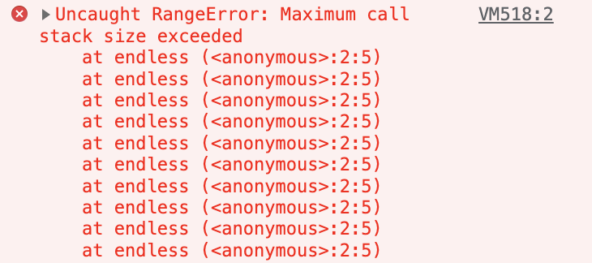

# Event Loop

## Process
프로세스 : 운영체제 위에서 연속적으로 실행되고 있는 프로그램 <br>
프로그래밍을 동작하는 최고 단위
* <em>Ex) 음악 재생 프로그램, 사진 뷰어 프로그램 등은 각각의 프로세스를 가짐</em>
* 각각의 프로세스는 메모리 위에서 독립적으로 실행
* 프로세스는 리소스 자원이 정해져 있음 (프로세스마다 할당된 메모리, 데이터 등)

<br>

>**Operation System** <br>
>>****Process**** <br>
>>>****Code**** - 프로그램 실행을 위한 코드 <br>
>>>****Stack**** - 프로세스 안에서 함수들이 어떤 순서로 실행되는지 등의 정보 저장 <br>
>>>****Heap**** - 오브젝트 생성, 데이터 만들 때 데이터가 저장되는 공간(동적으로 할당된 변수들 저장) <br>
>>>****Data**** - 전역 변수, 스태틱 변수 할당 <br>

<br>

## Thread
스레드 : 프로그램 안에서 동시에 여러개가 수행될 수 있는 작은 단위
* 한 프로세스 안에서 여러개 동작 가능
* 각각 해야 하는 업무 배정 (≒ 일꾼)
* 프로세스에 지정된 코드, 데이터, 힙을 공통적으로 접근해서 업데이트가 가능
* 동시다발적으로 발생 가능 -> 프로세스가 효율적으로 일 할 수 있음
* <em>Ex) 음악 재생하며 사진 편집</em>
* 멀티스레딩 프로그램이 어려운 이유

<br>

>**Process** <br>
>>**Code** **Heap** **Data** <br><br>
>>**Thread1** - 스레드마다 스택 할당 
>>>**Stack** - 일의 흐름을 기억

<br><br>

## JavaScript 런타임 환경
자바스크립트 : single threaded language <br>
자바스크립트 언어 자체에 멀티스레딩이 없다
* JS가 동작하고 있는 브라우저 안에서는 여러가지 스레드가 들어 있음 => **WebAPI를 이용하면 멀티스레딩이 가능**
* JS가 동작하고 있는 런타임 환경(실행 환경)에서는 다양한 방식으로 멀티스레딩같은 효과를 얻을 수 있음
* Event Loop를 이용해서 다양한 동작 실행 가능

<br>

>**JavaScript Runtime Environment** <br>
>>**JavaScript Engine** <br>
>>>**Memory Heap** - 데이터 만들 때, 변수를 선언해서 오브젝트를 할당할 때 데이터가 메모리 힙에 저장. 구조적으로 정리되지 않음<br>
>>>**Call Stack** - 함수를 실행하는 순서에 따라 쌓임 <br>

<br>

## Stack
LIFO (Last In First Out) 후입선출 <br>
제일 나중에 들어온 것이 제일 먼저 나간다
* 스택에는 push, pop peek 등의 API가 있다.
* 콜 스택에는 함수가 실행되고 어디로 돌아오는지의 정보도 포함된다.
* 콜 스택은 함수들이 호출하는 순서를 기억했다가 함수 종료시 원래 있던 자리로 돌아가기 위해 쓰이는 자료구조 중 하나
* 모든 프로세스와 스레드 안에는 각각의 콜스택이 존재 

<br>

```js
function endless() {
    endless();
}

endless();
```


* 프로세스 또는 스택마다 콜 스택 사이즈가 지정되어 있음
* 지정된 사이즈 초과시 에러 
* 재귀함수 : 함수 안에서 자기 자신을 계속 부르는 것 -> 사용시 주의 필요 
