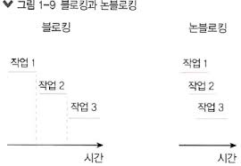
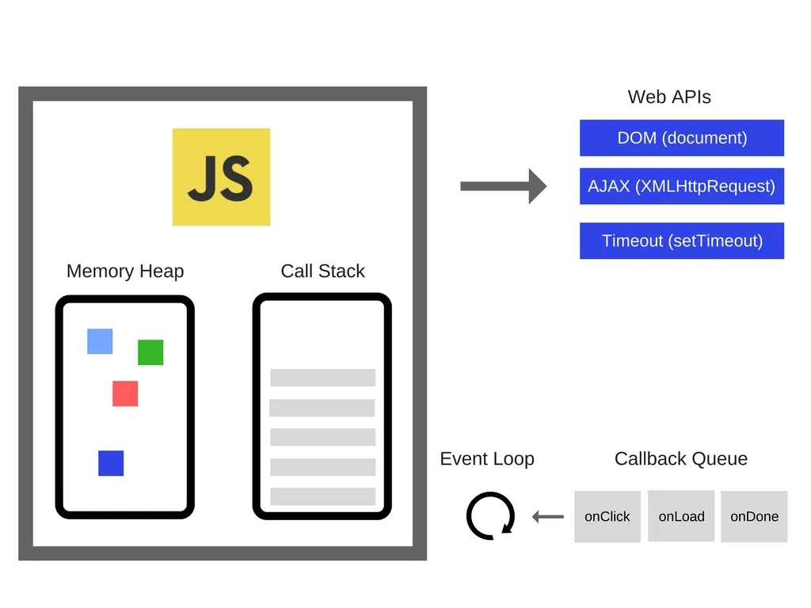
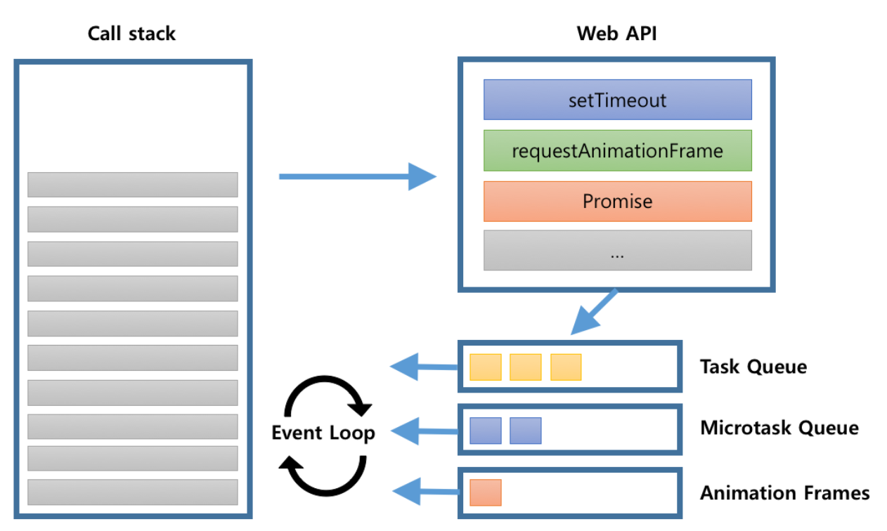
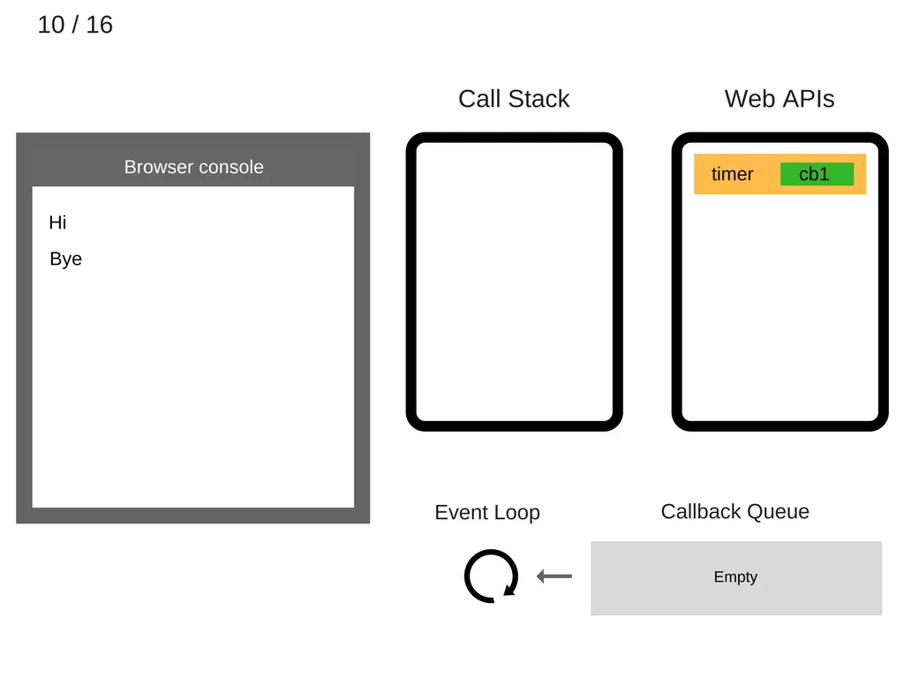
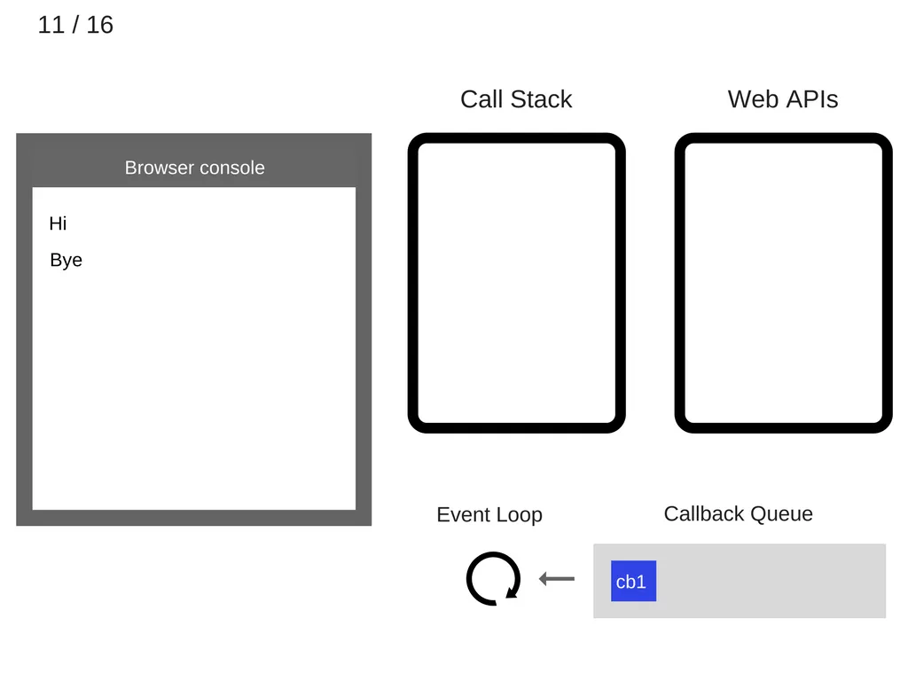

# Event Loop

## 자바스크립트

1. 자바스크립트는 **싱글 스레드(single thread)** 언어 💡콜스택이 1개
2. 자바스크립트는 **논블로킹(non-blocking)** 으로 작업을 수행 

* 블로킹 : 추가 작업을 실행하려면 기존 작업이 완료될 때까지 기다려야 하는 경우 => `동기 sync`  
* 논블로킹 : 다른 작업에 의해 차단당하지 않는 경우 => `비동기 async` 
  * Node.js 표준 라이브러리  
  
  

## 자바스크립트 엔진

자바스크립트 코드를 기계어로 변환해 컴퓨터가 실행할 수 있도록 하는 역할

### 1. 메모리 힙(memory heap)

선언한 변수가 어디에 저장되었는지 기록

### 2. 콜 스택(call stack)

함수 호출(call)이 스택으로 쌓이고, 하나씩 실행됨      
함수가 실행되고 난 후에는 콜 스택에서 빠져나감

자바스크립트 파일의 어느 부분이 현재 실행 중인지 알 수 있음   
* 스택 : 후입선출(LIFO)

  

## Web APIs

자바스크립트 엔진이 브라우저에서 실행될 때, `브라우저에서 제공하는 Web API`를 사용할 수 있음   

### 예시

1. DOM(document)
2. AJAX(XMLHttpRequest)
3. Timeout(setTimeout)

> https://developer.mozilla.org/en-US/docs/Web/API

  

## 콜백 큐(callback queue)

콜백함수가 큐로 쌓임  
Web APIs 에서 처리한 콜백함수가 쌓임 - timer 대기 등의 벗겨내는 작업
* 큐 : 선입선출(FIFO)
* 콜백함수 : 다른 함수에게 인자로 전달된 함수

**중요도 순서**에 따라, 앞의 것이 비워져야 그 다음 것이 들어갈 수 있음

>setTimeout이 0초에 처리되고, promise가 3초 뒤에 처리된다고 해도 ✅ promise가 먼저 콜 스택으로 들어감  

 

### 1. 마이크로태스크 큐(microtask queue)

잡 큐  
🤝 promise, async  
코드를 사용해서만 만들 수 있는데, 주로 Promise를 사용해 만듦  
Promise와 함께 쓰이는 .then/catch/finally, async 함수 등

Ex. 👩🏻‍🍳 요리하기 - 굵직한 일  

 

### 2. 애니메이션 프레임(animation frames)

애니메이션, CSS 속성, transform 

 

### 3. 매크로태스크 큐(macrotask queue)

이벤트 큐 or 콜백 큐 or 태스크 큐  
⏰ timing - setTimeout, setInterval

Ex. 🧂 소금치기 - 자잘한 일 

  

## Event Loop  

> `Web APIs` ➡️ `callback queue` ➡️ `🔄 event loop` ➡️ `call stack` 

### Event Loop

🔄콜 스택이 비면, 콜백 큐의 맨 앞에 있는 콜백을 콜 스택으로 전달

  

## 참고 사이트 

> https://blog.sessionstack.com/how-javascript-works-event-loop-and-the-rise-of-async-programming-5-ways-to-better-coding-with-2f077c4438b5  
> https://nodejs.org/en/docs/guides/blocking-vs-non-blocking/    
> https://ko.javascript.info/event-loop#ref-441  
> https://ko.javascript.info/microtask-queue  
> https://developer.mozilla.org/ko/docs/Web/API/HTML_DOM_API/Microtask_guide  
> https://www.youtube.com/watch?v=8aGhZQkoFbQ  
> https://developer.mozilla.org/en-US/docs/Web/API/window/requestAnimationFrame
