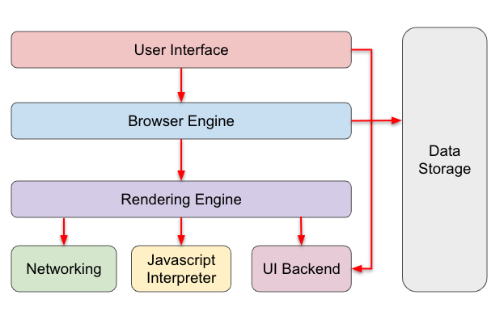
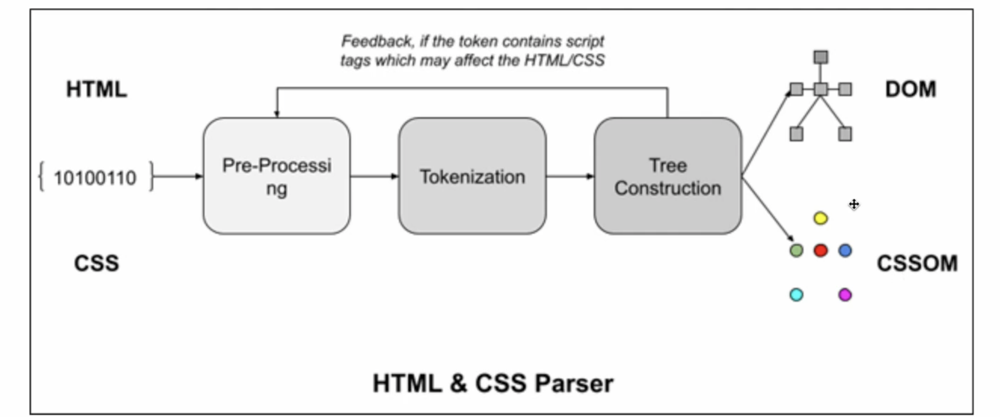
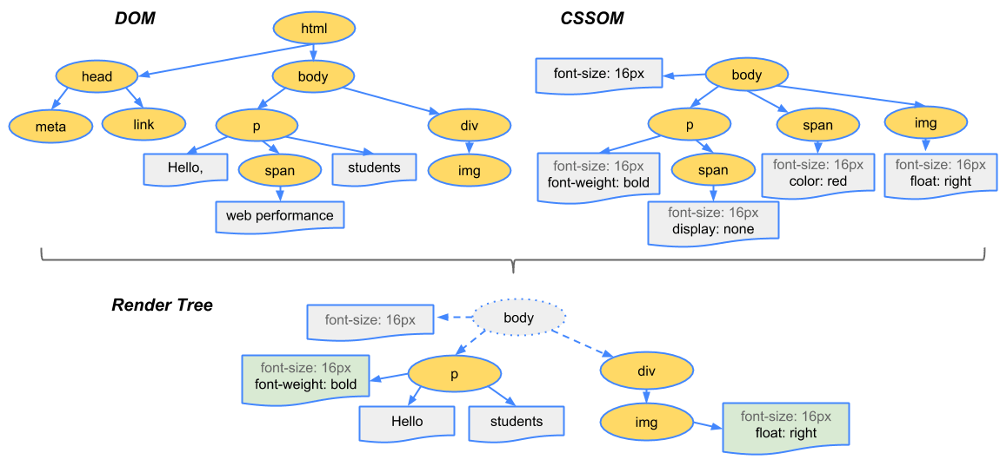
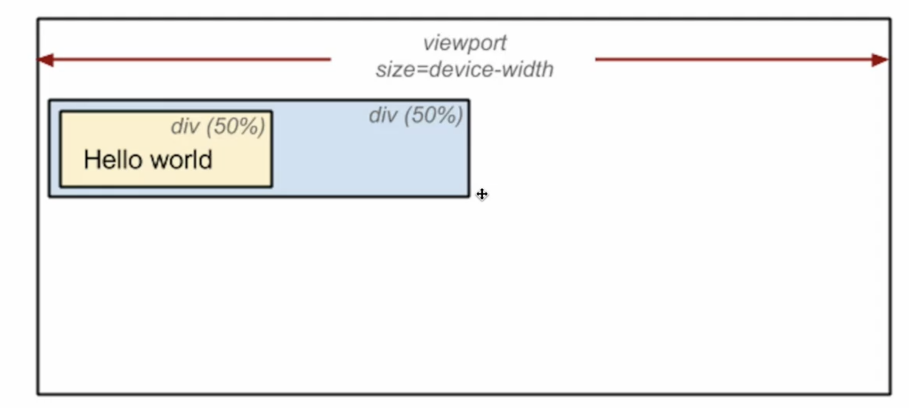

# 브라우저 렌더링 과정

## 브라우저

브라우저는 브라우저 엔진 등으로 구성   
이중에서 렌더링 엔진이 브라우저 렌더링을 담당



<br><br>

## 브라우저 렌더링 과정  
DOM트리 CSS파서 등을 기반으로 렌더 트리가 구축되는 등의 작업


<br>

### 1. DOM 트리 구축

하나의 html 페이지는 div, span 등 각각의 요소를 가짐   
각 요소는 하나하나 `노드(Node)`로 설정이 되어 트리 형태로 저장되는데, 이것이 `DOM 트리`    


> Ex. div > span, span이라는 요소가 있다면   
> div라는 👨‍👩‍👧‍👦부모노드 밑에 span이라는 👶🏻자식노드가 2개 생성

<br>

### 2. CSSOM 트리 구축 

각각의 노드는 `CSS 파서`에 의해 정해진 스타일 규칙이 적용되어 있음 (Ex. `span.color = "red"`)  
이런 규칙에 따라 `CSSOM 트리`가 생성  
💡 DOM 트리 구축과 동시에 일어남  
CSS의 **상속**을 반영하여 생성 (부모 요소가 자식에게 스타일을 전달하는 기능)



<br>

### 3. 자바스크립트 파싱, 실행 

`<script>` 태그를 만나면 HTML 파싱을 중단하고 자바스크립트를 파싱, 실행

`<script>` 태그의 위치에 따라서 사용자가 보는 화면의 렌더링 시간이 달라질 수 있음  
⚠️ DOM이 완성되지 않은 상태에서 DOM을 직접 조작하게 되면 에러가 발생

이러한 오류와 페이지 로딩 시간의 단축을 위해서   
💡 `<script>` 태그를 `<body>` 태그의 가장 아래에 위치시키는 것이 권장 -> JS 에러가 나면 화면이 그려지는 중간에 멈춰버리기 때문     
`<script>` 태그의 비동기 처리를 위해서 `async`, `defer` 키워드를 사용하여 로드할 수 있음 

```html
<body>
<!-- ... -->
    <script src="javascript.js"></script>
</body>
```

> **[async, defer](https://ko.javascript.info/script-async-defer)**  
> HTML 파싱, 병렬로 스크립트를 다운로드 


> **async** : 병렬 로딩, html 파싱을 멈추고, JS를 먼저 실행 후 파싱을 이어서 진행  
> ⚠️ DOM에 영향을 주지 않는 JS 파일에 적합 - 제이쿼리, 부트스트랩 등 라이브러리  
> ⚠️ 실행 순서를 보장하지 않음 -> JS로 동적 코드 추가하고 값을 false로 추가 (script.async = false)


> **defer** : 병렬 로딩을 하지만 html 파싱이 끝난 후에 실행  
> `</body>` 앞에 코드를 넣은 것과 같음  
> head 영역 안에 js 관련 코드를 넣어야 하는 경우 유용  
> JS 파일 용량이 크거나, 파싱 후 바로 실행시켜야 하는 경우에 사용  

<br>

### 4. 렌더 트리와 렌더 레이어 생성

미리 만들어놓은 `DOM 트리` 내에 있는 노드와 `CSSOM 트리`가 합쳐져(attachment) **렌더 객체**(Render Object)가 생성    
이들이 모여 병렬적인 `렌더 트리`가 생성  
이렇게 렌더 트리가 생성된 후 렌더 레이어에 올려지게 됨  

**최적화**를 거쳐 `렌더 레이어`가 완성  
* ⚠️ `display: none`이 포함된 노드는 지워짐   
* ⚠️ `visibility: hidden` 요소는 보이지 않지만 빈 공간으로 놔둠     
* 상속적인 스타일(font-size 등)은 부모 노드에만 위치하도록 설계  

> **attachment**
>
> attachment는 DOM과 CSSOM을 연결해 렌더 트리를 생성하는 과정    
> 렌더 트리는 DOM과 CSSOM의 결합체  
> 렌더링 엔진이 스타일 정보와 레이아웃 정보를 계산하여 **브라우저 화면에 실제로 표시될 요소만 추출**한 것

<br>




> **GPU(graphics processing unit), 그래픽 처리 장치**  
> 그래픽 연산을 빠르게 처리하여 결과값을 모니터에 출력하는 연산 장치  
>
> 렌더 레이어가 완성될 때 GPU에서 처리되는 부분(CSS3D / video&canvas / filter / animation / transform: translateZ(0) 등)이 있을 경우     
> 이 요소들은 각각 강제적으로 `그래픽 레이어(Graphic Layer)`로 분리

<br>

### 그래픽 레이어 장점 

렌더 레이어가 생성되면 레이아웃, 페인트 과정을 거침  
중간에 사용자의 화면 클릭 등 이벤트가 발생해 요소가 바뀌게 되면 레이아웃과 페인트가 다시 일어남(`리플로우(reflow)`, `리페인트(repaint)`)  
이 둘은 많이 일어나면 안됨 -> ⚠️ 브라우저 부하 증가  
많이 변경되는 것들은 그래픽 레이어로 분리(그렇다고 너무 많아도 안 되고 대략 30개 이하 정도)   

<br>

### 5. 렌더 레이어를 대상으로 Layout 설정

이때 좌표는 보통 부모를 기준으로 설정됨  
Global Layout은 브라우저 사이즈가 증가하거나 폰트 사이즈가 커지면 변경



<br>

### 6. 렌더 레이어를 대상으로 칠하기(paint)

픽셀마다 점을 찍듯 칠하기  
레스터화라고도 함  
텍스트, 색, 이미지 등 브라우저 창에 보이는 모든 것을 포함하여 화면에 픽셀을 렌더링

<br>

### 7. 레이어 합치기(composite layer) 및 표기

각각의 레이어로부터 비트맵이 생성되고 GPU에 텍스처로 업로드   
그다음 텍스처들은 서로 합쳐져 하나의 이미지로 렌더링되며 `화면으로 출력`  

<br><br>

## 렌더링 이후 업데이트

### 1. Reflow

레이아웃을 다시 계산하는 것


노드 변경, 요소 크기, 위치 변경, 윈도우 리사이징 등 **레이아웃에 영향을 주는 변경이 발생**한 경우에 실행

> **Reflow가 일어나는 CSS 속성**
>
> width, height  
> padding, margin, border   
> position, float, clear   
> display, visibility   
> font-size, line-height   
> text-align, vertical-align   
> white-space   
> flexbox 관련 속성   
> grid 관련 속성

<br>

### 2. Repaint

재결합된 렌더 트리를 기반으로 다시 칠하기 


배경, 색상, 그림자 등 레이아웃 수치를 변화시키지 않는 **스타일의 변경**이 일어났을 때 실행

> **Repaint가 일어나는 CSS 속성**
>
> color, background-color  
> border-color  
> outline-color  
> box-shadow  
> text-shadow

<br>

### 3. Composite

레이아웃과 페인트를 수행하지 않고 **레이어의 합성만 발생**할 때 실행

> **Composite이 일어나는 속성**
> 
> z-index  
> transform  
> opacity  
> filter

<br><br>

## Q. 렌더 객체와 렌더 레이어는 1:1 대응?

아니다.  
display:none으로 사라지는 노드들이 있을 수 있기 때문    
하지만 DOM 트리와 렌더 트리는 1:1대응

렌더 트리는 브라우저에서 실제로 화면에 그려지는 정보를 포함하므로
DOM 트리와 1:1관계가 아님

DOM은 HTML이 아님 
