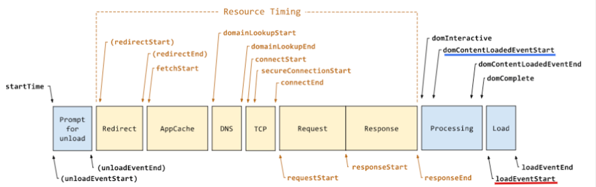
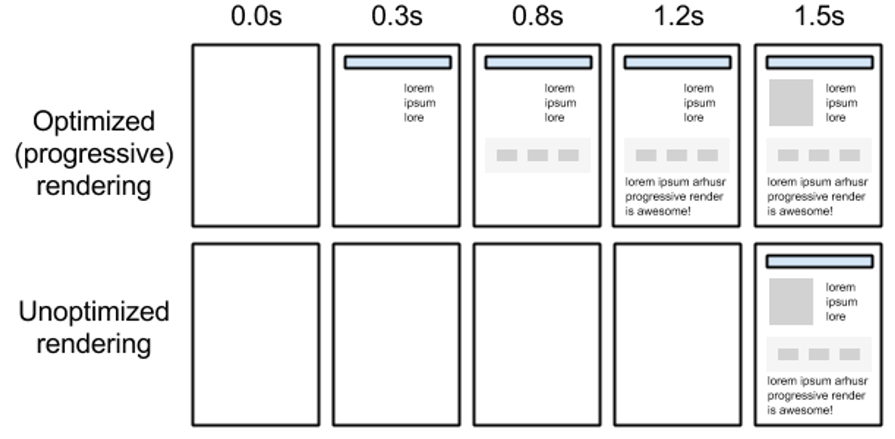
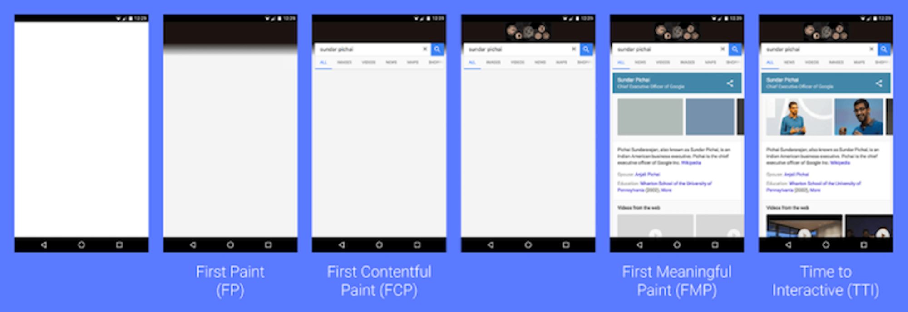

# 브라우저 렌더링

## 성능 측정

웹 페이지의 성능은 `브라우저 기준`과 `사용자 기준`에서 각각 측정 가능  

### 1. 브라우저 기준 성능 측정

웹 페이지의 **로드 시간** 측정

DOMContentLoaded와 load 이벤트의 발생 시점을 측정  
두 이벤트가 발생하는 시간 간격이 좁을수록 성능이 좋음 

* `DOMContentLoaded 이벤트`는 HTML, CSS 파싱이 끝나고 **렌더 트리를 구성할 준비가 된 시점**  
* `load 이벤트`는 HTML 상에 필요한 **모든 리소스가 로드된 시점**

  

### 2. 사용자 기준 성능 측정

웹 페이지에 사용자에게 제공하는 콘텐츠가 **처음 보여지는 시점**을 측정

  

웹 페이지가 로드되면서, **사용자에게 의미 있는 콘텐츠가 먼저 그려지는 시점을 측정**

  

### 측정 지표

* **⭐️ FMP(First Meaningful Paint)** : 사용자에게 의미 있는 콘텐츠가 그려지기 시작하는 첫 순간
  * CSS, JS가 로드되고 스타일이 적용되어 주요 콘텐츠를 읽을 수 있음 
* **FP(First Paint)** : 흰 화면에서 무언가 처음 그려지는 순간
* **FCP(First Contentful Paint)** : 콘텐츠(텍스트, 이미지)가 출력되기 시작한 순간
* **TTI(Time to Interactive)** : 자바스크립트의 초기 실행이 완료되어 사용자가 직접 행동을 취할 수 있는 순간
