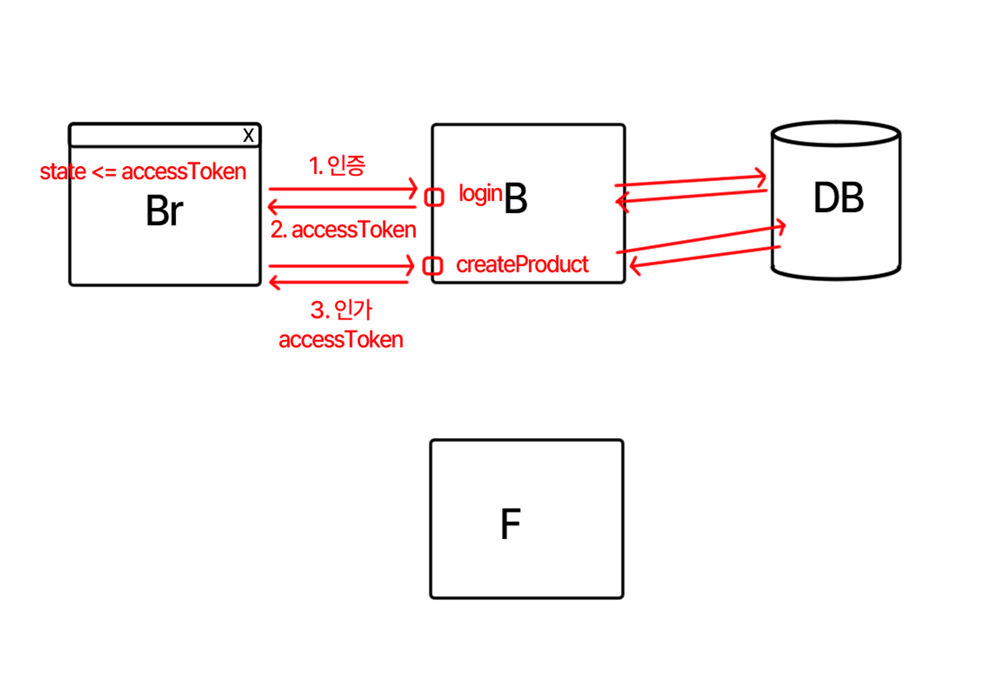

# AccessToken, RefreshToken

## RefreshToken 개념

리프레시 토큰으로 액세스 토큰 재발급  
2주~1개월 정도의 긴 만료 기한

1. 자동로그인으로 로그인 연장 개념
2. 로컬스토리지에 저장하면 보안이슈 발생 -> 새로고침할 때마다 토큰 재발급

  

## 기존 로그인 방식 - AccessToken

1~2시간 정도의 짧은 만료 기한

### 1. 인증(Authentication)

사용자의 신원을 검증하는 과정 (ID와 PW를 통해 로그인하는 행위)  
암호화해서 토큰 만드는 과정 

> `브라우저` ↔ `백엔드 / 세션` ↔ `데이터베이스`

인증하고서 받은 액세스 토큰 = **세션 아이디**

#### 브라우저 저장소에 저장

* 변수
* 로컬스토리지 : 보안에 취약 
* 세션스토리지 : 보안에 취약
* 쿠키 
  * `httpOnly` : 브라우저에서 Javascript를 이용해 쿠키에 접근할 수 없고, 통신으로만 해당 데이터를 주고받을 수 있는 옵션
  * `secure` : https 통신 시에만 해당 쿠키를 받아올 수 있는 옵션

 

### 2. 인가(Authorization) 

토큰을 복호화해서 이 사람이 특정 사용자가 맞는지 확인하는 과정   
인가 후 데이터 제공 

1. Redis 이용  
   레디스 : 메모리 기반의 데이터베이스  
   인가에 Redis 사용하면 빠름
2. 토큰 이용   
   암호화한 토큰, 객체를 토큰으로 만든 것    
   [JWT](https://jwt.io/) (JSON Web Token) = 엑세스 토큰이라고 부름
   
백엔드 자체에서 인가를 하기 때문에 api는 데이터 조회 1번만 하면 됨

현업에서는 JWT를 써도 레디스를 이용하게 됨  
중복 로그인 방지, 로그인 만료 등 복잡한 처리를 위해 레디스를 사용 

  
