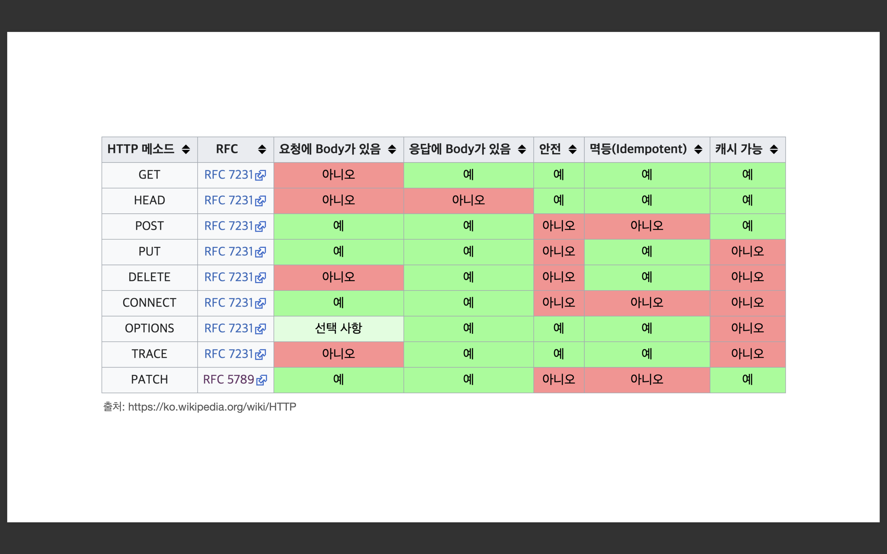

## HTTP 메소드 속성

### HTTP 메소드의 속성
* 안전(Safe Methods)
* 멱등(Idempotent Methods)
* 캐시가능(Cacheable Methods)

 

### 안전 Safe
호출해도 리소스가 변경되지 않는다 = 안전하다

Q. 그래도 계속 호출해서, 로그 같은게 쌓여서 장애가 발생하면?   
A. 안전은 해당 리소스만 고려한다. 그런 부분까지 고려하지 않는다.

 

### 멱등 Idempotent
* f(f(x)) = f(x)
* 한 번 호출하든 두 번 호출하든 100번 호출하든 결과가 똑같다.

 

* <strong>멱등 메소드</strong>
  * <strong>GET</strong> : 한 번 조회하든, 두 번 조회하든 같은 결과가 조회된다. 
  * <strong>PUT</strong> : 결과를 대체한다. 따라서 같은 요청을 여러번 해도 최종 결과는 같다. 
  * <strong>DELETE</strong> : 결과를 삭제한다. 같은 요청을 여러번 해도 삭제된 결과는 똑같다. 
  * <strong>⛔️POST</strong> : 멱등이 아니다! 두 번 호출하면 같은 결제가 중복해서 발생할 수 있다. 
  
   

<strong>활용</strong>
* 자동 복구 메커니즘 
* 서버가 TIMEOUT 등으로 정상 응답을 못 주었을 때, 클라이언트가 같은 요청을 다시 해도 되는가?의 판단 근거

  

<strong>Q: 재요청 중간에 다른 곳에서 리소스를 변경해버리면?</strong>
* 사용자1: GET -> username:A, age:20
* 사용자2: PUT -> username:A, age:30
* 사용자1: GET -> username:A, age:30 -> 사용자2의 영향으로 바뀐 데이터 조회 

<strong>A: 멱등은 외부 요인으로 중간에 리소스가 변경되는 것 까지는 고려하지는 않는다.</strong> 
동일한 사용자가 똑같은 요청을 여러번 한 것에 대해서만 고려

 

### 캐시가능 Cacheable
응답 결과 리소스를 캐시해서 사용해도 되는가? 
* GET, HEAD, POST, PATCH 캐시가능 
* 실제로는 GET, HEAD 정도만 캐시로 사용 
  * POST, PATCH는 본문 내용까지 캐시 키로 고려해야 하는데, 구현이 쉽지 않음