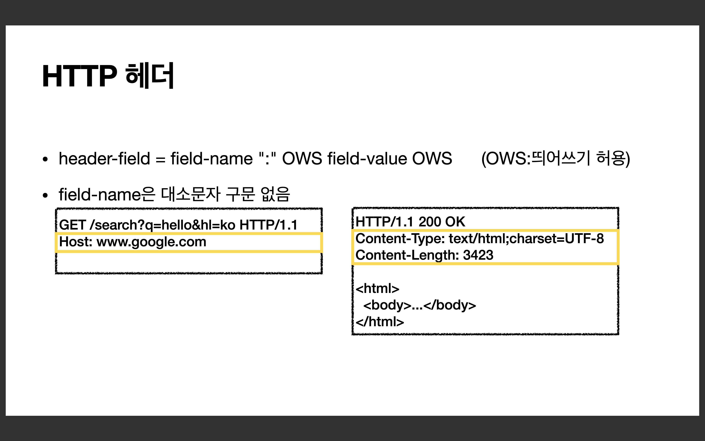

## HTTP 메시지

### 공식 스펙

    HTTP-message = start-line
                    *( header-field CRLF )
                    CRLF
                    [ message-body ]
https://tools.ietf.org/html/rfc7230#section-3

 

### 시작 라인
<strong>요청 메시지</strong>

    GET /search?q=hello&hl=ko HTTP/1.1
    Host: www.google.com

* start-line = <strong>request-line</strong> / status-line
* <strong>request-line</strong> = method SP(공백) request-target SP HTTP-version CRLF(엔터)

 

* HTTP 메서드 (GET: 조회)
  * 종류: GET, POST, PUT, DELETE 등
  * 서버가 수행해야 할 동작 지정
      * GET: 리소스 조회
      * POST: 요청 내역 처리 
    
        

* 요청 대상 (/search?q=hello&hl=ko)
  * absolute-path[?query] (절대경로[?쿼리]) 
  * 절대경로= "/" 로 시작하는 경로 
  * 참고: *, http://...?x=y 와 같이 다른 유형의 경로지정 방법도 있다.
     
  

* HTTP Version
  * HTTP/1.1

  

<strong>응답 메시지</strong>

    HTTP/1.1 200 OK
    Content-Type: text/html;charset=UTF-8 
    Content-Length: 3423

    <html> 
        <body>...</body>
    </html>

* start-line = request-line / <strong>status-line</strong>
* <strong>status-line</strong> = HTTP-version SP status-code SP reason-phrase CRLF

 

* HTTP 버전 
* HTTP 상태 코드: 요청 성공, 실패를 나타냄 
  * 200: 성공 
  * 400: 클라이언트 요청 오류 
  * 500: 서버 내부 오류
* 이유 문구: 사람이 이해할 수 있는 짧은 상태 코드 설명 글

 

### HTTP 헤더 

<strong>용도</strong>

* HTTP 전송에 필요한 모든 부가정보  
<em>Ex) 메시지 바디의 내용, 메시지 바디의 크기, 압축, 인증, 요청 클라이언트(브라우저) 정보,
서버 애플리케이션 정보, 캐시 관리 정보...</em> 
* 표준 헤더가 너무 많음
  * https://en.wikipedia.org/wiki/List_of_HTTP_header_fields
* 필요시 임의의 헤더 추가 가능 
  * helloworld: hihi

 

### HTTP 메시지 바디

<strong>용도</strong>

* 실제 전송할 데이터 
* HTML 문서, 이미지, 영상, JSON 등등 byte로 표현할 수 있는 모든 데이터 전송 가능

 

### 단순함, 확장 가능

* HTTP는 단순하다. 스펙도 읽어볼만 함 
* HTTP 메시지도 매우 단순 
* 크게 성공하는 표준 기술은 단순하지만 확장 가능한 기술