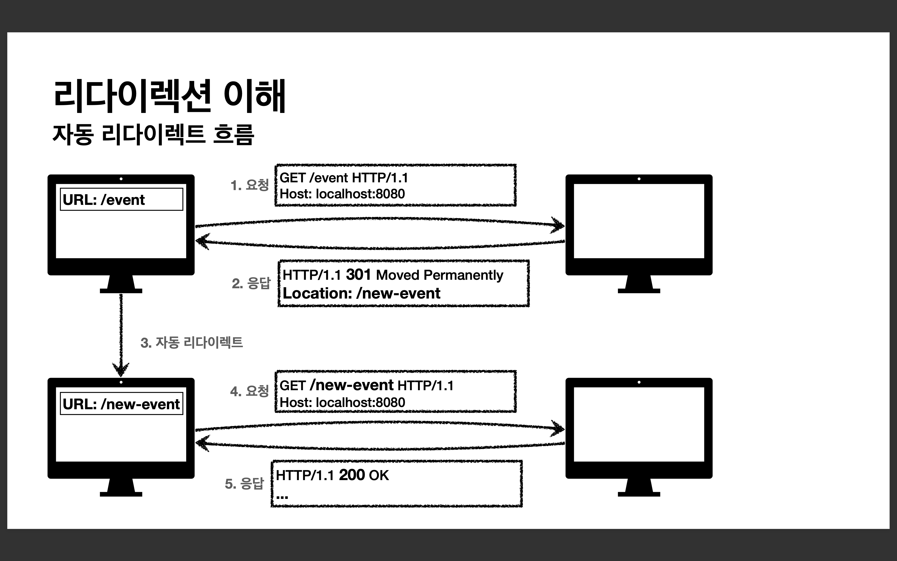
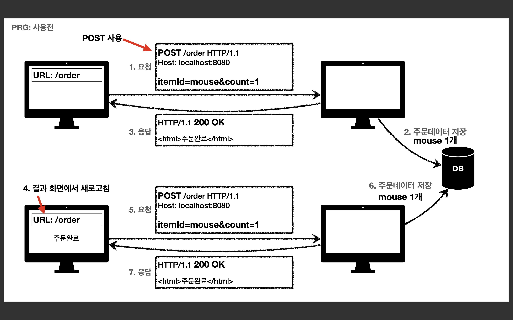
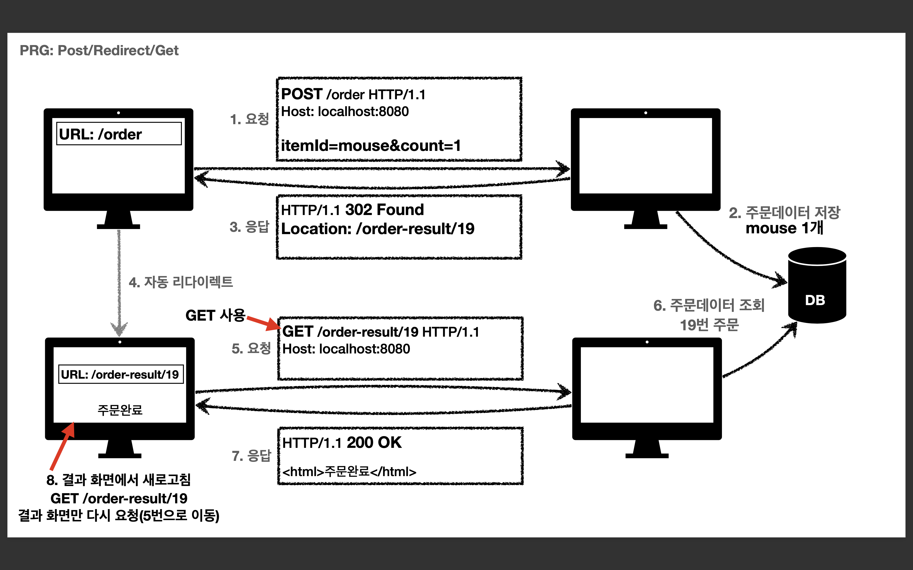

## HTTP 상태코드

### 상태코드

클라이언트가 보낸 요청의 처리 상태를 응답에서 알려주는 기능

* 1xx (Informational) : 요청이 수신되어 처리중 
* 2xx (Successful) : 요청 정상 처리 
* 3xx (Redirection) : 요청을 완료하려면 추가 행동이 필요 
* 4xx (Client Error) : 클라이언트 오류, 잘못된 문법등으로 서버가 요청을 수행할 수 없음 
* 5xx (Server Error) : 서버 오류, 서버가 정상 요청을 처리하지 못함

  

### 만약 모르는 상태 코드가 나타나면?
클라이언트가 인식할 수 없는 상태코드를 서버가 반환하면? 
* 클라이언트는 상위 상태코드로 해석해서 처리 
* 미래에 새로운 상태 코드가 추가되어도 클라이언트를 변경하지 않아도 됨 
* <em>Ex)
  * 299 ??? -> 2xx (Successful) 
  * 451 ??? -> 4xx (Client Error) 
  * 599 ??? -> 5xx (Server Error) </em>
  
  

### 1xx (Informational)
요청이 수신되어 처리중  
* 거의 사용하지 않으므로 생략

  

### 2xx - 성공 (Successful)
클라이언트의 요청을 성공적으로 처리
* 200 OK 
* 201 Created 
* 202 Accepted 
* 204 No Content

 

><strong>201 Created</strong>  

요청 성공해서 새로운 리소스가 생성됨  
* 생성된 리소스는 응답의 Location 헤더 필드로 식별  
* POST는 서버에서 자원 생성

    요청
    POST /members HTTP/1.1 
    Content-Type: application/json
    
    {
        "username": "young", 
        "age": 20
    }
 

    응답
    HTTP/1.1 201 Created 
    Content-Type: application/json 
    Content-Length: 34
    Location: /members/100
    
    {
        "username": "young", 
        "age": 20
    }

 

><strong>202 Accepted</strong>  

요청이 접수되었으나 처리가 완료되지 않았음  
* 배치 처리 같은 곳에서 사용  
* <em>Ex) 요청 접수 후 1시간 뒤에 배치 프로세스가 요청을 처리함</em>

 

><strong>204 No Content</strong>  

서버가 요청을 성공적으로 수행했지만, 응답 페이로드 본문에 보낼 데이터가 없음  

* <em>Ex) 웹 문서 편집기에서 save 버튼</em> 
  * save 버튼의 결과로 아무 내용이 없어도 된다. 
  * save 버튼을 눌러도 같은 화면을 유지해야 한다. 
  * 결과 내용이 없어도 204 메시지(2xx)만으로 성공을 인식할 수 있다.

  

### 3xx - 리다이렉션 (Redirection)
요청을 완료하기 위해 유저 에이전트(주로 웹브라우저)의 추가 조치 필요
* 300 Multiple Choices 
* 301 Moved Permanently 
* 302 Found 
* 303 See Other 
* 304 Not Modified 
* 307 Temporary Redirect 
* 308 Permanent Redirect

 

<strong>리다이렉션 이해</strong>

웹 브라우저는 3xx 응답의 결과에 Location 헤더가 있으면, Location 위치로 자동 이동 (리다이렉트)

 

### 종류
* <strong>영구 리다이렉션</strong> - 특정 리소스의 URI가 영구적으로 이동
  * <em>Ex) /members -> /users 
  * Ex) /event -> /new-event </em>
* <strong>일시 리다이렉션</strong> - 일시적인 변경 
  * 주문 완료 후 주문 내역 화면으로 이동 
  * PRG : Post/Redirect/Get 
* <strong>특수 리다이렉션</strong> 
  * 결과 대신 캐시를 사용

 

> <strong>영구 리다이렉션   
> 301, 308</strong>

* 리소스의 URI가 영구적으로 이동 
* 원래의 URL를 사용X, 검색 엔진 등에서도 변경 인지 
* <strong>301 Moved Permanently 
  * 리다이렉트시 요청 메소드가 GET으로 변하고, 본문이 제거될 수 있음(MAY)
* 308 Permanent Redirect</strong> 
  * 301과 기능은 같음 
  * <strong>리다이렉트시 요청 메소드와 본문 유지(처음 POST를 보내면 리다이렉트도 POST 유지)</strong>
* <em>실무에서는 301을 그나마 더 사용하지만, 영구 리다이렉션은 대체로 사용하지 않는 편</em>

 

><strong>일시적인 리다이렉션  
>302, 307, 303</strong>

* 리소스의 URI가 일시적으로 변경 
* 따라서 검색 엔진 등에서 URL을 변경하면 안됨 
* <strong>302 Found
  * 리다이렉트시 요청 메소드가 GET으로 변하고, 본문이 제거될 수 있음<u>(MAY)</u>
* 307 Temporary Redirect</strong> 
  * 302와 기능은 같음 
  * <strong>리다이렉트시 요청 메소드와 본문 <u>유지</u> (요청 메서드를 변경하면 안된다. MUST NOT) 
* 303 See Other </strong>
  * 302와 기능은 같음 
  * <strong>리다이렉트시 요청 메소드가 GET으로 <u>변경</u></strong>
* <em>실무에서는 302를 많이 사용</em>

 

> <strong>PRG: Post/Redirect/Get</strong> 

일시적인 리다이렉션 - 예시

* POST로 주문후에 웹 브라우저를 새로고침하면? 
* 새로고침은 다시 요청 
* 중복 주문이 될 수 있다

 

* POST로 주문후에 새로 고침으로 인한 중복 주문 방지 
* POST로 주문후에 주문 결과 화면을 GET 메소드로 리다이렉트 
* 새로고침해도 결과 화면을 GET으로 조회 
* 중복 주문 대신에 결과 화면만 GET으로 다시 요청

 

* PRG 이후 리다이렉트 
  * URL이 이미 POST -> GET으로 리다이렉트 됨 
  * 새로고침해도 GET으로 결과 화면만 조회

 

> <strong>그래서 뭘 써야 하나요? 302, 307, 303</strong>

* <strong>정리</strong> 
  * 302 Found -> GET으로 변할 수 있음 
  * 307 Temporary Redirect -> 메서드가 변하면 안됨 
  * 303 See Other -> 메서드가 GET으로 변경

* <strong>역사</strong>
  * 처음 302 스펙의 의도는 HTTP 메서드를 유지하는 것 
  * 그런데 웹 브라우저들이 대부분 GET으로 바꾸어버림(일부는 다르게 동작)
  * 그래서 모호한 302를 대신하는 명확한 307, 303이 등장함(301 대응으로 308도 등장)

* <strong>현실</strong> 
  * 307, 303을 권장하지만 현실적으로 이미 많은 애플리케이션 라이브러리들이 302를 기본값으로 사용 
  * 자동 리다이렉션시에 GET으로 변해도 되면 그냥 302를 사용해도 큰 문제 없음

 

> <strong>기타 리다이렉션  
> 300 304</strong>

* 300 Multiple Choices: 안쓴다. 
* 304 Not Modified
  * 캐시를 목적으로 사용
  * 클라이언트에게 리소스가 수정되지 않았음을 알려준다. 따라서 클라이언트는 로컬PC에 저장된 캐시를 재사용한다. (캐시로 리다이렉트 한다.)
  * 304 응답은 응답에 메시지 바디를 포함하면 안된다. (로컬 캐시를 사용해야 하므로) 
  * 조건부 GET, HEAD 요청시 사용

  

### 4xx - 클라이언트 오류 (Client Error)

* 클라이언트의 요청에 잘못된 문법등으로 서버가 요청을 수행할 수 없음
* <strong>오류의 원인이 클라이언트에 있음</strong>
* ⭐️중요! 클라이언트가 이미 잘못된 요청, 데이터를 보내고 있기 때문에, 똑같은 재시도가 실패함

 

><strong>400 Bad Request</strong>  

클라이언트가 잘못된 요청을 해서 서버가 요청을 처리할 수 없음

* 요청 구문, 메시지 등등 오류
* 클라이언트는 요청 내용을 다시 검토하고, 보내야함
* <em>Ex) 요청 파라미터가 잘못되거나, API 스펙이 맞지 않을 때</em>

 

><strong>401 Unauthorized</strong>  

클라이언트가 해당 리소스에 대한 인증이 필요함

* 인증(Authentication) 되지 않음 - 로그인되지 않음
* 401 오류 발생시 응답에 WWW-Authenticate 헤더와 함께 인증 방법을 설명 
* 참고
  * 인증(Authentication) : 본인이 누구인지 확인 (로그인)
  * 인가(Authorization) : 권한부여 (ADMIN 권한처럼 특정 리소스에 접근할 수 있는 권한, 인증이 있어야 인가가 있음)
  * 오류 메시지가 Unauthorized 이지만 인증 되지 않음 (이름이 아쉬움)

 

><strong>403 Forbidden</strong>  

서버가 요청을 이해했지만 승인을 거부함
* 주로 인증 자격 증명은 있지만, 접근 권한이 불충분한 경우
* <em>Ex) 어드민 등급이 아닌 사용자가 로그인은 했지만, 어드민 등급의 리소스에 접근하는 경우</em>

 

><strong>404 Not Found</strong>  

요청 리소스를 찾을 수 없음
* 요청 리소스가 서버에 없음
* 또는 클라이언트가 권한이 부족한 리소스에 접근할 때 해당 리소스를 숨기고 싶을 때

  

### 5xx - 서버 오류 (Server Error)
* 서버 문제로 오류 발생 
* 서버에 문제가 있기 때문에 재시도하면 성공할 수도 있음(복구가 되거나 등등)

 

><strong>500 Internal Server Error</strong>  

서버 내부 문제로 오류 발생, 애매하면 500 오류

 

><strong>503 Service Unavailable</strong>  

서비스 이용 불가
* 서버가 일시적인 과부하 또는 예정된 작업으로 잠시 요청을 처리할 수 없음 
* Retry-After 헤더 필드로 얼마뒤에 복구되는지 보낼 수도 있음
