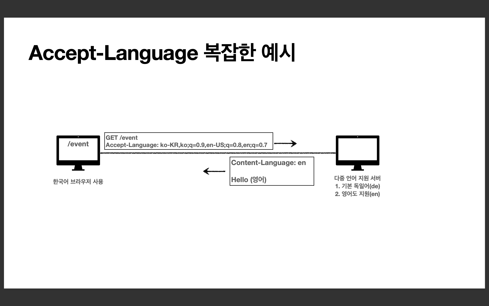
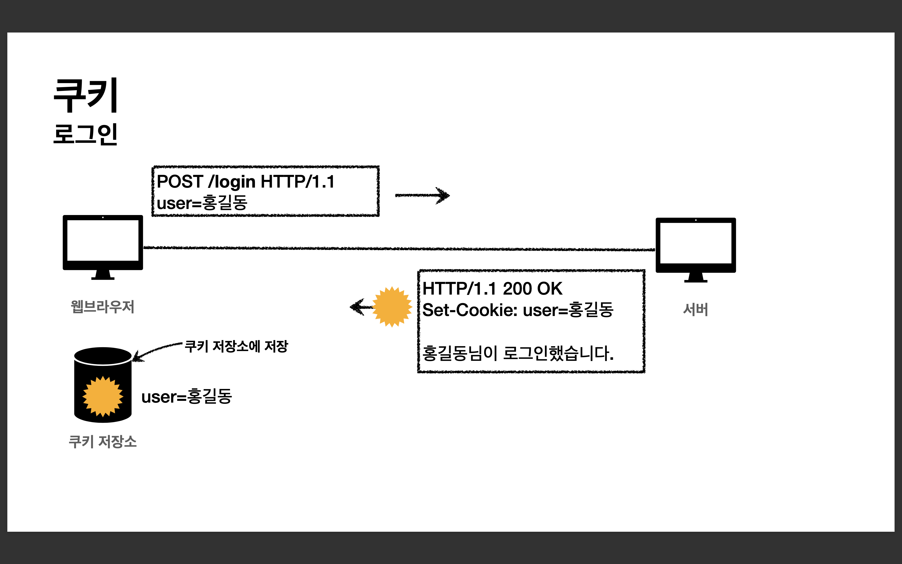
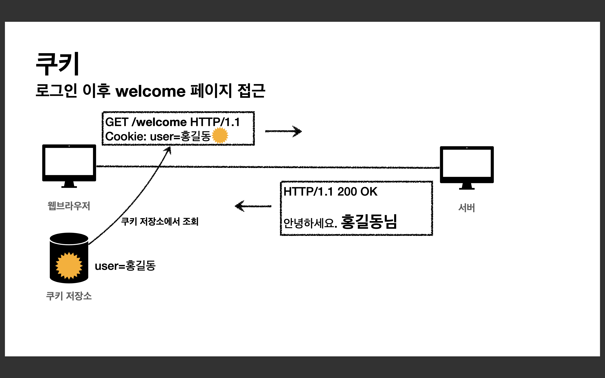
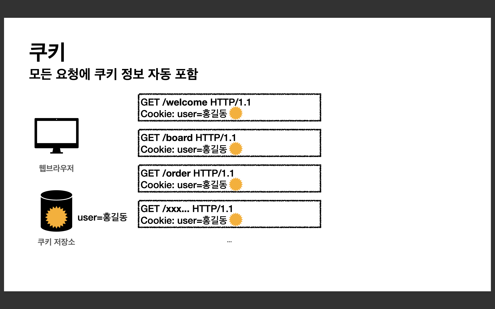

# 일반 헤더

## 1. HTTP 헤더 개요

### HTTP 헤더
header-field = field-name ":" OWS field-value OWS (OWS:띄어쓰기 허용)

    GET /search?q=hello&hl=ko HTTP/1.1 
    Host: www.google.com

field-name은 대소문자 구문 없음

    HTTP/1.1 200 OK
    Content-Type: text/html;charset=UTF-8 
    Content-Length: 3423

    <html> 
        <body>...</body>
    </html>

 

### HTTP 헤더 용도

* HTTP 전송에 필요한 모든 부가정보
  * <em>Ex) 메시지 바디의 내용, 메시지 바디의 크기, 압축, 인증, 요청 클라이언트, 서버 정보, 캐시 관리 정보...</em>
* 표준 헤더가 너무 많음
  * https://en.wikipedia.org/wiki/List_of_HTTP_header_fields
* 필요시 임의의 헤더 추가 가능
  * helloworld: hihi

 

### HTTP 헤더 분류
<strong>RFC2616 (과거)  

* 헤더 분류</strong>
  * <strong>General 헤더</strong> : 메시지 전체에 적용되는 정보, Ex) Connection : close
  * <strong>Request 헤더</strong> : 요청 정보, Ex) User-Agent : Mozilla/5.0 (Macintosh; ..)
  * <strong>Response 헤더</strong> : 응답 정보, Ex) Server : Apache
  * <strong>Entity 헤더</strong> : 엔티티 바디 정보, Ex) Content-Type : text/html, Content-Length: 3423

 

### HTTP BODY 
<strong>message body - RFC2616 (과거)</strong>

* 메시지 본문(message body)은 엔티티 본문(entity body)을 전달하는데 사용 
* 엔티티 본문은 요청이나 응답에서 전달할 실제 데이터 (메시지 본문 안에 엔티티 본문을 담아 전송)
* <strong>엔티티 헤더</strong>는 <strong>엔티티 본문</strong>의 데이터를 해석할 수 있는 정보 제공
  * 데이터 유형(html, json), 데이터 길이, 압축 정보 등등

 

### HTTP 표준 
1999년 RFC2616 ❌ <--- 폐기됨  
2014년 RFC7230~7235 등장  

 

### RFC723x 변화
* 엔티티(Entity) -> 표현(Representation)
* Representation = representation Metadata + Representation Data
* 표현 = 표현 메타데이터 + 표현 데이터

 

### HTTP BODY
<strong>message body - RFC7230(최신)</strong>

* 메시지 본문(message body)을 통해 표현 데이터 전달 
* 메시지 본문 = 페이로드(payload)
* <strong>표현</strong>은 요청이나 응답에서 전달할 실제 데이터
* <strong>표현 헤더는 표현 데이터</strong>를 해석할 수 있는 정보 제공
  * 데이터 유형(html, json), 데이터 길이, 압축 정보 등등
* <em>참고: 표현 헤더는 표현 메타데이터와, 페이로드 메시지를 구분해야 하지만, 여기서는 생략</em>

  

---

## 2. 표현
* Content-Type : 표현 데이터의 형식 
* Content-Encoding : 표현 데이터의 압축 방식 
* Content-Language : 표현 데이터의 자연 언어 (영어, 한국어) 
* Content-Length : 표현 데이터의 길이

* <em>표현 헤더는 전송, 응답 둘다 사용</em>

 

### Content-Type
<strong>표현 데이터의 형식 설명</strong>

    HTTP/1.1 200 OK
    Content-Type: text/html;charset=UTF-8 
    Content-Length: 3423
    
    <html> 
        <body>...</body>
    </html>

또는 

    HTTP/1.1 200 OK 
    Content-Type: application/json 
    Content-Length: 16
    
    {"data":"hello"}

* 미디어 타입, 문자 인코딩  
* <em>Ex)
  * text/html; charset=utf-8
  * application/json 
  * image/png</em>

 

### Content-Encoding
<strong>표현 데이터 인코딩</strong>

    HTTP/1.1 200 OK
    Content-Type: text/html;charset=UTF-8 
    Content-Encoding: gzip 
    Content-Length: 521
    
    lkj123kljoiasudlkjaweioluywlnfdo912u34lj 
    ko98udjkl

* 표현 데이터를 압축하기 위해 사용
* 데이터를 전달하는 곳에서 압축 후 인코딩 헤더 추가 
* 데이터를 읽는 쪽에서 인코딩 헤더의 정보로 압축 해제
* <em>Ex)
  * gzip 
  * deflate 
  * identity (압축x)</em>

 

### Content-Language
<strong>표현 데이터의 자연 언어</strong>

* 표현 데이터의 자연 언어를 표현 
* <em>Ex)
  * ko
  * en 
  * en-US</em>
  
 

### Content-Length
<strong>표현 데이터의 길이</strong>

    HTTP/1.1 200 OK
    Content-Type: text/html;charset=UTF-8 
    Content-Length: 5
    
    hello

* 바이트 단위
* Transfer-Encoding(전송 코딩)을 사용하면 Content-Length를 사용하면 안됨

  

---

## 3. 콘텐츠 협상

### 협상(콘텐츠 네고시에이션) 
<strong>클라이언트가 선호하는 표현 요청</strong>

* Accept : 클라이언트가 선호하는 미디어 타입 전달 
* Accept-Charset : 클라이언트가 선호하는 문자 인코딩 
* Accept-Encoding : 클라이언트가 선호하는 압축 인코딩 
* Accept-Language : 클라이언트가 선호하는 자연 언어

* <em>협상 헤더는 요청시에만 사용</em>

 

### 협상과 우선순위1 
<strong>Quality Values(q)</strong>

    GET /event
    Accept-Language: ko-KR,ko;q=0.9,en-US;q=0.8,en;q=0.7

* Quality Values(q) 값 사용
* 0~1, <strong>클수록 높은 우선순위</strong>
* 생략하면 1
* Accept-Language: ko-KR,ko;q=0.9,en-US;q=0.8,en;q=0.7
  1. ko-KR;q=1 (q생략)
  2. ko;q=0.9
  3. en-US;q=0.8 
  4. en:q=0.7

 

### 협상과 우선순위2 
<strong>Quality Values(q)</strong>

    GET /event
    Accept: text/*, text/plain, text/plain;format=flowed, */*

* 구체적인 것이 우선한다.
* Accept: <strong>text/﹡, text/plain, text/plain;format=flowed, ﹡/﹡</strong> 
  1. text/plain;format=flowed
  2. text/plain
  3. text/﹡
  4. ﹡/﹡

 

### 협상과 우선순위3 
<strong>Quality Values(q)</strong>

* 구체적인 것을 기준으로 미디어 타입을 맞춘다. 
* Accept: <strong>text/*</strong>;q=0.3, <strong>text/html</strong>;q=0.7, <strong>text/html;level=1</strong>, <strong>text/html;level=2</strong>;q=0.4, ﹡/﹡;q=0.5

  

---

## 4. 전송 방식

* Transfer-Encoding 
* Range, Content-Range

 

### 전송 방식 설명
* <strong>단순 전송</strong> : 한번에 요청하고 한번에 받기. 콘텐츠 길이를 알 때 (Ex. Content-Length: 3423)
* <strong>압축 전송</strong> : 압축해서 용량을 줄일 수 있음 (Ex. Content-Encoding: gzip)
* <strong>분할 전송</strong> : Content-Length 넣으면 안됨 (Ex. Transfer-Encoding: chunked)
* <strong>범위 전송</strong> : 범위 지정해서 전송 (Ex. Content-Range: bytes 1001-2000 / 2000)
  
  

---

## 5. 일반 정보

* From : 유저 에이전트의 이메일 정보
* Referer : 이전 웹 페이지 주소
* User-Agent : 유저 에이전트 애플리케이션 정보
* Server : 요청을 처리하는 오리진 서버의 소프트웨어 정보 
* Date : 메시지가 생성된 날짜

 

### From
<strong>유저 에이전트의 이메일 정보</strong>

* 일반적으로 잘 사용되지 않음 
* 검색 엔진 같은 곳에서, 주로 사용 
* 요청에서 사용

 

### Referer
<strong>이전 웹 페이지 주소</strong>

* 현재 요청된 페이지의 이전 웹 페이지 주소 
* A -> B로 이동하는 경우 B를 요청할 때 Referer: A 를 포함해서 요청 
* Referer를 사용해서 유입 경로 분석 가능 
* 요청에서 사용 
* <em>참고: referer는 단어 referrer의 오타</em>

 

### User-Agent
<strong>유저 에이전트 애플리케이션 정보</strong>

* user-agent: Mozilla/5.0 (Macintosh; Intel Mac OS X 10_15_7) AppleWebKit/ 537.36 (KHTML, like Gecko) Chrome/86.0.4240.183 Safari/537.36 
* 클라이언트의 애플리케이션 정보(웹 브라우저 정보, 등등) 
* 통계 정보 
* 어떤 종류의 브라우저에서 장애가 발생하는지 파악 가능 
* 요청에서 사용
* <em>클라이언트의 애플리케이션 = 유저 에이전트</em>

 

### Server
<strong>요청을 처리하는 ORIGIN 서버의 소프트웨어 정보</strong>

* Server: Apache/2.2.22 (Debian) 
* server: nginx
* 응답에서 사용
* <em>ORIGIN 서버 = 요청이 이루어지는 마지막 서버 </em>

 

### Date
<strong>메시지가 발생한 날짜와 시간</strong>
* Date: Tue, 15 Nov 1994 08:12:31 GMT 
* 응답에서 사용

  

---

## 6. 특별한 정보

* Host : 요청한 호스트 정보(도메인)
* Location : 페이지 리다이렉션
* Allow : 허용 가능한 HTTP 메서드
* Retry-After : 유저 에이전트가 다음 요청을 하기까지 기다려야 하는 시간

 

### ⭐ ️Host
<strong>요청한 호스트 정보(도메인)</strong>

    GET /search?q=hello&hl=ko HTTP/1.1 
    Host: www.google.com

* 요청에서 사용
* 필수
* 하나의 서버가 여러 도메인을 처리해야 할 때 
* 하나의 IP 주소에 여러 도메인이 적용되어 있을 때

 

### Location
<strong>페이지 리다이렉션</strong>

* 웹 브라우저는 3xx 응답의 결과에 Location 헤더가 있으면, Location 위치로 자동 이동 (리다이렉트)
* 응답코드 3xx에서 설명
* 201 (Created) : Location 값은 요청에 의해 생성된 리소스 URI
* 3xx (Redirection) : Location 값은 요청을 자동으로 리디렉션하기 위한 대상 리소스를 가리킴

 

### Allow
<strong>허용 가능한 HTTP 메서드</strong>

* 405 (Method Not Allowed) 에서 응답에 포함해야함 
* Allow: GET, HEAD, PUT
* POST를 지원하지 않는다는 것을 알려줘야 함
* <em>서버에서 많이 구현되어 있지는 않다.</em>

 

### Retry-After
<strong>유저 에이전트가 다음 요청을 하기까지 기다려야 하는 시간</strong>

* 503 (Service Unavailable): 서비스가 언제까지 불능인지 알려줄 수 있음 
* Retry-After: Fri, 31 Dec 1999 23:59:59 GMT (날짜 표기) 
* Retry-After: 120 (초단위 표기)

  

---

## 7. 인증

* Authorization: 클라이언트 인증 정보를 서버에 전달 
* WWW-Authenticate: 리소스 접근시 필요한 인증 방법 정의

 

### Authorization
<strong>클라이언트 인증 정보를 서버에 전달</strong>

* Authorization: Basic xxxxxxxxxxxxxxxx

 

### WWW-Authenticate
<strong>리소스 접근시 필요한 인증 방법 정의</strong>

* 401 Unauthorized 응답과 함께 사용 
* WWW-Authenticate: Newauth realm="apps", type=1, 

title="Login to \"apps\"", Basic realm="simple"

  

---

## 8. 쿠키

* Set-Cookie : 서버에서 클라이언트로 쿠키 전달(응답)
* Cookie : 클라이언트가 서버에서 받은 쿠키를 저장하고, HTTP 요청시 서버로 전달

 

### Stateless
* HTTP는 무상태(Stateless) 프로토콜이다.
* 클라이언트와 서버가 요청과 응답을 주고 받으면 연결이 끊어진다. 
* 클라이언트가 다시 요청하면 서버는 이전 요청을 기억하지 못한다. 
* 클라이언트와 서버는 서로 상태를 유지하지 않는다.

 

### 모든 요청에 정보를 넘기는 문제
* 모든 요청에 사용자 정보가 포함되도록 개발해야함 
* 브라우저를 완전히 종료하고 다시 열면?

 

 

### 쿠키 설명
* 예) set-cookie: <strong>sessionId=abcde1234; expires</strong>=Sat, 26-Dec-2020 00:00:00 GMT; <strong>path</strong>=/; <strong>domain</strong>=.google.com; <strong>Secure</strong> 
* 사용처
  * 사용자 로그인 세션 관리
  * 광고 정보 트래킹
* 쿠키 정보는 항상 서버에 전송됨
  * 네트워크 트래픽 추가 유발
  * 최소한의 정보만 사용해야함 (세션 id, 인증 토큰)
  * 서버에 전송하지 않고, 웹 브라우저 내부에 데이터를 저장하고 싶으면 웹 스토리지 (localStorage, sessionStorage) 참고
* <em>주의! 보안에 민감한 데이터는 저장하면 안됨 (주민번호, 신용카드 번호 등등)</em>

 

### 쿠키 - 생명주기 
<strong>Expires, max-age</strong>

* Set-Cookie : <strong>expires</strong>=Sat, 26-Dec-2020 04:39:21 GMT
  * 만료일이 되면 쿠키 삭제
* Set-Cookie : <strong>max-age</strong>=3600 (3600초)
  * 0이나 음수를 지정하면 쿠키 삭제
* 세션 쿠키 : 만료 날짜를 생략하면 브라우저 종료시 까지만 유지 
* 영속 쿠키 : 만료 날짜를 입력하면 해당 날짜까지 유지

 

### 쿠키 - 도메인 
<strong>Domain</strong>

* Ex) domain=example.org
* <strong>명시 : 명시한 문서 기준 도메인 + 서브 도메인 포함</strong>
  * <em>Ex) domain=example.org를 지정해서 쿠키 생성
    * example.org는 물론이고
    * dev.example.org도 쿠키 접근</em> 
* <strong>생략 : 현재 문서 기준 도메인만 적용</strong>
  * <em>Ex) example.org에서 쿠키를 생성하고 domain 지정을 생략
    * example.org에서만 쿠키 접근
    * dev.example.org는 쿠키 미접근</em>

 

### 쿠키 - 경로 
<strong>Path</strong>

* 예) path=/home
* <strong>이 경로를 포함한 하위 경로 페이지만 쿠키 접근
* 일반적으로 path=/ 루트로 지정</strong> 
* Ex)
  * <strong>path=/home 지정</strong>
  * /home -> 가능 
  * /home/level1 -> 가능 
  * /home/level1/level2 -> 가능 
  * /hello -> 불가능

 

### 쿠키 - 보안 
<strong>Secure, HttpOnly, SameSite</strong>

* Secure
  * 쿠키는 http, https를 구분하지 않고 전송
  * Secure를 적용하면 https인 경우에만 전송 
* HttpOnly
  * XSS 공격 방지
  * 자바스크립트에서 접근 불가(document.cookie) 
  * HTTP 전송에만 사용
* SameSite
  * XSRF 공격 방지
  * 요청 도메인과 쿠키에 설정된 도메인이 같은 경우만 쿠키 전송
