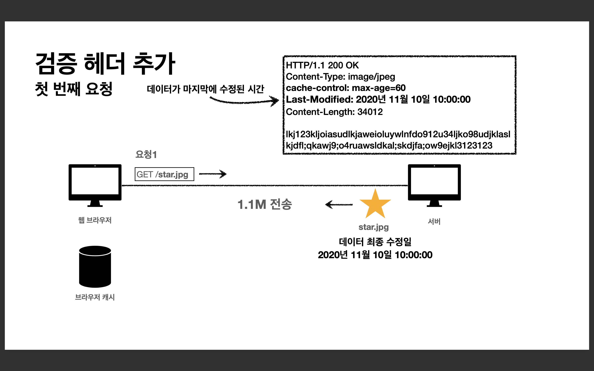
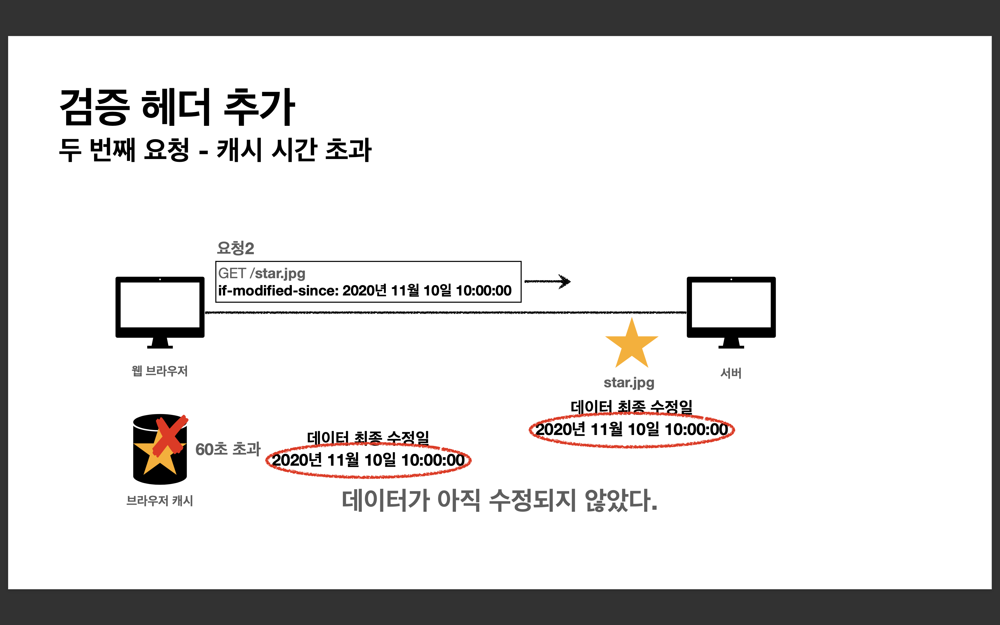
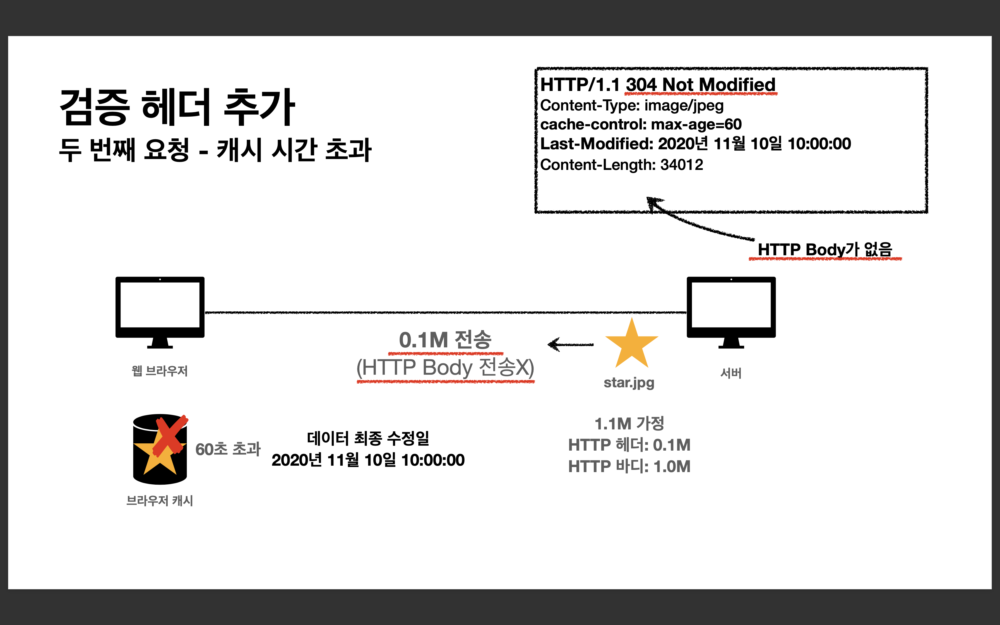
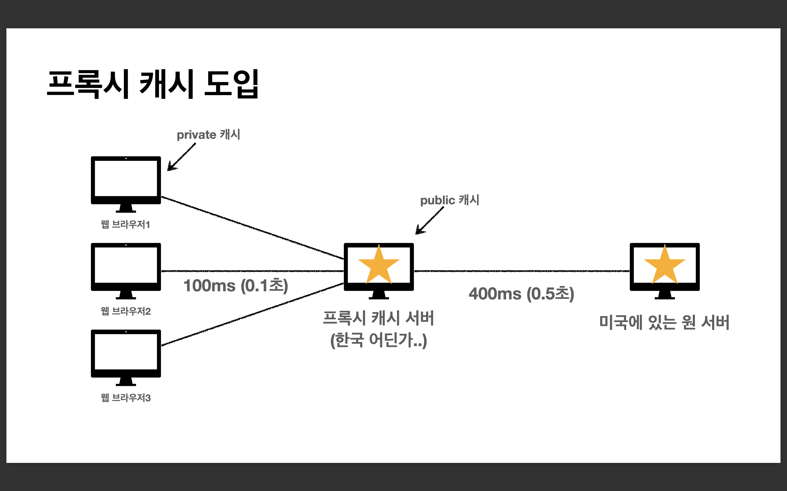
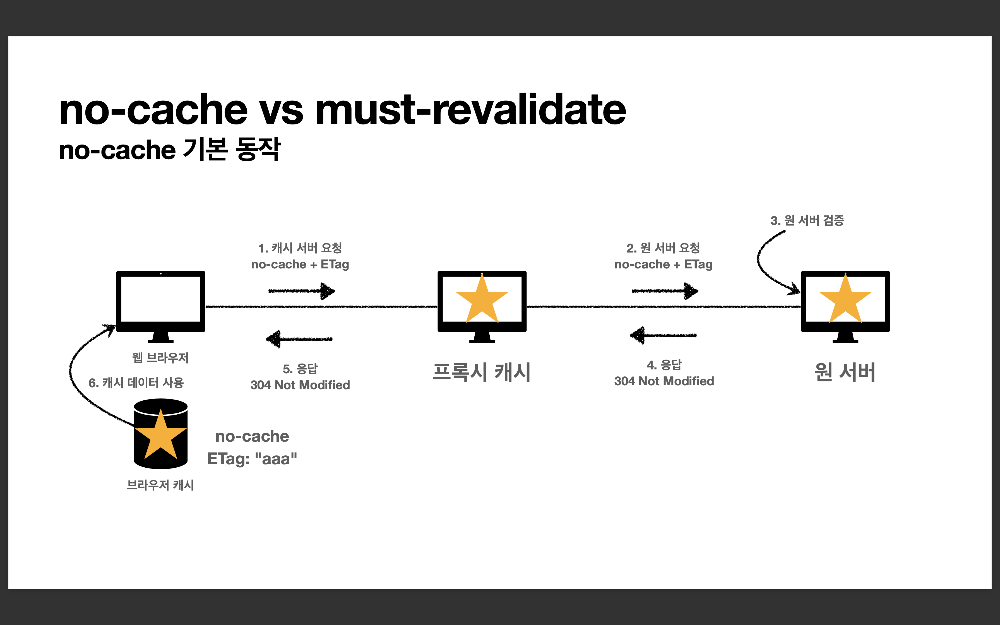
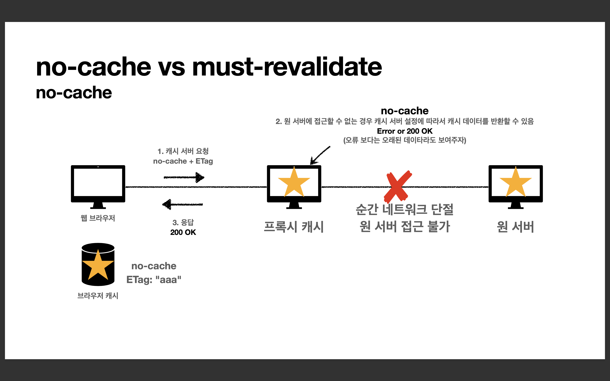
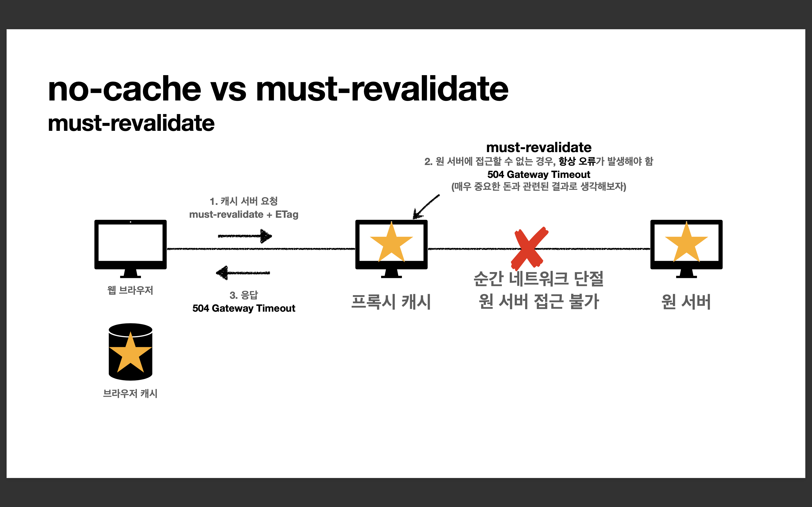

# 캐시와 조건부 요청

## 1. 캐시 기본 동작

### 캐시가 없을 때
* 데이터가 변경되지 않아도 계속 네트워크를 통해서 데이터를 다운로드 받아야 한다. 
* 인터넷 네트워크는 매우 느리고 비싸다. 
* 브라우저 로딩 속도가 느리다. 
* 느린 사용자 경험

 

### 캐시 적용
* 캐시 덕분에 캐시 가능 시간동안 네트워크를 사용하지 않아도 된다. 
* 비싼 네트워크 사용량을 줄일 수 있다.
* 브라우저 로딩 속도가 매우 빠르다.
* 빠른 사용자 경험

    HTTP/1.1 200 OK 
    Content-Type: image/jpeg
    ⭐️cache-control: max-age=60
    Content-Length: 34012

    lkj123kljoiasudlkjaweioluywlnfdo912u34ljko98udjkla 
    slkjdfl;qkawj9;o4ruawsldkal;skdjfa;ow9ejkl3123123

<strong>️cache-control : 캐시가 유효한 시간(초)</strong>

 

1. 첫 번째 요청 : 응답 결과를 캐시에 저장
2. 두 번째 요청 : 캐시 유효 시간 검증 -> 캐시에서 조회
3. 세 번째 요청 - 캐시 시간 초과 : 캐시 유효 시간 검증 -> 응답 결과를 다시 캐시에 저장

 

### 캐시 시간 초과
* 캐시 유효 시간이 초과하면, 서버를 통해 데이터를 다시 조회하고, 캐시를 갱신한다. 
* 이때 다시 네트워크 다운로드가 발생한다.

  

---

## 2. 검증 헤더와 조건부 요청1

### 캐시 시간 초과
캐시 유효 시간이 초과해서 서버에 다시 요청하면 다음 두 가지 상황이 나타난다. 
1. 서버에서 기존 데이터를 변경함 💛 -> 💚
2. 서버에서 기존 데이터를 변경하지 않음 💛

 

### 검증 헤더 추가
* 캐시 만료후에도 서버에서 데이터를 변경하지 않음 💛
* 생각해보면 데이터를 전송하는 대신에 저장해 두었던 캐시를 재사용할 수 있다.
* 단 클라이언트의 데이터와 서버의 데이터가 <u>같다는 사실을 확인할 수 있는 방법</u> 필요

    
    HTTP/1.1 200 OK
    Content-Type: image/jpeg
    cache-control: max-age=60 
    ⭐️Last-Modified: 2020년 11월 10일 10:00:00
    Content-Length: 34012
    
    lkj123kljoiasudlkjaweioluywlnfdo912u34ljko98udjklasl 
    kjdfl;qkawj9;o4ruawsldkal;skdjfa;ow9ejkl3123123

<strong>Last-Modified(검증 헤더) : 데이터가 마지막에 수정된 시간</strong>

 

 

1. 첫 번째 요청 : 응답 결과를 캐시에 저장
2. 두 번째 요청 - 캐시 시간 초과 : 
   1. 캐시가 가지고 있는, 데이터 최종 수정일 담아 요청
   2. 서버의 데이터 최종 수정일과 비교 검증 
   3. HTTP Body제외, 헤더만 전송
   4. 응답 결과를 재사용, 헤더 데이터 갱신 
   5. 캐시에서 조회

    
    <2-1>
    GET /star.jpg
    if-modified-since: 2020년 11월 10일 10:00:00

<strong>if-modified-since(조건부 요청)</strong>

    <2-3>
    HTTP/1.1 ⭐️304 Not Modified
    Content-Type: image/jpeg
    cache-control: max-age=60 
    Last-Modified: 2020년 11월 10일 10:00:00 
    Content-Length: 34012

304 Not Modified, HTTP Body 전송X    

 

### 검증 헤더와 조건부 요청 정리

* 캐시 유효 시간이 초과해도, 서버의 데이터가 갱신되지 않으면
* 304 Not Modified + 헤더 메타 정보만 응답 (바디X)
* 클라이언트는 서버가 보낸 응답 헤더 정보로 캐시의 메타 정보를 갱신 
* 클라이언트는 캐시에 저장되어 있는 데이터 재활용
* 결과적으로 네트워크 다운로드가 발생하지만, 용량이 적은 헤더 정보만 다운로드 
* 매우 실용적인 해결책

  

---

## 3. 검증 헤더와 조건부 요청2

### 검증 헤더와 조건부 요청
* <strong>검증 헤더</strong>
  * 캐시 데이터와 서버 데이터가 같은지 검증하는 데이터
  * Last-Modified , ETag

* <strong>조건부 요청 헤더</strong>
  * 검증 헤더로 조건에 따른 분기 
  * If-Modified-Since : Last-Modified 사용 
  * If-None-Match : ETag 사용
  * 조건이 만족하면 200 OK
  * 조건이 만족하지 않으면 304 Not Modified

 

### 예시

* If-Modified-Since: 이후에 데이터가 수정되었으면?

* <strong>데이터 미변경 예시</strong>
    * 캐시: 2020년 11월 10일 10:00:00 vs 서버: 2020년 11월 10일 10:00:00 
    * <strong>304 Not Modified</strong> (너의 캐시로 리다이렉션해라), 헤더 데이터만 전송(BODY 미포함)
    * 전송 용량 0.1M (헤더 0.1M, 바디 1.0M)

  * <strong>데이터 변경 예시</strong>
    * 캐시: 2020년 11월 10일 10:00:00 vs 서버: 2020년 11월 10일 <u>11</u>:00:00 
    * <strong>200 OK</strong> (수정이 되었다), 모든 데이터 전송(BODY 포함)
    * 전송 용량 1.1M (헤더 0.1M, 바디 1.0M)

 

### Last-Modified, If-Modified-Since 단점
* 1초 미만(0.x초) 단위로 캐시 조정이 불가능
* 날짜 기반의 로직 사용
* 데이터를 수정해서 날짜가 다르지만, 같은 데이터를 수정해서 데이터 결과가 똑같은 경우 (실제 콘텐츠는 동일) 
* 서버에서 별도의 캐시 로직을 관리하고 싶은 경우
  * <em>Ex) 스페이스나 주석처럼 크게 영향이 없는 변경에서 캐시를 유지하고 싶은 경우</em>

 

### ETag, If-None-Match
* ETag(Entity Tag)
* 캐시용 데이터에 임의의 고유한 버전 이름을 달아둠
  * <em>Ex) ETag: "v1.0", ETag: "a2jiodwjekjl3"</em>
* 데이터가 변경되면 이 이름을 바꾸어서 변경함(Hash를 다시 생성)
  * <em>Ex) ETag: "aaaaa" -> ETag: "bbbbb"</em>
* 진짜 단순하게 ETag만 보내서 같으면 유지, 다르면 다시 받기!

 

### ETag, If-None-Match 정리
* 단순하게 ETag만 서버에 보내서 같으면 유지, 다르면 다시 받기
* <strong>캐시 제어 로직을 서버에서 완전히 관리</strong>
* 클라이언트는 단순히 이 값을 서버에 제공(클라이언트는 캐시 메커니즘을 모름)
* <em>Ex)
  * 서버는 배타 오픈 기간인 3일 동안 파일이 변경되어도 ETag를 동일하게 유지 
  * 애플리케이션 배포 주기에 맞추어 ETag 모두 갱신</em>

  

---

## 4. 캐시와 조건부 요청 헤더

### 캐시 제어 헤더
* Cache-Control : 캐시 제어 
* Pragma : 캐시 제어(하위 호환) 
* Expires : 캐시 유효 기간(하위 호환)

 

### Cache-Control 
<strong>캐시 지시어(directives)</strong>

* Cache-Control : max-age
  * 캐시 유효 시간, 초 단위
* Cache-Control : no-cache
  * 데이터는 캐시해도 되지만, 항상 원(origin) 서버에 검증하고 사용
* Cache-Control : no-store
  * 데이터에 민감한 정보가 있으므로 저장하면 안됨 (메모리에서 사용하고 최대한 빨리 삭제)

 

### Pragma
<strong>캐시 제어(하위 호환)</strong>

* Pragma: no-cache 
* HTTP 1.0 하위 호환 - 지금은 거의 사용하지 않음

 

### Expires
<strong>캐시 만료일 지정(하위 호환)</strong>
>expires: Mon, 01 Jan 1990 00:00:00 GMT

* 캐시 만료일을 정확한 날짜로 지정
* HTTP 1.0 부터 사용
* 지금은 더 유연한 Cache-Control: max-age 권장 (초 단위가 더 유연)
* Cache-Control: max-age와 함께 사용하면 Expires는 무시

 

### 검증 헤더와 조건부 요청 헤더
* <strong>검증 헤더 (Validator)</strong>
  * <strong>ETag</strong>: "v1.0", <strong>ETag</strong>: "asid93jkrh2l"
  * <strong>Last-Modified</strong>: Thu, 04 Jun 2020 07:19:24 GMT 
* <strong>조건부 요청 헤더</strong>
  * If-Match, If-None-Match: ETag 값 사용
  * If-Modified-Since, If-Unmodified-Since: Last-Modified 값 사용

  

---

## 5. 프록시 캐시

### 프록시 캐시 도입

 

### Cache-Control 
<strong>캐시 지시어(directives) - 기타</strong>

* <strong>Cache-Control : public</strong>
  * 응답이 public 캐시에 저장되어도 됨 
* <strong>Cache-Control : private</strong>
  * 응답이 해당 사용자만을 위한 것임, private 캐시에 저장해야 함(기본값) 
* <strong>Cache-Control : s-maxage</strong>
  * 프록시 캐시에만 적용되는 max-age 
* <strong>Age : 60 (HTTP 헤더)</strong>
  * 오리진 서버에서 응답 후 프록시 캐시 내에 머문 시간(초)
  
  

---

## 6. 캐시 무효화

### Cache-Control
<strong>확실한 캐시 무효화 응답</strong>

* <strong>Cache-Control: no-cache, no-store, must-revalidate 
* Pragma: no-cache</strong> 
  * HTTP 1.0 하위 호환
* 웹브라우저가 임의로 캐시하는 것을 방지

 

### Cache-Control
<strong>캐시 지시어(directives) - 확실한 캐시 무효화</strong>

* <strong>Cache-Control: no-cache</strong>
  * 데이터는 캐시해도 되지만, 항상 <strong>원 서버에 검증</strong>하고 사용(이름에 주의!) 
* <strong>Cache-Control: no-store</strong>
  * 데이터에 민감한 정보가 있으므로 저장하면 안됨
 (메모리에서 사용하고 최대한 빨리 삭제)
* <strong>Cache-Control: must-revalidate</strong>
  * 캐시 만료후 최초 조회시 <strong>원 서버에 검증</strong>해야함
  * 원 서버 접근 실패시 반드시 오류가 발생해야함 - 504(Gateway Timeout) 
  * must-revalidate는 캐시 유효 시간이라면 캐시를 사용함
  * <em>Ex) 통장 잔고</em>
* <strong>Pragma: no-cache</strong>
  * HTTP 1.0 하위 호환

 

### no-cache vs must-revalidate

<strong>no-cache</strong>

 

<strong>must-revalidate</strong>

