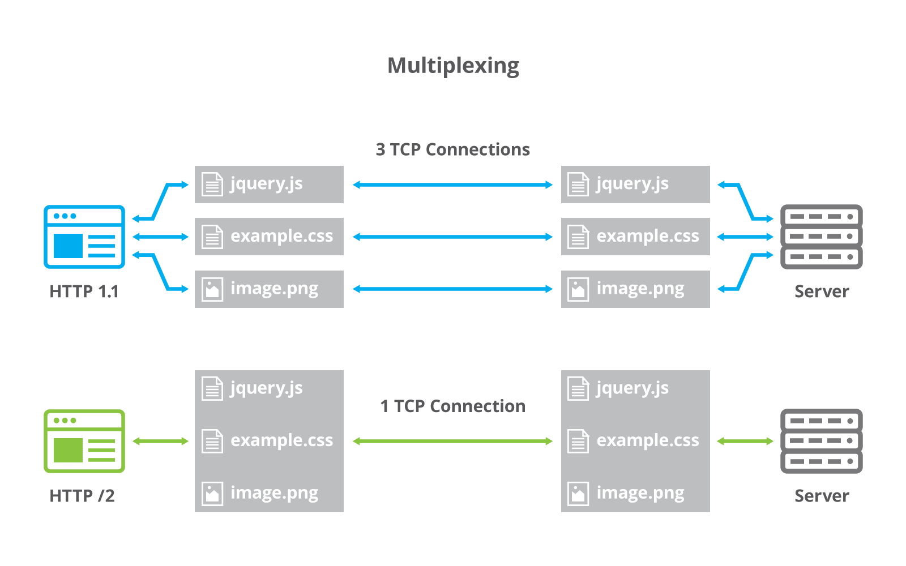
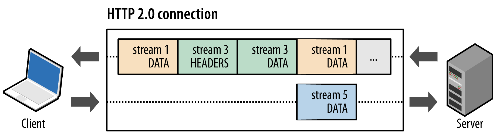
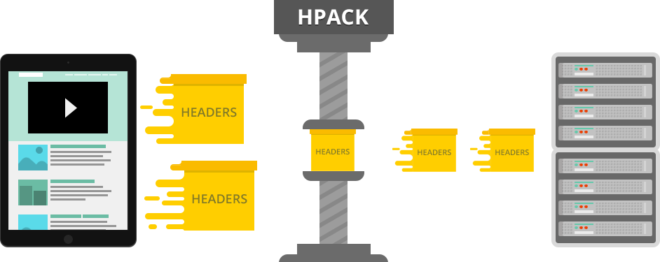
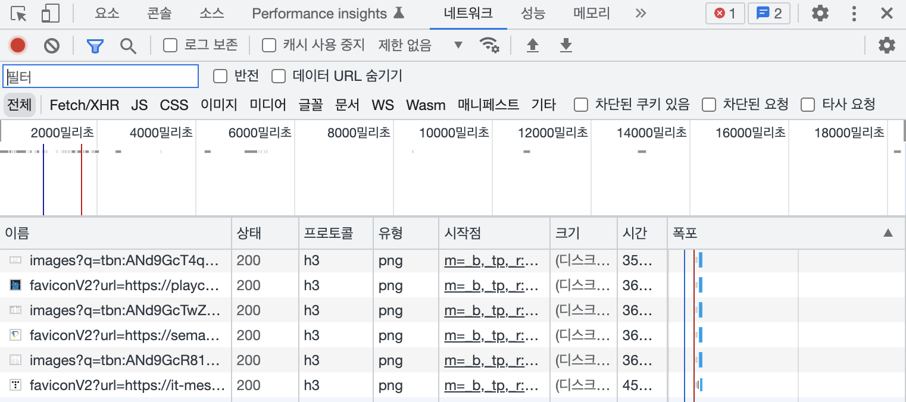

# HTTP1, HTTP2, HTTP3

## HTTP1

HTTP(HyperText Transfer Protocol)  
HTTP/1.0은 기본적으로 한 연결당 하나의 요청을 처리하도록 설계 -> RTT 증가  
서버에서 파일을 가져올 때마다 `TCP 3-way Handshake`가 계속해서 일어남

### RTT 증가 해결 방법

* `RTT` : 패킷왕복시간, 패킷이 목적지에 도달하고나서 다시 출발지로 돌아오는데 걸리는 시간

1. 이미지 스프라이트(image sprite)
   * 여러 이미지를 합쳐 하나의 이미지를 다운받고, background-image의 position을 이용해 이미지를 표기하는 기법
2. 코드 압축
   * 개행 문자, 빈칸 등을 없애서 코드의 용량을 최소화
3. Base64 인코딩 기술 
   * 이미지 파일을 64진법으로 이루어진 문자열로 인코딩하는 방법
   * 서버에 이미지에 대한 HTTP 요청을 하지 않아도 됨
   * Base64 문자열로 변환할 경우 37%정도 크기가 커지는 단점
   * https://www.base64-image.de/

 

### 이미지 스프라이트 

> 다음 쇼핑 https://shoppinghow.kakao.com/top

 

## HTTP1.1

매번 TCP 연결을 하지 않고 `keep-alive` 옵션으로 여러 개의 파일을 송수신    
HTTP1에도 keep-alive가 있었지만 표준화 X    
HTTP1.1부터 표준화되어 기본 옵션으로 설정   

⚠️ 여전히 HOL(Head of Line Blocking)을 해결하지 못함

### HOL

네트워크에서 같은 큐에 있는 패킷이 첫번째 패킷에 의해 지연될 때 발생하는 성능 저하 현상     
일반적으로는 순차적으로 잘 다운받아지지만 앞의 것이 느리게 받아지면 뒤의 것들이 대기하게 되면서 다운로드가 지연  

  

## HTTP/2

SPDY 프로토콜에서 파생   
HTTP/1.x보다 지연 시간을 줄이고 응답 시간을 더 빠르게 할 수 있음   
멀티플렉싱, 헤더 압축, 서버 푸시, 요청의 우선순위 처리를 지원하는 프로토콜  
HOL을 해결

### 멀티플렉싱

HOL 해결방법  
여러개의 스트림을 사용해 송수신  
특정 스트림의 패킷이 손실되어도 해당 스트림에만 영향을 미치고, 나머지 스트림은 정상 동작  

스트림을 이용해 동시에 다운로드 

* 스트림(stream) : 시간이 지남에 따라 사용할 수 있게 되는 일련의 데이터 요소를 가리키는 데이터 흐름  

 

### 헤더 압축

HTTP/1.x의 헤더의 커다란 크기 문제를 해결  
허프만 코딩 압축 알고리즘을 사용하는 `HPACK` 압축 형식  

* 허프만 코딩 
  * 문자열을 문자 단위로 쪼개 빈도수를 측정
  * 빈도가 높은 정보는 적은 비트 수를 사용해서 표현하고, 빈도가 낮은 정보는 비트 수를 많이 사용해서 표현
  * 전체 데이터의 표현에 필요한 비트양을 줄이는 원리

 

### 서버 푸시

HTTP/1.1에서는 클라이언트가 서버에 요청해야 파일 다운로드가 가능  
HTTP/2는 클라이언트 요청 없이 서버가 바로 리소스를 푸시  

html을 읽으면서 그 안에 있는 css 파일을 서버에서 푸시해 클라이언트에 먼저 줄 수 있음  

  

## HTTP/3

TCP 기반의 HTTP/2와 달리 UDP 기반     
`QUIC`이라는 계층 위에서 돌아감   
HTTP/2에서 장점이었던 멀티플렉싱 등을 가지고 있음  
`초기 연결 설정 시 지연시간 감소`라는 대표적 특성과 `순방향 오류 수정 메커니즘`이라는 특징을 가짐  

크롬 개발자도구 > 네트워크 > 프로토콜 

### 초기 연결 설정 시 지연시간 감소

QUIC은 TCP를 사용하지 않아서 통신 시작 시 3-way Handshake 과정이 없음  
QUIC은 첫 연결 설정에 1-RTT만 소요  

 

### 순방향 오류 수정 메커니즘

QUIC은 순방향 오류 수정 메커니즘(FEC, Forward Error Correction)이 적용됨  
전송한 패킷이 손실되었을 때 수신 측에서 에러를 검출하고 수정하는 방식  
열악한 네트워크 환경에서도 낮은 패킷 손실률  

  

## 참고 사이트

> https://developer.mozilla.org/ko/docs/Web/HTTP/Basics_of_HTTP/Evolution_of_HTTP 
