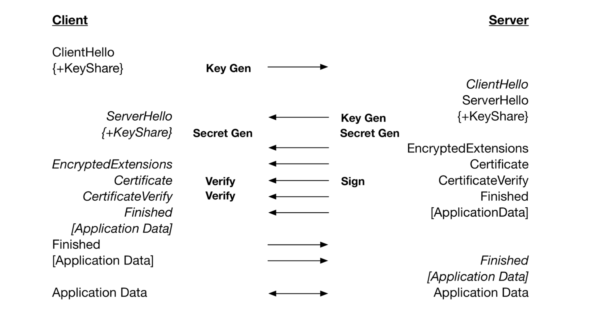
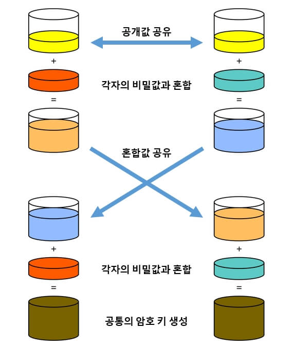
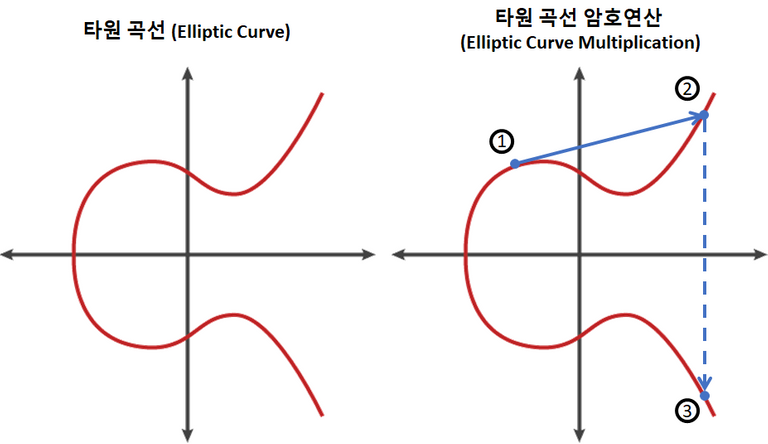
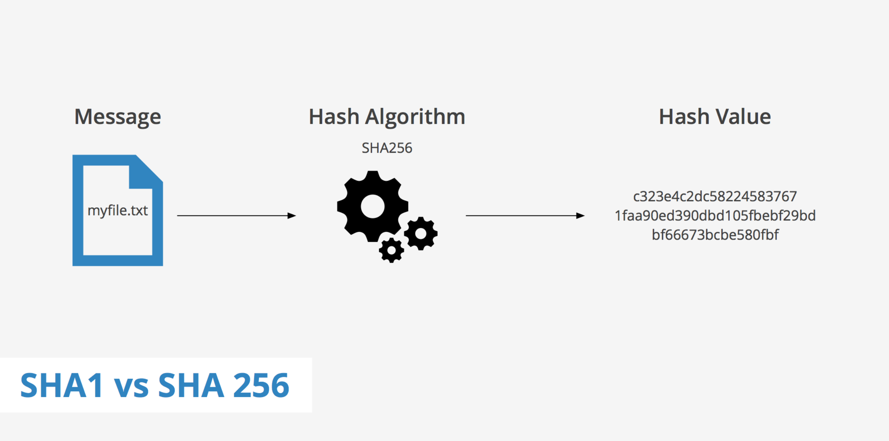

# HTTPS, TLS 

## TLS, SSL

TLS와 SSL은 동일 (명칭의 차이, 그래도 TLS라고 부르는 것이 맞음)

### SSL(Secure Socket Layer)

SSL 1.0, SSL 2.0, SSL 3.0, TLS 1.0, TLS 1.3까지 버전이 올라가며 TLS로 명칭이 변경

### TLS(TransportLayer Security Protocol)

전송 계층에서 보안을 제공하는 프로토콜  
클라이언트와 서버가 통신할 때 TLS를 통해 제3자가 메시지를 도청하거나 변조하지 못하도록 함 

  

## TLS 핸드쉐이크

어떻게 암호화된 통신을 하는가의 기초가 되는 것이 TLS 핸드쉐이크 과정   

* 1-RTT로 인증 작업 수행
* 인증 작업에서 **비대칭 암호화 (공개키 암호화)**
    * 비용이 많이 들어서(연산 작업이 더 필요하기 때문) 인증 후에 대칭 암호화로 전환
    * 엄격한 인증이 필요해서 비대칭 암호화 사용
* 인증이 끝나면 **대칭 암호화**

 

## TLS 핸드쉐이크 과정

> 📌 사용할 TLS버전을 정하고, 사이퍼슈트, 서버의 공개키, SSL인증서를 기반으로 인증작업을 수행  
> 이 후 대칭 암호화를 위해 세션키를 생성  

1. `Client Hello`  
클라이언트는 TLS버전, **사이퍼슈트**와 클라이언트 랜덤값(무작위 문자열), **임시 DH 매개변수**를 서버에게 보냄

2. `Server Hello, EncryptedExtensions, Certificate, CertificateVerify`  
서버는 클라이언트로부터 받은 옵션을 확인    
서버와 클라이언트 모두에서 지원하는 가장 높은 TLS 버전을 식별하며 결정, 사이퍼슈트 지원 여부를 확인  
공개키가 포함된 **SSL 인증서**, 서버 랜덤값(무작위 문자열), 임시 DH 매개변수를 보냄    
클라이언트와 서버 각각 서로 교환한 DH 매개변수를 사용하여 **임시 암호 키(세션키)** 생성

3. `Finished`  
클라이언트와 서버와 **세션키를 기반으로 대칭 암호화된 통신**이 시작( = 보안세션이 시작됨)
   * 키교환 알고리즘 : 대표적으로 RSA와 DH  
   DH를 기반으로 하며, **타원곡선 DH**를 사용    
   cf. TLS1.3버전에서는 RSA의 경우 취약점이 있기 때문에 공식적으로 지원하지 않음
   
  

## DH 매개변수 (DH = Diffie-Hellman)

### Diffie-Hellman 알고리즘 

1. 서로 공개값을 공유
2. 각자의 비밀값과 혼합
3. 서로 혼합값을 공유
4. 각자의 비밀값과 혼합
5. 공통의 암호키를 생성  

### DH 종류 

1. DHE : 그냥 디피헬만을 사용
2. ECDHE : 타원곡선 암호화 방법과 DH를 섞음 
   * 주로 사용됨 

 

## 타원곡선 암호화 방법

보완성 강화 

곡선을 사용해 개인 키 보유자만 알 수 있는 타원곡선을 그린 후, 이것을 기반으로 교차점을 생성  
이 교차점의 수를 기반으로 암호를 설정하는 방법  

 

## 사이퍼슈트

사이퍼 슈트는 프로토콜, AEAD 사이퍼 모드, 해싱 알고리즘이 나열된 규약  
암호제품군이라고도 부름   

TLS1.3버전에는 다섯 개가 존재 - 취약점이 제거된 제품군 

* TLS_AES_128_GCM_SHA256  
* TLS_AES_256_GCM_SHA384  
* TLS_CHACHA20_POLY1305_SHA256  
* TLS_AES_128_CCM_SHA256  
* TLS_AES_128_CCM_8_SHA256

> 🔎 TLS_AES_128_GCM_SHA256에는 세 가지 규약이 들어 있음을 의미  
> 
> * TLS : 프로토콜
> * AES_128_GCM : AEAD 사이퍼 모드
> * SHA256 :  해싱 알고리즘  

 

### AEAD 사이퍼 모드

AEAD(Authenticated Encryption with Associated Data)는 데이터 암호화 알고리즘  
AES_128_GCM 등이 존재  

> EX. AES_128_GCM
>
> 128 비트의 키를 사용하는 **표준 블록 암호화 기술**과 병렬 계산에 용이한 **암호화 알고리즘 GCM**이 결합된 알고리즘

### 해싱 알고리즘

해싱 알고리즘은 데이터를 추정하기 힘든 더 작고, 섞여 있는 조각으로 만드는 알고리즘  
SSL/TLS는 해싱 알고리즘으로 SHA-256 알고리즘과 SHA-384 알고리즘을 사용  

> SHA-256 알고리즘
> 
> SHA-256 알고리즘은 그 중 많이 사용되는 알고리즘   
> 해시 함수의 결괏값이 256비트인 알고리즘이며 비트 코인을 비롯한 많은 블록체인 시스템에서도 사용

### Q. 해싱알고리즘은 TLS에서 어떻게 사용될까?

인증서가 올바른 인증서인지 확인할 때 전자서명을 이용하는데 이 때 해싱 알고리즘이 쓰임  

1. 인증 생성작업 : 전자 서명을 만드는데 서명되는 메시지를 해싱
2. 인증 확인작업 : 메시지를 복호화해서 해시를 서로 비교해 올바른 메시지인지 확인

#### 전자서명

송신자가 자신의 신원을 증명하는 절차 또는 정보

> Ex. 네이버에서 다운로드한 프로그램이 악성인지 아니면 네이버에서 공식적으로 다운로드한 프로그램인지 확인할 때    
> 프로그램 안에 제작자 표시를 할 수 있고 이 표시는 기술적인 장치를 기반으로 되어있음 => 전자서명
> 1. 전자서명을 통해 인증서에 적힌 주체가 '서비스 제공자'인지 확인 
> 2. 인증서에 기록된 전자서명을 기반으로 CA의 공개키로 복호화해서 지문을 얻고 
> 3. 인증서에 기록된 정보들을 해시 함수에 입력하여 해시를 얻어내서 두 해시의 일치 여부를 확인
> 4. 이를 통해 인증서의 유효성을 검증 (두 지문이 일치한다면 인증서 자체가 변조된 적이 없는 것을 의미)
> 
> 💡 유효성 검증이란 인증서가 변조되지 않았고, 인증서가 '서비스 제공자' 것임을 확인하는 절차

  

## 인증서

인증서는 주체와 공개키가 있는 데이터 파일  

1. 주체(인증서 발급한 CA, 도메인, 웹사이트 소유자, 인증서 소유자)
2. 공개키(공개키, 공개키 암호화 방법)

자신의 웹사이트 안에서 SSL 인증서를 만들 수도 있지만 보통은 인증기관인 CA에서 발급한 SSL인증서를 기반으로 인증작업을 수행  
주체는 클라이언트가 접속한 서버가 클라이언트가 의도한 서버가 맞는지 확인할 때 쓰이고,   
공개키는 처음 인증작업을 수행할 때 쓰임

 

### CA

인증서의 역할은 클라이언트가 접속한 서버가 클라이언트가 의도한 서버가 맞는지를 보장하는 역할  
이 인증서를 발급하는 기업들을 CA(Certificate Authority)  
서비스의 도메인, 공개키와 같은 정보는 서비스가 CA로부터 인증서를 구입할 때 제출해야 함   

#### 다양한 유형의 인증서

* 단일 도메인 : 단 하나의 도메인(www.naver.com)에 적용되는 인증서
* 와일드카드 : 도메인의 하위 도메인도 포함하는 인증서
  * Ex. www.cloudflare.com, blog.cloudflare.com
* 멀티 도메인: 멀티 도메인 SSL 인증서는 관련되지 않은 다수의 도메인에 적용될 수 있는 인증서 

  
