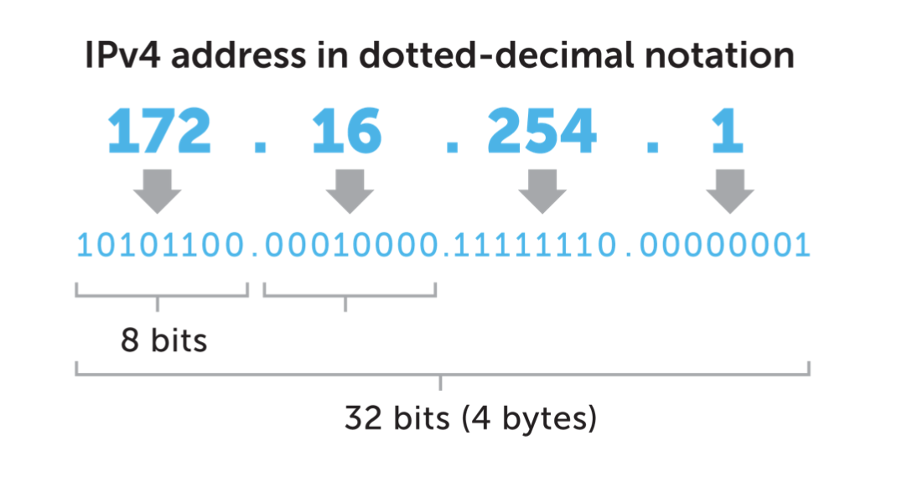
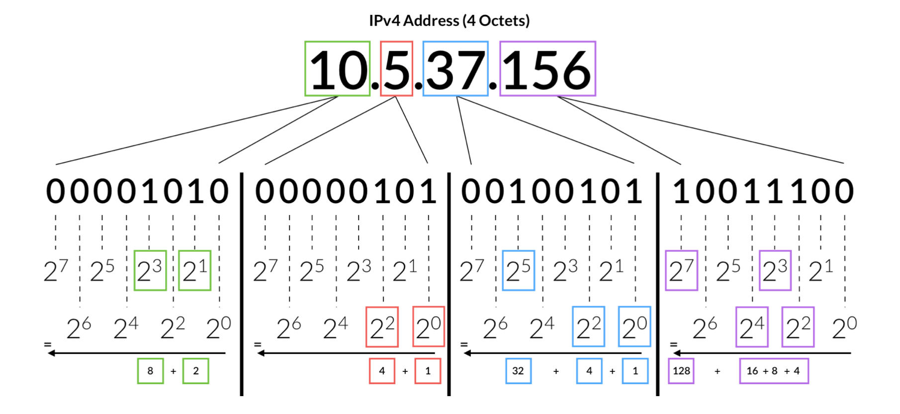
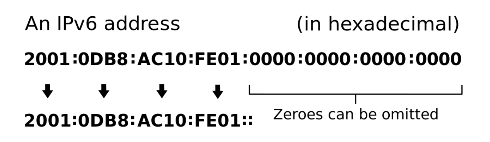
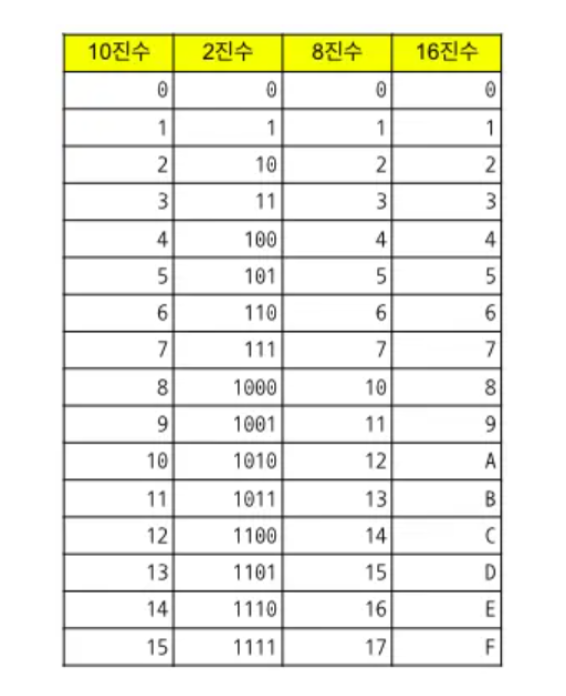
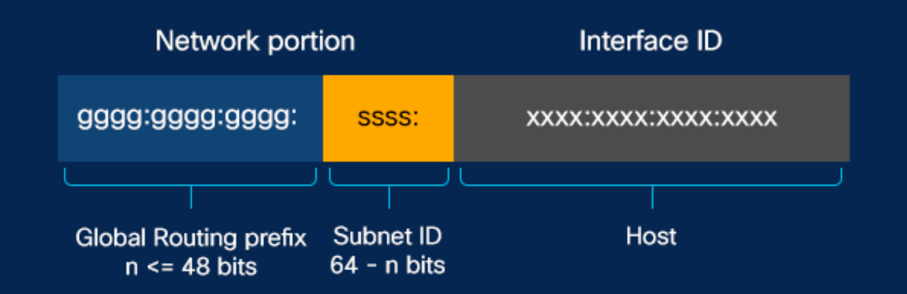
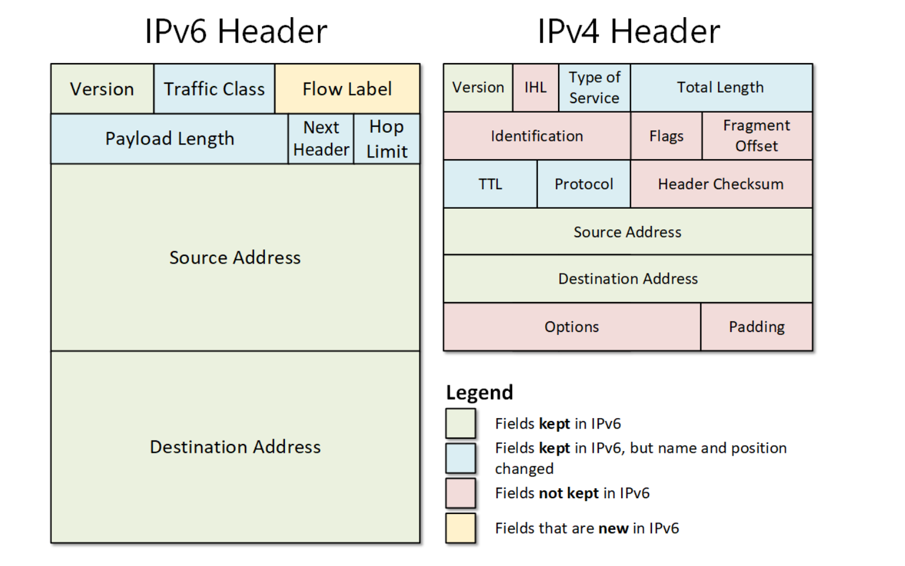
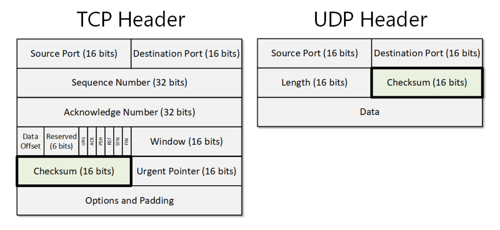
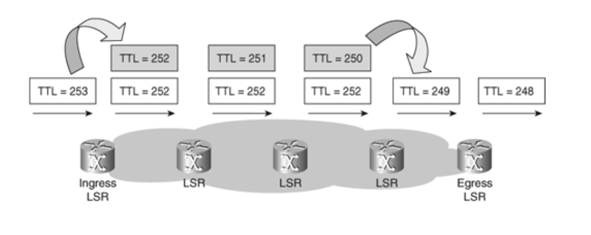

# IP 주소체계

## 📌 IPv4

IP 주소는 인터넷 주소로 IPv4, IPv6로 나눠짐

* 32비트, `2^32개의 주소`(41억 9천만 주소) 표현  
* `8비트` 단위로 점을 찍어 4개로 구분(8비트의 단위를 옥텟이라고함)   
* 8비트를 10진수로 표현  
* 주소가 부족하기 때문에 `NAT, 서브네팅` 등 여러개의 부수적인 기술이 필요
  * 인구 수가 41억보다 많고, 개인이 가진 기기가 1개 이상인 경우도 많기 때문 

### 옥텟

IPv4는 4개의 옥텟으로 구성됨 

  

## 📌 IPv6

* 128비트, `2^128개의 주소` 표현
  * 많은 주소를 처리할 수 있으며 NAT, 서브네팅이 필요하지 않음  
* `16비트`씩 8개로 구분
* 16비트는 16진수로 변환되어 콜론(:)으로 구분하여 표시
* 앞의 연속되는 0은 생략 가능 

 

* 앞 64비트 : 네트워크 
* 뒤 64비트 : 인터페이스 주소(호스)

 

### 1. IPSec 내장

IPSec은 데이터 패킷을 암호화 하는 `보안 네트워크 프로토콜` 제품군

### 2. 단순해진 헤더 포맷

IPv4 헤더의 불필요한 필드를 제거하여 보다 빠른 처리 가능

### 3. 체크섬

IPv4는 체크섬이 있지만 IPv6는 체크섬이 없음  

IPv6는 헤더의 효율화를 위해 CRC(순환중복검사)를 제외  
-> 상위 프로토콜(TCP, UDP)에서 이미 체크섬이 있기 때문에 이를 제거할 수 있음

* ⚠️ UDP + IPv6로 사용할 때는 반드시 체크섬 필드를 사용한다고 설정해야 함
  * UDP를 사용할 때 체크섬 필드는 선택사항이기 때문 
* IPv4는 헤더가 가변길이 
* IPv6는 고정길이(40바이트)라서 인터넷 헤더길이 정보가 삭제됨
* 이외에도 여러가지 불필요한 정보 삭제됨

### 4. CRC (순환중복검사)

네트워크상에서 데이터에 오류가 있는지 확인하기 위한 `체크값을 결정하는 방식`  

1. 데이터를 전송하기 전에, 주어진 데이터의 값에 따라 CRC 값을 계산하여 데이터에 붙여 전송  
2. 데이터 전송이 끝난 후 받은 데이터의 값으로 다시 CRC 값을 계산
3. 두 값을 비교 
4. 두 값이 다르면 데이터 전송 과정에서 잡음 등에 의해 오류가 덧붙여 전송된 것임을 알 수 있음

### 5. TTL이 HOP limit로 대체

`IPv4` TTL ➡️ `IPv6` HOP limit    
명칭만 달라짐  

TTL이란, IPv4에서 TTL 필드는 패킷이 네트워크에서 `무한순환하지 않도록` 하는 변수  
패킷이 네트워크에서 라우터를 거칠 때마다 TTL 값이 1씩 감소  
값이 0이 되면 패킷이 폐기됨  

  

## IPv4와 IPv6 어떤 것이 좋은가

IPv6는 IPv4보다 많은 주소를 표현할 수 있음  
IPv6는 IPv4의 불필요한 헤더가 삭제되어서 속도가 빠름      
IPv6는 IPSec이라는 네트워크 보안제품군이 내장되었기 때문에 보안 측면에서도 좋음 (패킷 자체가 암호화)  

💡 보통은 IPv6를 사용하는 것이 IPv4보다 속도가 더 빠르지만,
IPv6이 사용하는 패킷이 더 크기 때문에 일부 사용사례에서는 속도가 느림

