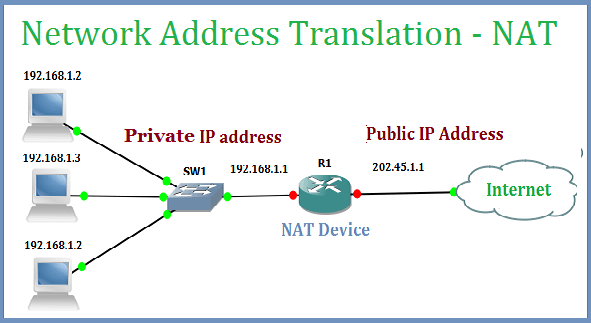

# IP 주소체계 

## NAT

NAT(Network Address Translation)  
패킷이 트래픽 라우팅 장치를 통해 전송되는 동안 패킷의 IP 주소를 변경하고, IP 주소를 다른 IP 주소로 매핑하는 방법

 

### public IP, private IP

부족한 IPv4의 IP 주소를 공인 IP(public IP)와 사설 IP(private IP)로 나누고 중간에 `NAT`이라는 기술을 통해 해결

* 공인 IP(public IP) : 외부와 소통할 때 
* 사설 IP(private IP) : 내부끼리 소통할 때 

 

### NAT 장점

* 보완성이 좋음 : 내부 네트워크 IP가 외부에 노출되지 않음(다르게 설정)

  

## NAT을 사용하는 예시 

### 공유기

실생활에서 인터넷 회선 하나를 개통하고 공유기를 달아서 wifi를 만들 때, 여러 대의 호스트(사설 IP)가 하나의 공인 IP 주소를 사용하여 인터넷에 접속    
* 공유기의 상세 설명란에 `NAT 기능 제공`이 적혀 있음

