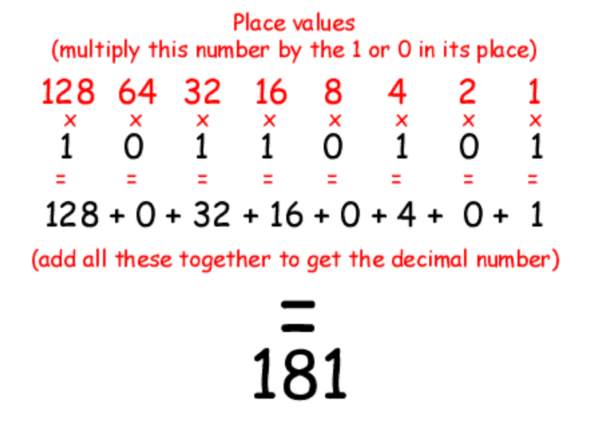
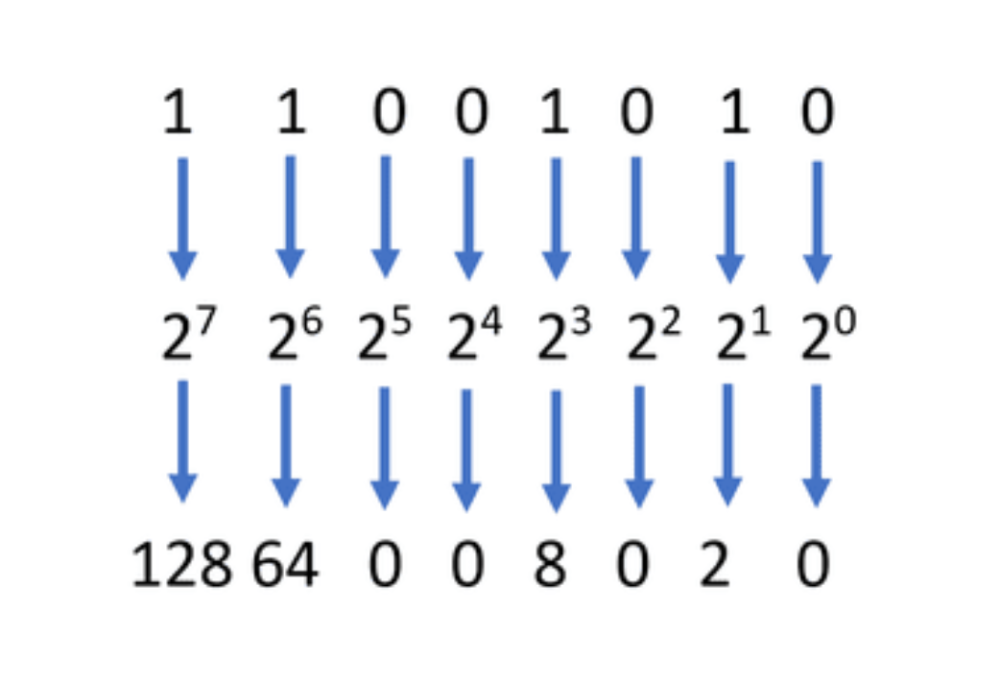
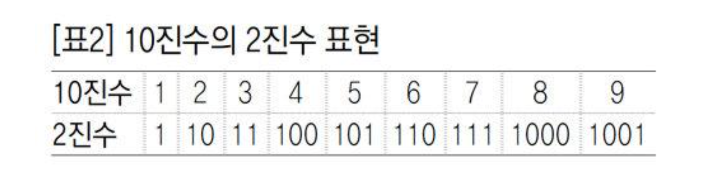

# IP 주소체계 

## 십진법

일반적으로 표현하는 수는 0 ~ 9를 기반으로 수를 표현하는 `십진법`     

### 십진법 예시 

각각의 자리는 0 ~ 9, 10개의 숫자로 표현됨  
`123` ➡️ 3 * 10 ^ 0 ➕ 2 * 10 ^ 1 ➕ 1 * 10 ^ 2  

  

## 이진수 이해하기

0 과 1, 두개의 숫자로 표현되는 `이진법` 수 => 이진수

이진법의 수를 십진법의 수와 구별하기 위해 다음과 같은 방법을 사용

- 100101b : b를 덧붙임(b는 binary, 이진의 약자)
- 100101(2) : (2)를 덧붙임, 주로 수학에서 쓰임
- 0b100101 : 앞에 0b를 덧붙임

### 이진수 예시

10진수 -> 2진수 표현

오른쪽 끝에서부터 각각의 자리는 1부터 2가 곱해지며 1, 2, 4, 8, 16, 32 ... 이런식으로 2배씩 증가하며 수를 표현  
각각의 자리는 `비트`    
각 비트가 나타내는 수는 오른쪽 끝부터 2의 0승, 2의 1승 2의 2승...   
0인지 1인지를 통해 해당 수 1, 2, 4 등을 더하지 않거나 더하는 것을 기반으로 수를 표현  

### 181을 표현하는 이진수 10110101

### 202을 표현하는 이진수 11001010

각 자리수를 더하면 128 + 64 + 8 + 2 ➡️ `202`

### 10진수의 2진수 표현  

