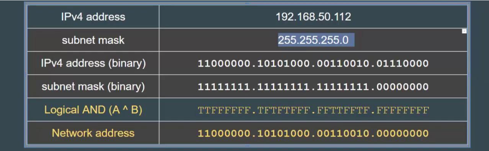
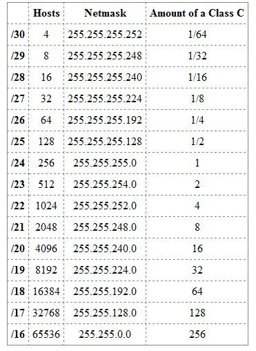

# IP 주소체계 

## 클래스리스 

클래스풀의 단점을 해결하기 위해 클래스리스 등장  
클래스로 나누는 것이 아닌, `서브넷마스크`를 중심으로 네트워크 주소와 호스트 주소를 나눔  

- 서브네팅 : 네트워크를 나눈다는 의미
- 서브넷(subnet) : 서브네트워크, 쪼개진 네트워크
- 서브넷마스크(subnet mask) : 서브네트워크를 위한 비트마스크

현재 우리의 주소체계는 클래스리스를 사용

<br><br>

## 서브넷마스크

`네트워크 주소` 부분은 모두 1, `호스트 주소` 부분은 0으로 설정해서 나눔 



세로로 `& 연산자` 사용

* & : true
* True : 1
  * T & T = T
* False : 0
  * T & F = F
  * F & T = F
  * F & F = F

<br><br>

## 서브넷마스크 표



255.255.255.0 = 256개를 기반으로 나눠가면서 계산  

* /숫자 : 왼쪽에서부터 1이 n개 만큼 있다는 의미
* /24 = 255.255.255.0 

<br><br>

## 서브넷마스크 확인

```
ipconfig
```

* IPv4 주소 : 124.34.13.91 
* 서브넷 마스크 : 255.255.255.128 (클래스 C)
* 기본 게이트웨이 : 124.34.13.254

<br><br>

## 예시 

Q. 10개의 사무실이 있고, 사무실당 12개의 장치를 연결해야 한다면? 서브넷 마스크를 어떻게 할당해야 할까? 

A. 한 서브네트워크(서브넷)당 123.12.12.12/28로 16개의 네트워크를 확보해야 함  
240(11110000)  
16 - 2 = 14개 장치까지 가능
