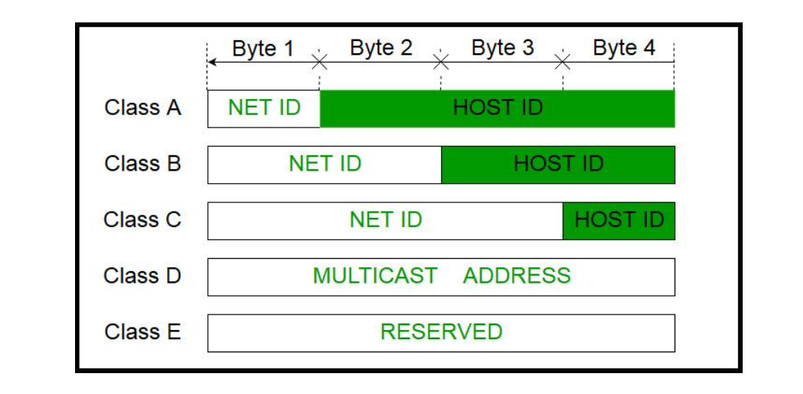
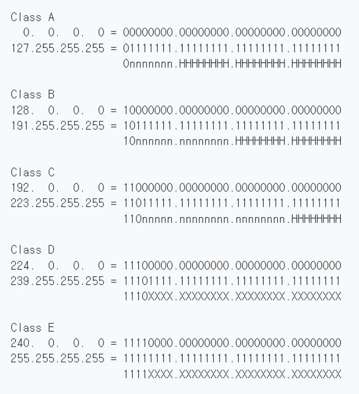
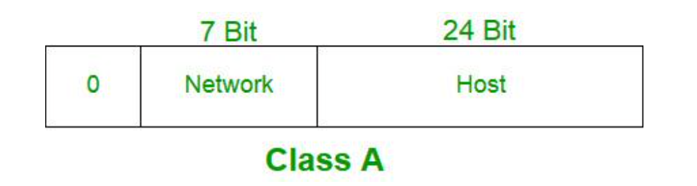
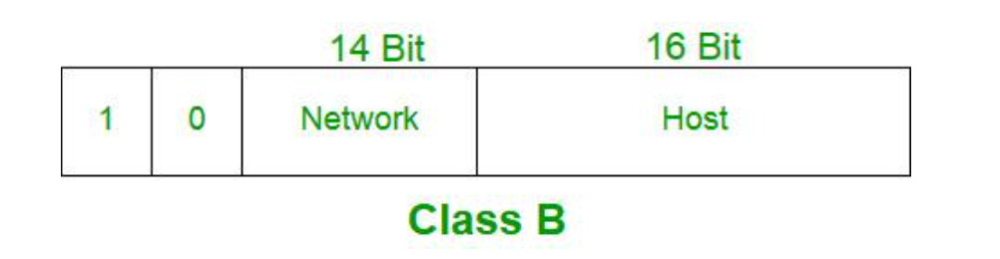
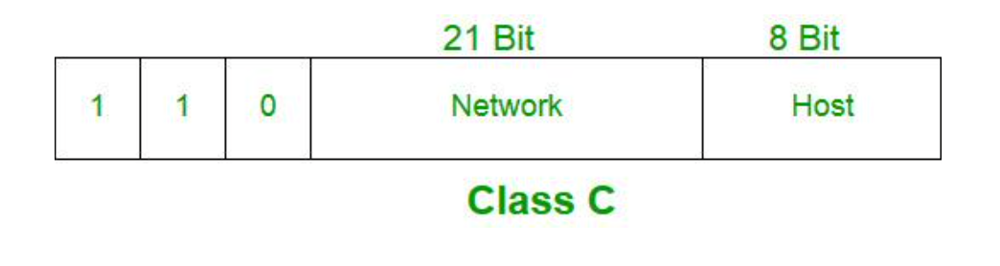
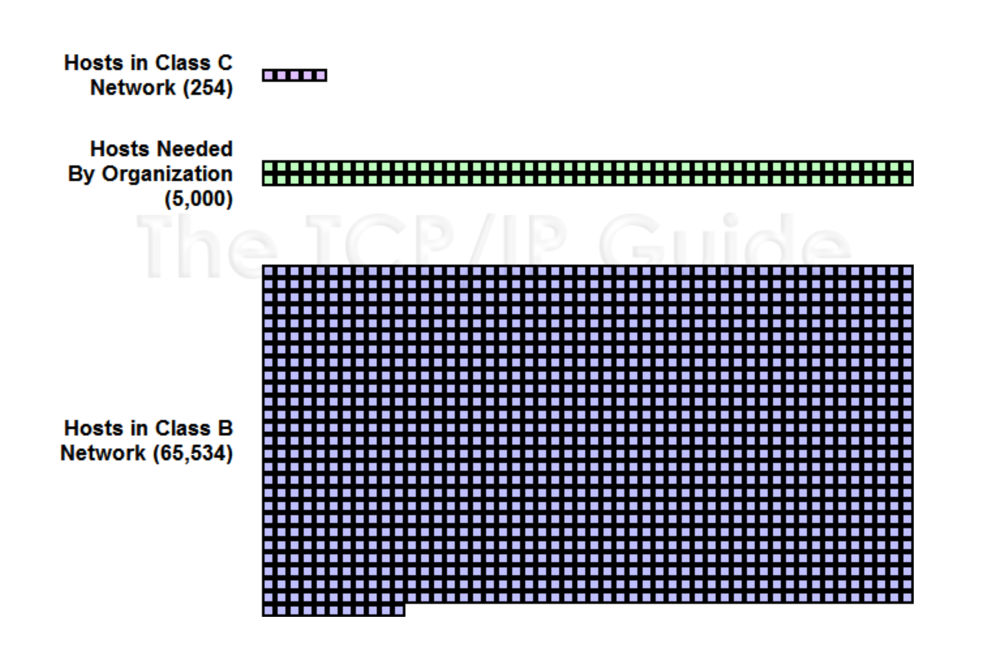

# IP 주소체계 

## 클래스풀(Classful IP Addressing)

네트워크를 구분하는 방법  

IP 주소는 인터넷 주소 -> 네트워크 주소, 호스트 주소로 나뉨

* `네트워크 주소` : 호스트들을 모은 네트워크를 지칭 
  * 네트워크 주소가 동일 = 로컬 네트워크 
* `호스트 주소` : 호스트를 구분하기 위한 주소

 

* IPv4를 기준으로 설명   
* 네트워크 호스트(network host)는 컴퓨터 네트워크에 연결된 컴퓨터나 기타 장치  
  
  

## 정의

네트워크 주소를 매기고 그에 따라 네트워크의 크기를 다르게 구분하여 클래스를 할당하는 주소체계   
구분하는 기준자(첫, 2, 3옥텟)를 `서브넷마스크`라고 함

 

맨 앞자리가 0 = A, 두번째 0 = B, 세번째 0 = C 인 이진수를 십진수로 표현한 이미지

class D, E는 중요하지 않음  

* class D : 멀티캐스트용 주소 
* class E : 여분 주소(주소가 부족할 때 할당) 

 

### class A

- 첫번째 옥텟까지 네트워크 주소로 사용
- 2^24 – 2
- 한 네트워크당 16,777,214 호스트 ID(약 1600만개) / 0
- 네트워크 주소 범위 : `1 ~ 126`로 시작 
- 127.255.255.255까지 포함
  - 127.X : 루프백 주소이기 때문에 포함 X 
    - 루프백 주소 : 본인 IP(네트워크)를 가리키는 주소 (localhost, 127.0.0.1) 
  - 0.0.0.0 : 특수 주소로 포함 X (알 수 없는 대상에 달아 놓는 임시 주소)

 

### class B

- 두번째 옥텟까지 네트워크 주소로 사용 
- 2^16–2
- 한 네트워크당 65,534 호스트 ID(약 6만 5천개) / 10
- 네트워크 주소 범위 : `128 ~ 191`로 시작

 

### class C

- 세번째 옥텟까지 네트워크 주소로 사용
- 2^8–2
- 한 네트워크당 254 호스트 ID / 110 
- 네트워크 주소 범위 : `192 ~ 223`로 시작

 

### 2개를 빼는 이유

* 맨 앞자리는 네트워크 주소로 남겨둠 
* 마지막 주소는 브로드캐스팅 주소로 남겨둠  

=> `-2`

  

## 문제점

* 큰 네트워크가 필요한 조직의 경우 : 네트워크의 크기가 작은 경우, 여러개를 확보해야 하는 어려움 존재 
* 작은 네트워크가 필요한 조직의 경우 : 너무 많은 IP를 가져가므로 IP가 낭비됨
    
### IP 주소를 다루는 방법의 변화

`classful -> calssless -> NAT`
