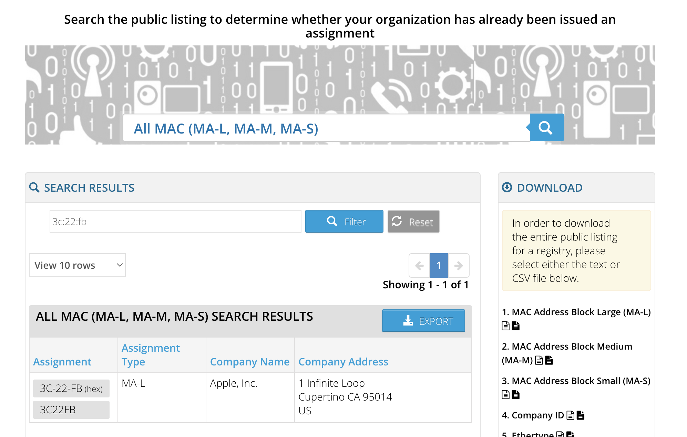
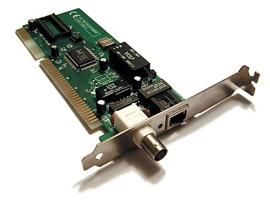
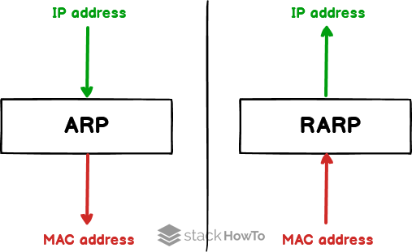
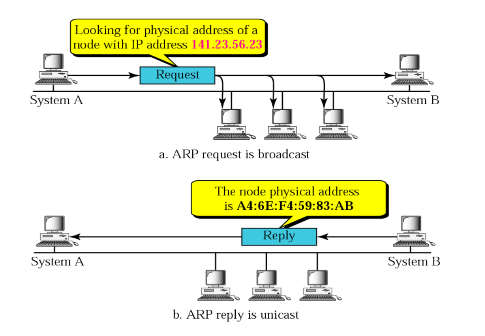

# IP 주소, MAC 주소, ARP, RARP

## IP 주소(Internet Protocol address)

논리적 주소(가변적)  
컴퓨터 네트워크에서 장치들이 서로를 인식하고 통신을 하기 위해서 사용하는 특수한 번호  
IP를 기반으로 통신한다고도 하지만 사실상 그 밑의 물리적 주소인 MAC 주소를 통해 통신 

<br><br>

## MAC 주소(Media Access Control Address)

장치의 주소  
네트워크 인터페이스에 할당된 고유 식별자이며 보통 장치의 NIC에 할당됨

* NIC(Network Interface Card) : 랜카드 

### 구성 


48비트로 이루어져있으며, 24비트의 OUI와 24비트의 UAA로 구성 

- OUI : IEEE에서 할당한 제조사 코드
- UAA : 제조사에서 구별되는 코드

### MAC 주소 확인하기

```
ipconfig/all
```

> 💻 맥북 MAC 주소 확인 : 환경설정 > 네트워크 > 고급 > 하드웨어 

<br>



> https://regauth.standards.ieee.org/standards-ra-web/pub/view.html#registries

* MAC주소는 보통은 유일함 
  * 유일하지 않을 수도 있음
  * 실수 또는 의도적으로 UAA를 중복되게 만들 수도 
  * 동일 네트워크에서만 중복되지 않으면 문제없음
* NIC에 고정된 MAC주소를 변경할 수 있지만 지양됨 
  * MAC주소를 변경 자체를 어렵게 한 OS도 존재 

<br>

### IEEE(Institute of Electrical and Electronics Engineers)

전기/전자/전산 분야의 국제 기구 및 학회  
관련 전문가들이 합병해서 창설한 국제조직이며, 관련 기술 공유와 표준 정의 등의 활동

<br>

### PC의 NIC



<br><br>

## ARP와 RARP



MAC주소는 ARP를 통해 파악이 가능  
`ARP`를 통해 논리적 주소인 **IP 주소**를 ➡️ 물리적 주소인 **MAC 주소**로 변환     
이와 반대로 `RARP`(reverse)를 통해 물리적 주소인 **MAC 주소**를 ➡️ 논리적 주소인 **IP 주소**로 변환하기도 함  

<br><br>

### ARP의 과정



1. 해당 IP주소에 맞는 MAC주소를 찾기 위해 해당 데이터를 `브로드캐스팅`을 통해 연결된 네트워크에 있는 장치한테 모두 보냄
2. 맞는 장치가 있다면 해당 장치는 보낸 장치에게 `유니캐스트`로 데이터를 전달해 주소를 찾음
